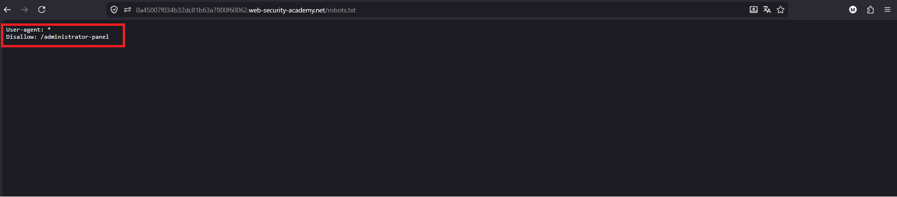
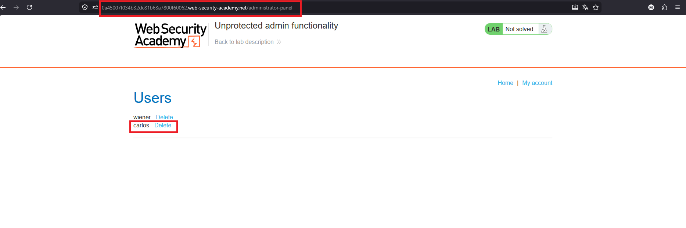
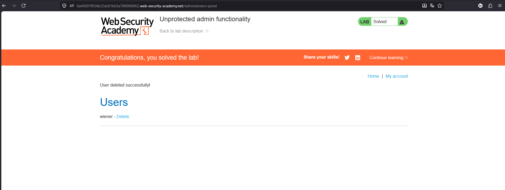

# Unprotected admin functionality

## 1. Lab Bilgisi

**Difficulty:** Apprentice

## 2. Vulnerability Özeti

Bu labda admin paneli herhangi bir yetkilendirme kontrolü olmadan erişilebilir durumda. Uygulama, admin panelinin yolunu doğrudan menüde göstermese de `robots.txt` dosyasında `/administrator-panel` yolunu sızdırıyor. Bu path'e gidince admin paneline erişip `carlos` kullanıcısını silebildim.

## 3. Exploitation Steps

1. İlk olarak uygulamanın `robots.txt` dosyasını kontrol ettim.



2. `robots.txt` içerisinde aşağıdaki disallow kuralı bulundu:

```txt
Disallow: /administrator-panel
```

3. Bu path'i URL'e ekleyerek `/administrator-panel` adresine gittim. Herhangi bir login veya yetki kontrolü olmadan admin paneli açıldı.



4. Admin panelindeki kullanıcı listesinde `carlos` kullanıcısının yanındaki `Delete` linkine tıkladım.

5. `carlos` kullanıcısı silindi ve lab çözüldü.



## 4. Impact

Admin paneli yetkilendirme kontrolü olmadan erişilebilir olduğu için normal bir kullanıcı yönetimsel fonksiyonları kullanabilir. Bu durumda saldırgan kullanıcı silebilir, admin işlemleri yapabilir veya uygulamanın kritik verilerine erişebilir.

## 5. Remediation

Admin fonksiyonları sadece yetkili kullanıcılara açık olmalıdır. Hassas path'ler `robots.txt` gibi herkese açık dosyalarda gizlenmeye çalışılmamalıdır; bu dosya güvenlik kontrolü sağlamaz. Backend tarafında her admin endpoint'i için session ve role-based access control kontrolleri uygulanmalıdır.
