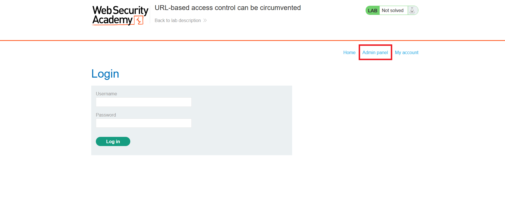
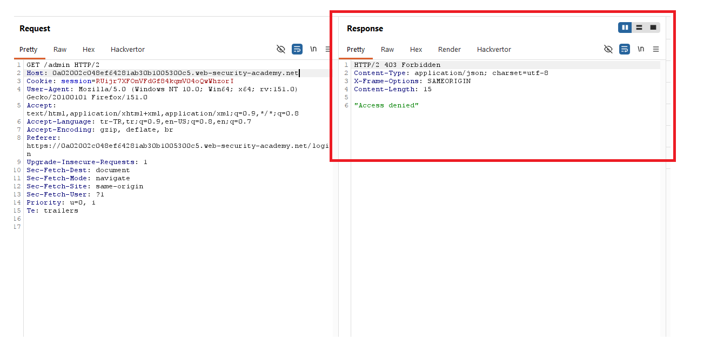
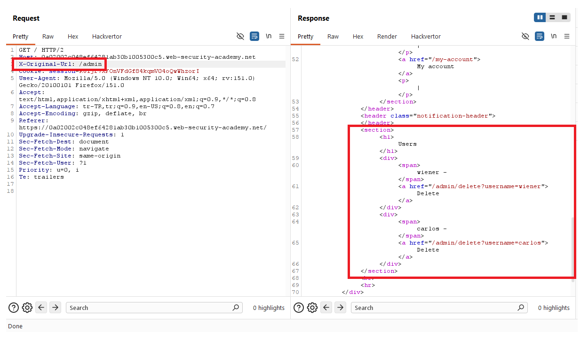
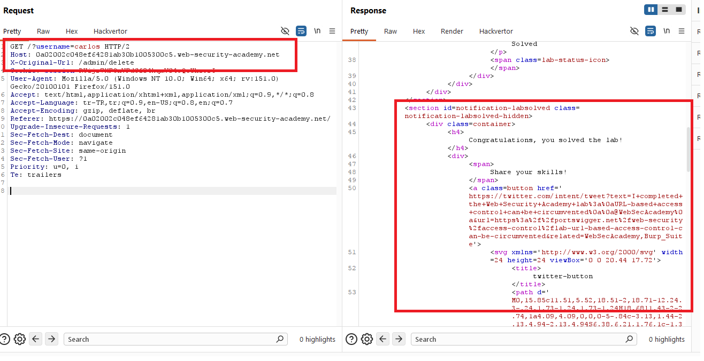
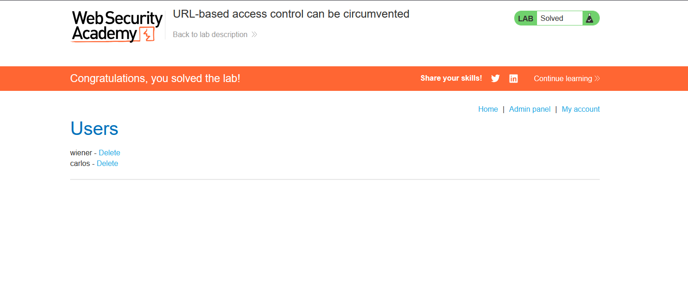

# URL-based access control can be circumvented

## 1. Lab Bilgisi

**Difficulty:** Practitioner

## 2. Vulnerability Özeti

Bu labda admin paneline doğrudan `/admin` path'i ile gidildiğinde access control devreye giriyor ve istek `403 Forbidden` dönüyor. Ancak uygulama, URL routing veya reverse proxy tarafında `X-Original-URL` header'ını dikkate aldığı için path `/` olarak bırakılıp hedef admin URL'i bu header içine yazıldığında kontrol atlatılabiliyor.

`X-Original-URL: /admin` header'ı ile admin paneli görüntülendi. Daha sonra aynı teknikle `X-Original-URL: /admin/delete` kullanılıp query string üzerinden `username=carlos` gönderilerek Carlos kullanıcısı silindi ve lab çözüldü.

## 3. Kullanılan Bilgiler

**Zafiyetli header:** `X-Original-URL`

**Engellenen endpoint:** `/admin`

**Bypass edilen endpoint:** `/`

**Admin panel header'i:** `X-Original-URL: /admin`

**Kullanıcı silme header'ı:** `X-Original-URL: /admin/delete`

**Hedef kullanıcı:** `carlos`

## 4. Exploitation Steps

1. Uygulamada `Admin panel` linkinin göründüğünü fark ettim.



2. `/admin` endpoint'ine doğrudan istek gönderdiğimde response `403 Forbidden` döndü. Bu, admin path'i üzerinde URL tabanlı access control uygulandığını gösterdi.

```http
GET /admin HTTP/2
```



3. Request path'ini `/` olarak değiştirip hedef URL'i `X-Original-URL` header'ı içine yazdım:

```http
GET / HTTP/2
X-Original-URL: /admin
```

Bu istek sonucunda admin panel içeriği döndü ve `wiener` ile `carlos` kullanıcıları için delete linkleri göründü.



4. Carlos kullanıcısını silmek için path'i yine `/` olarak bıraktım, query string'e `username=carlos` ekledim ve `X-Original-URL` header'ını silme endpoint'ine ayarladım:

```http
GET /?username=carlos HTTP/2
X-Original-URL: /admin/delete
```



5. Carlos kullanıcısı silindi ve lab başarıyla çözüldü.



## 5. Impact

URL tabanlı access control sadece görünen request path'i üzerinden uygulanır, ancak backend veya proxy `X-Original-URL` gibi header'ları kullanarak isteği farklı bir endpoint'e yönlendirirse saldırgan korunan admin fonksiyonlarına erişebilir. Bu durum yetkisiz kullanıcı silme, admin paneline erişim ve kritik işlevlerin kötüye kullanılması gibi sonuçlara yol açabilir.

## 6. Remediation

Access control kararlarında kullanıcıdan gelen `X-Original-URL`, `X-Rewrite-URL` veya benzeri header'lara güvenilmemelidir. Yetki kontrolü, backend tarafında request'in gerçek hedef endpoint'i ve oturumdaki kullanıcının yetkileri üzerinden tutarlı şekilde uygulanmalıdır. Reverse proxy kullanılıyorsa bu tür internal routing header'ları dış kullanıcılardan gelen request'lerde silinmeli veya yalnızca güvenilir upstream bileşenlerden kabul edilmelidir.
