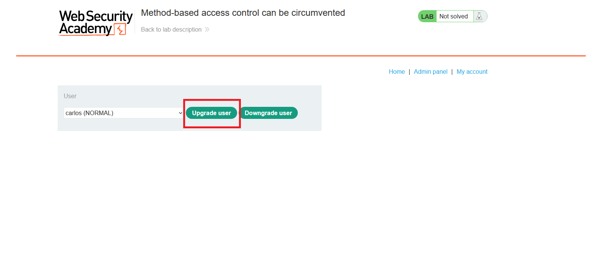
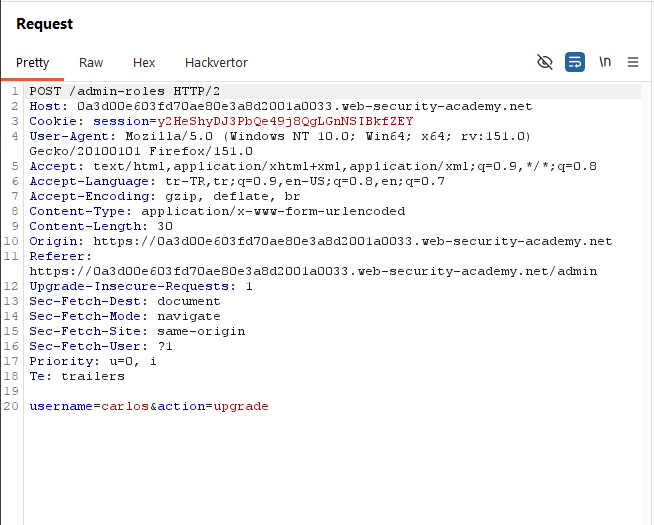
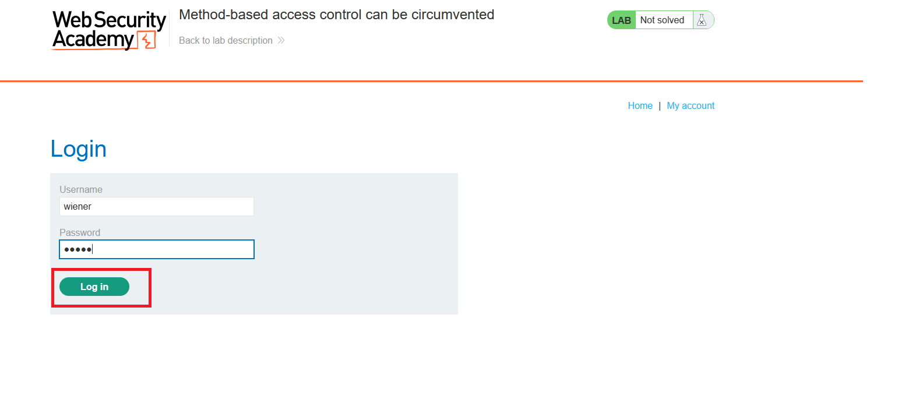
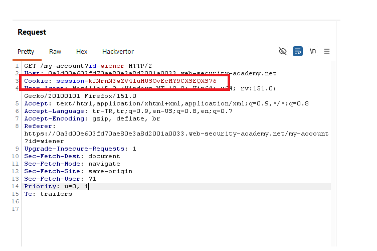
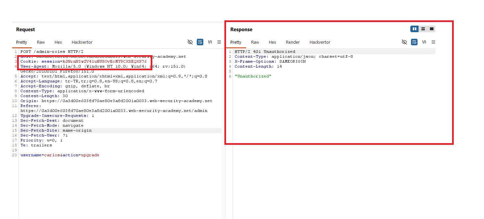
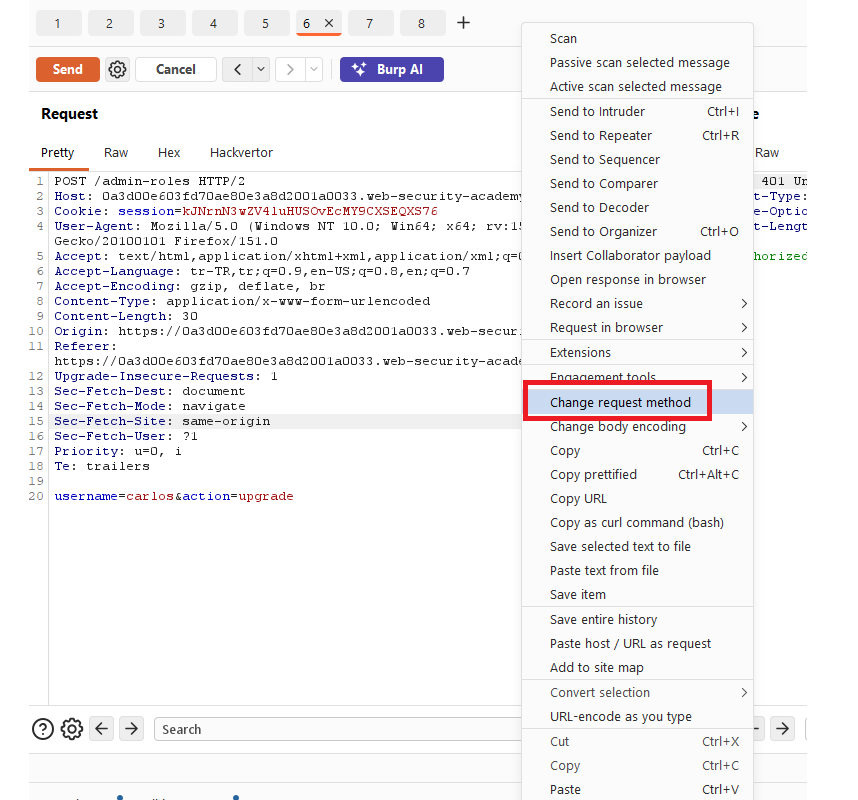
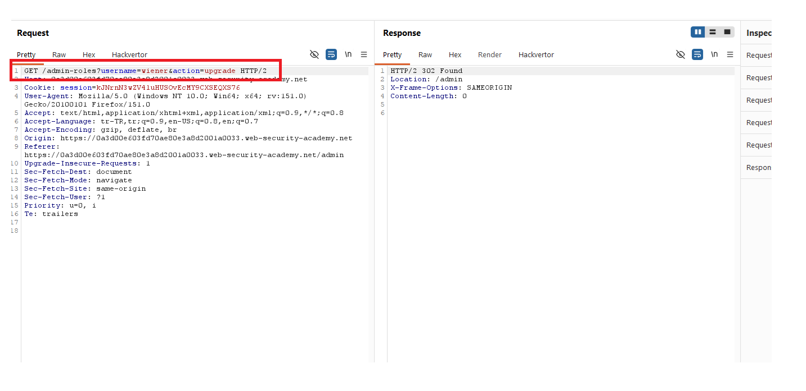
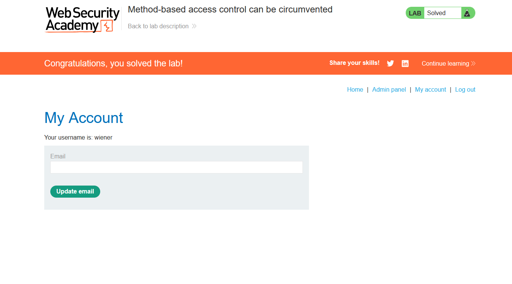

# Method-based access control can be circumvented

## 1. Lab Bilgisi

**Difficulty:** Practitioner

## 2. Vulnerability Özeti

Bu labda kullanıcı rollerini değiştiren `/admin-roles` endpoint'i normalde admin yetkisi gerektiriyor. Admin panelinden yapılan işlem `POST /admin-roles` isteği ile çalışıyor ve body içinde hedef kullanıcı ile aksiyon gönderiliyor.

Normal kullanıcı oturumuyla aynı `POST` isteği gönderildiğinde uygulama `401 Unauthorized` dönüyor. Ancak request method'u `GET` olarak değiştirildiğinde ve parametreler query string üzerinden gönderildiğinde access control kontrolü atlatılabiliyor. Bu sayede `wiener` kullanıcısı admin rolüne yükseltildi ve lab çözüldü.

## 3. Kullanılan Bilgiler

**Admin kullanıcı:** `administrator`

**Normal kullanıcı:** `wiener`

**Normal kullanıcı parolası:** `peter`

**Zafiyetli endpoint:** `/admin-roles`

**Yetkisiz kalan istek:** `POST /admin-roles`

**Bypass edilen istek:** `GET /admin-roles?username=wiener&action=upgrade`

**Hedef kullanıcı:** `wiener`

**Aksiyon:** `upgrade`

## 4. Exploitation Steps

1. Admin panelinde kullanıcı rolü değiştirme formunu inceledim. `carlos` kullanıcısı seçiliyken `Upgrade user` butonuna tıklandığında kullanıcı rolü yükseltilebiliyordu.



2. Burp Suite ile admin panelinden gönderilen role-change isteğini yakaladım. İstek `POST /admin-roles` endpoint'ine gidiyordu ve body içinde `username` ile `action` parametreleri bulunuyordu.

```http
POST /admin-roles HTTP/2
Content-Type: application/x-www-form-urlencoded

username=carlos&action=upgrade
```



3. Daha sonra normal kullanıcı hesabı olan `wiener:peter` bilgileriyle giriş yaptım.



4. `wiener` oturumuna ait session cookie değerini aldım ve admin role-change isteğinde bu session'ı kullandım.



5. Aynı `POST /admin-roles` isteğini normal kullanıcı session'ı ile gönderdiğimde uygulama `401 Unauthorized` döndü. Bu, endpoint'in `POST` method'u için access control uyguladığını gösterdi.

```http
POST /admin-roles HTTP/2
Content-Type: application/x-www-form-urlencoded

username=carlos&action=upgrade
```



6. Burp Suite içinde isteğe sağ tıklayıp `Change request method` seçeneğini kullandım.



7. Burp isteği `GET` method'una çevirdi ve body parametrelerini query string içine taşıdı. Bu aşamada hedef kullanıcıyı `wiener` olarak değiştirdim:

```http
GET /admin-roles?username=wiener&action=upgrade HTTP/2
```

Bu istek `302 Found` response'u döndürdü ve `/admin` sayfasına yönlendirme yaptı. Bu, role upgrade işleminin başarılı olduğunu gösterdi.



8. `wiener` kullanıcısı admin rolüne yükseltildi ve lab başarıyla çözüldü.



## 5. Impact

Access control yalnızca belirli HTTP method'ları için uygulanırsa saldırgan aynı endpoint'e farklı method ile istek göndererek yetki kontrolünü atlatabilir. Bu labda normal kullanıcı, `POST` isteğinde engellenmesine rağmen aynı işlemi `GET` isteğiyle yaparak kendi hesabını admin rolüne yükseltebildi. Bu durum privilege escalation ve admin fonksiyonlarının yetkisiz kullanımıyla sonuçlanır.

## 6. Remediation

Yetki kontrolleri endpoint'in tüm desteklenen HTTP method'ları için tutarlı şekilde uygulanmalıdır. Rol değiştirme gibi state-changing işlemler yalnızca uygun method ile kabul edilmeli, örneğin `GET` istekleriyle kullanıcı rolü değiştirilmesine izin verilmemelidir. Backend tarafında method fark etmeksizin kullanıcının ilgili admin işlemini yapmaya yetkili olup olmadığı kontrol edilmeli; yetkisiz istekler `403 Forbidden` veya uygun bir authorization response'u ile engellenmelidir.
