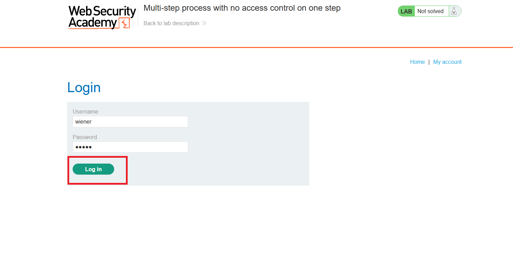
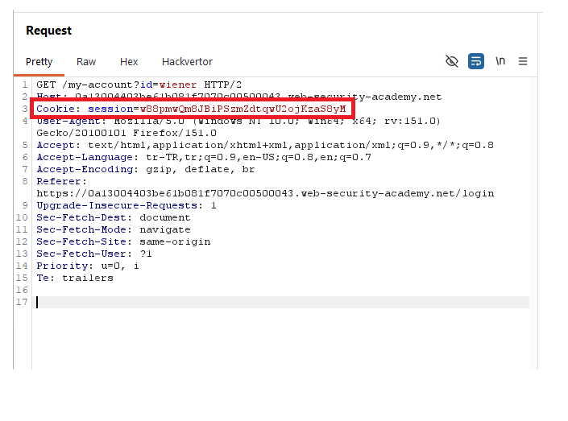
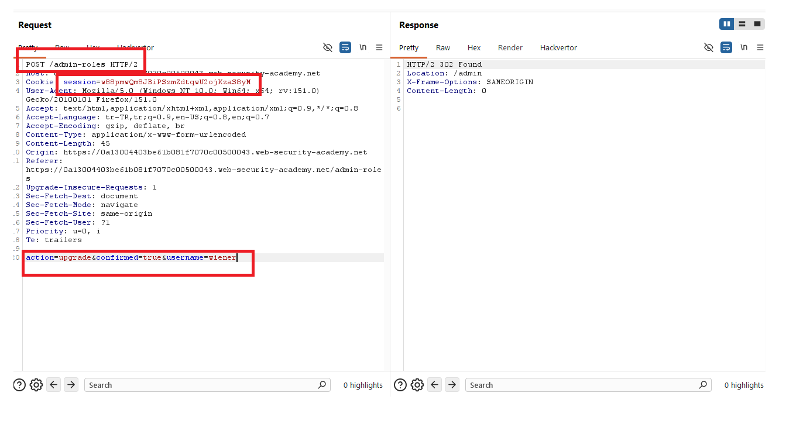
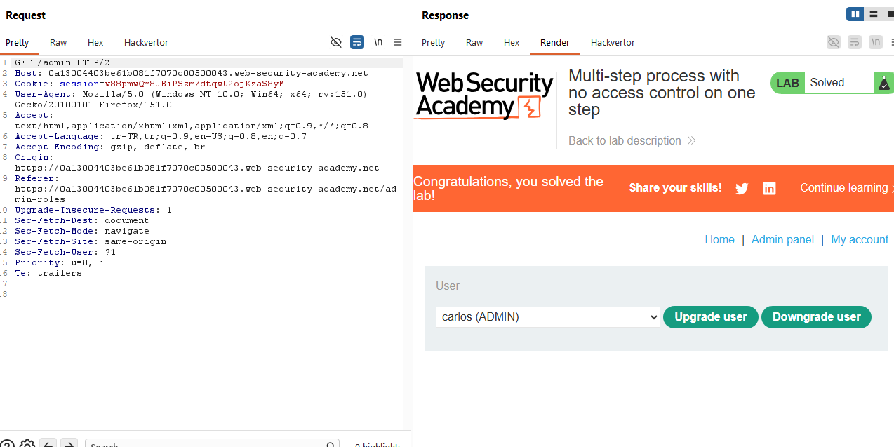
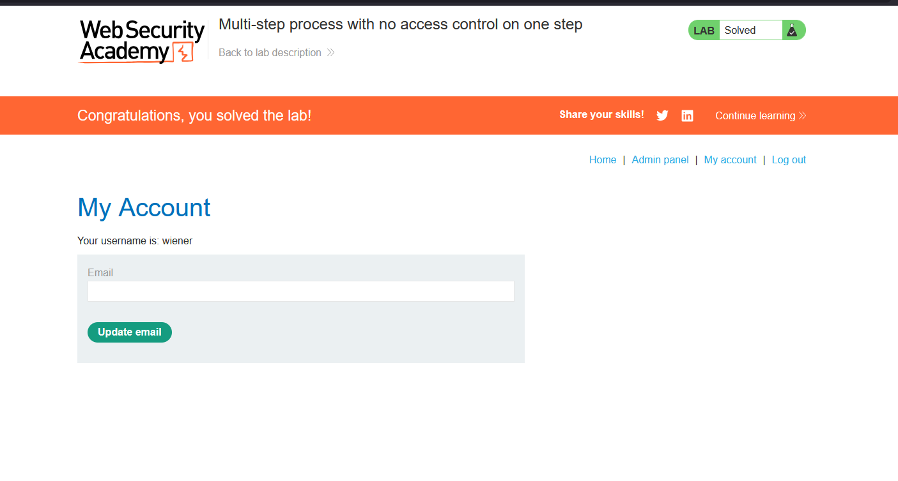

# Multi-step process with no access control on one step

## 1. Lab Bilgisi

**Difficulty:** Practitioner

## 2. Vulnerability Özeti

Bu labda kullanıcı rolü yükseltme işlemi çok adımlı bir süreç olarak tasarlanmış. Normalde admin panelinden kullanıcı seçiliyor, role upgrade işlemi başlatılıyor ve ardından confirmation adımı tamamlanıyor.

Access control kontrolü ilk adımda uygulanıyor olsa da ikinci adımda, yani confirmation isteğinde yeterli yetki kontrolü yapılmıyor. Bu nedenle normal kullanıcı oturumuyla doğrudan confirmation adımına istek gönderildiğinde `wiener` kullanıcısı admin rolüne yükseltilebiliyor.

## 3. Kullanılan Bilgiler

**Normal kullanıcı:** `wiener`

**Normal kullanıcı parolası:** `peter`

**Zafiyetli endpoint:** `/admin-roles`

**Zafiyetli adım:** Confirmation adımı

**Hedef kullanıcı:** `wiener`

**Kullanılan payload:**

```txt
action=upgrade&confirmed=true&username=wiener
```

## 4. Exploitation Steps

1. `wiener:peter` bilgileriyle uygulamaya giriş yaptım.



2. Burp Suite üzerinden `wiener` kullanıcısına ait session cookie değerini aldım.



3. Role upgrade işleminin confirmation adımına karşılık gelen `/admin-roles` isteğini normal kullanıcı session'ı ile gönderdim. Body içinde `action=upgrade`, `confirmed=true` ve `username=wiener` parametreleri yer alıyordu.

```http
POST /admin-roles HTTP/2
Content-Type: application/x-www-form-urlencoded

action=upgrade&confirmed=true&username=wiener
```

Uygulama bu isteğe `302 Found` response'u döndürdü ve `/admin` sayfasına yönlendirme yaptı. Bu, confirmation adımında access control kontrolünün eksik olduğunu gösterdi.



4. `/admin` endpoint'ine gittiğimde lab çözülmüş görünüyordu ve admin paneline erişim sağlanmıştı. Panelde `carlos` kullanıcısının admin rolünde olduğu da görüntülendi.



5. `wiener` kullanıcısının admin rolüne yükseltilmesiyle lab başarıyla çözüldü.



## 5. Impact

Çok adımlı işlemlerde access control yalnızca ilk adımda uygulanırsa saldırgan yetkili olmadığı bir işlemin sonraki adımlarını doğrudan çağırabilir. Bu labda normal kullanıcı, role upgrade sürecinin confirmation adımına doğrudan istek göndererek kendi hesabını admin rolüne yükseltebildi. Bu durum privilege escalation ve admin fonksiyonlarının yetkisiz kullanımıyla sonuçlanır.

## 6. Remediation

Çok adımlı hassas işlemlerde her adım ayrı ayrı server tarafında yetki kontrolünden geçirilmelidir. Confirmation adımları yalnızca önceki adımı başarıyla tamamlayan ve ilgili işlemi yapmaya yetkili kullanıcılar için kabul edilmelidir. Ayrıca işlem state'i server tarafında güvenli şekilde takip edilmeli; kullanıcıdan gelen `confirmed=true` gibi parametrelere tek başına güvenilmemelidir.
