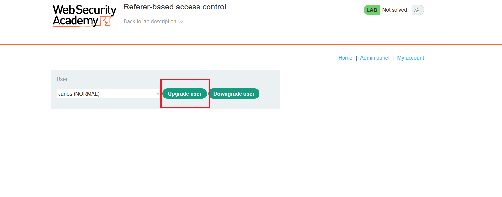
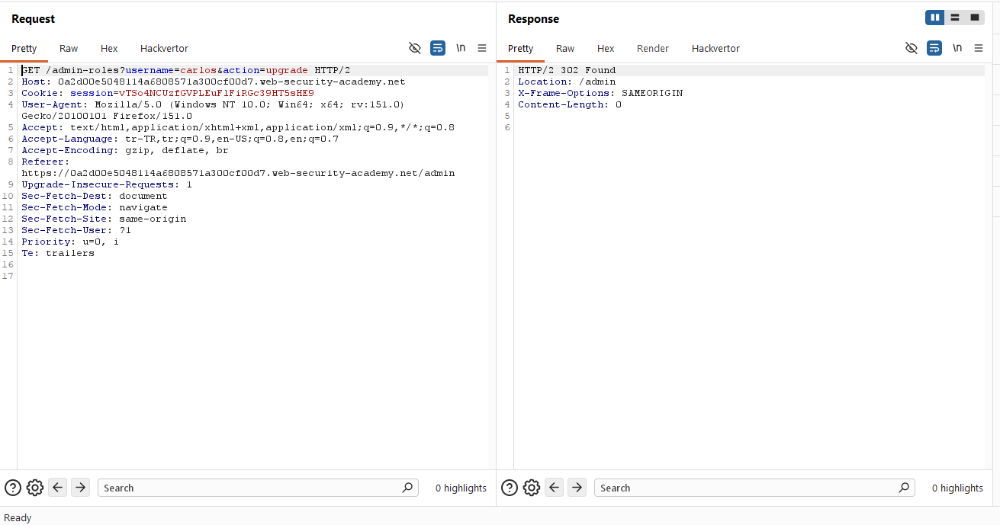
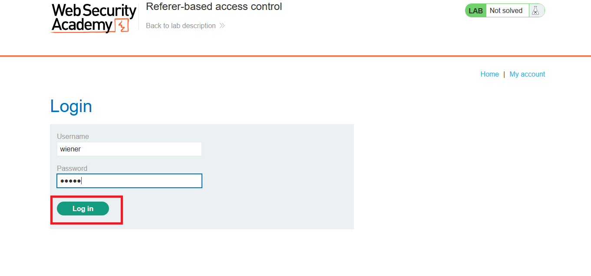
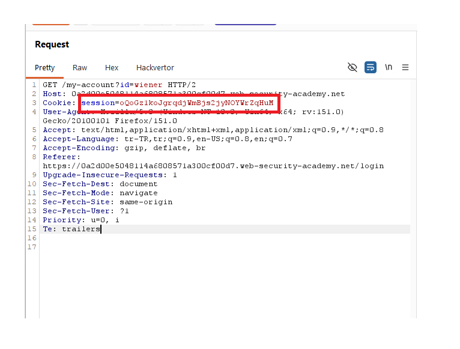
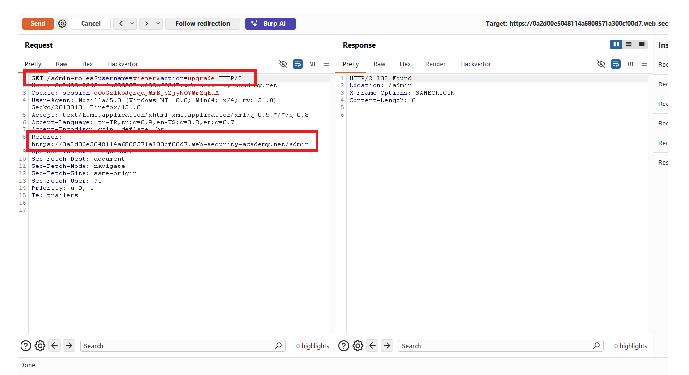
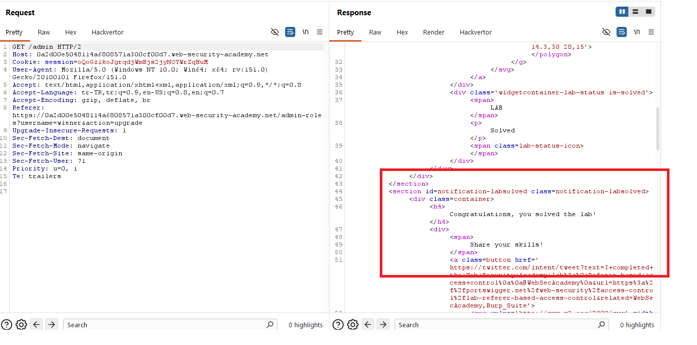
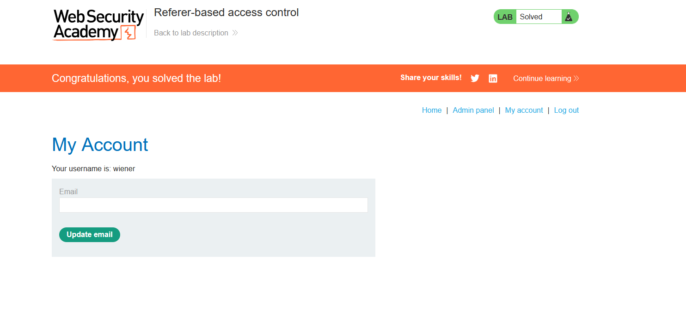

# Referer-based access control

## 1. Lab Bilgisi

**Difficulty:** Practitioner

## 2. Vulnerability Özeti

Bu labda kullanıcı rolü değiştirme işlemi `/admin-roles` endpoint'i üzerinden yapılıyor. Uygulama bu endpoint'e gelen isteklerde gerçek kullanıcı yetkisini doğru şekilde kontrol etmek yerine `Referer` header'ına güveniyor.

Admin panelinden yapılan normal istekte `Referer` değeri `/admin` olduğu için işlem kabul ediliyor. Aynı endpoint normal kullanıcı session'ı ile çağrıldığında `Referer` header'ı manuel olarak `/admin` sayfasını gösterecek şekilde ayarlanırsa access control kontrolü atlatılabiliyor. Bu sayede `wiener` kullanıcısı admin rolüne yükseltildi ve lab çözüldü.

## 3. Kullanılan Bilgiler

**Normal kullanıcı:** `wiener`

**Normal kullanıcı parolası:** `peter`

**Zafiyetli endpoint:** `/admin-roles`

**Zafiyetli header:** `Referer`

**Hedef kullanıcı:** `wiener`

**Kullanılan istek:**

```http
GET /admin-roles?username=wiener&action=upgrade HTTP/2
Referer: https://LAB-ID.web-security-academy.net/admin
```

## 4. Exploitation Steps

1. Admin panelinde kullanıcı rolü değiştirme formunu inceledim. `carlos` kullanıcısı seçiliyken `Upgrade user` butonu ile role upgrade işlemi yapılabiliyordu.



2. Burp Suite ile admin panelinden gönderilen role-change isteğini yakaladım. İstek `GET /admin-roles?username=carlos&action=upgrade` endpoint'ine gidiyordu ve `Referer` header'ı `/admin` sayfasını gösteriyordu.

```http
GET /admin-roles?username=carlos&action=upgrade HTTP/2
Referer: https://0a2d00e5048114a6808571a300cf00d7.web-security-academy.net/admin
```

Uygulama isteğe `302 Found` response'u döndürerek işlemi kabul etti.



3. Daha sonra normal kullanıcı hesabı olan `wiener:peter` bilgileriyle giriş yaptım.



4. `wiener` oturumuna ait session cookie değerini aldım.



5. Role upgrade isteğini normal kullanıcı session'ı ile tekrar gönderdim. Hedef kullanıcıyı `wiener` olarak değiştirdim ve `Referer` header'ını admin panelini gösterecek şekilde bıraktım:

```http
GET /admin-roles?username=wiener&action=upgrade HTTP/2
Referer: https://0a2d00e5048114a6808571a300cf00d7.web-security-academy.net/admin
```

Bu istek de `302 Found` response'u döndürdü. Böylece uygulamanın role upgrade işlemini kullanıcı yetkisi yerine `Referer` header'ına göre kabul ettiği doğrulandı.



6. `/admin` endpoint'ine gittiğimde lab çözülmüş görünüyordu. Response içinde lab status alanının `Solved` olduğu görüldü.



7. `wiener` kullanıcısı admin rolüne yükseltildi ve lab başarıyla çözüldü.



## 5. Impact

Access control kararlarında `Referer` header'ına güvenilirse saldırgan bu header'ı kolayca değiştirerek yetkili bir sayfadan geliyormuş gibi görünebilir. Bu labda normal kullanıcı, `Referer` değerini `/admin` olarak ayarlayarak kendi hesabını admin rolüne yükseltebildi. Bu durum privilege escalation ve admin fonksiyonlarının yetkisiz kullanımıyla sonuçlanır.

## 6. Remediation

Yetki kontrolleri `Referer` gibi kullanıcı tarafından değiştirilebilen client-side header'lara dayandırılmamalıdır. Backend tarafında her hassas işlem için oturumdaki kullanıcının gerekli role veya izne sahip olup olmadığı doğrudan kontrol edilmelidir. `Referer` yalnızca ek bağlamsal sinyal olarak değerlendirilebilir, ancak access control mekanizmasının ana dayanağı olmamalıdır.
