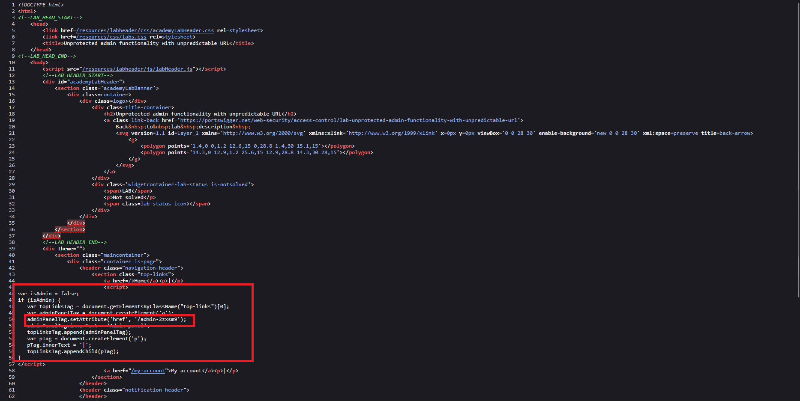
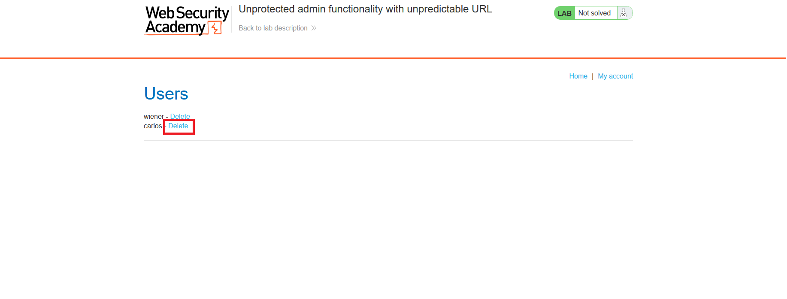
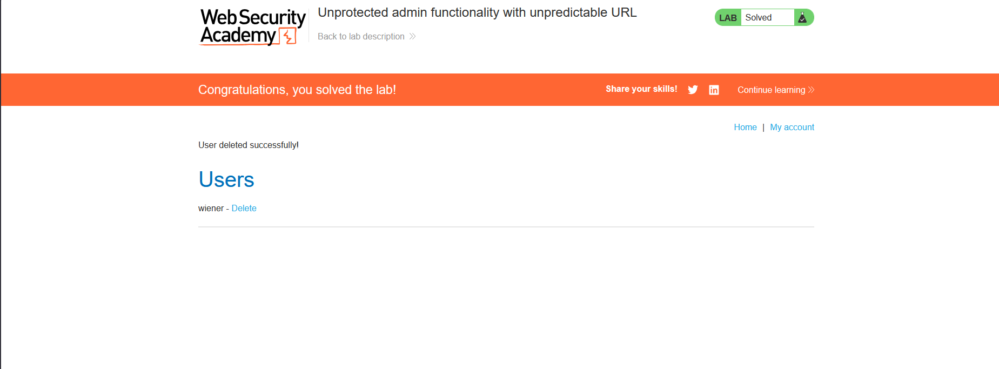

# Unprotected admin functionality with unpredictable URL

## 1. Lab Bilgisi

**Difficulty:** Apprentice

## 2. Vulnerability Özeti

Bu labda admin paneli tahmin edilmesi zor bir URL altında bulunuyor. Ancak bu URL client-side JavaScript içinde açık şekilde yer aldığı için sayfa kaynağı incelenerek bulunabiliyor. Kaynak kodda admin panel path'ini tespit edip bu adrese gidince herhangi bir yetki kontrolü olmadan admin paneline erişebildim ve `carlos` kullanıcısını silebildim.

## 3. Exploitation Steps

1. Ana sayfanın kaynak kodunu inceledim. JavaScript içinde admin panel linkinin sadece `isAdmin` değeri true olduğunda eklendiğini gördüm.

2. Aynı script bloğunda admin panel path'i açık şekilde görünüyordu:

```js
adminPanelTag.setAttribute('href', '/admin-z2xsm9');
```



3. URL'e `/admin-z2xsm9` path'ini ekleyerek admin paneline gittim. Sayfa herhangi bir yetki kontrolü yapmadan kullanıcı yönetim panelini açtı.



4. Kullanıcı listesinde `carlos` kullanıcısının yanındaki `Delete` linkine tıkladım.

5. `carlos` kullanıcısı silindi ve lab çözüldü.



## 4. Impact

Admin panelinin tahmin edilmesi zor bir URL altında tutulması tek başına güvenlik sağlamaz. Client-side koda erişebilen herkes bu URL'i bulabilir ve backend tarafında yetki kontrolü yoksa yönetimsel işlemleri gerçekleştirebilir. Bu durum kullanıcı silme, veri değiştirme veya diğer admin fonksiyonlarının kötüye kullanılmasına yol açabilir.

## 5. Remediation

Admin panel gibi hassas fonksiyonlar client-side gizleme veya tahmin edilmesi zor URL'lere güvenerek korunmamalıdır. Her admin endpoint'i backend tarafında session ve role-based access control kontrolleriyle korunmalıdır. Kullanıcı admin değilse admin paneli ve admin aksiyonları server tarafında engellenmelidir.
