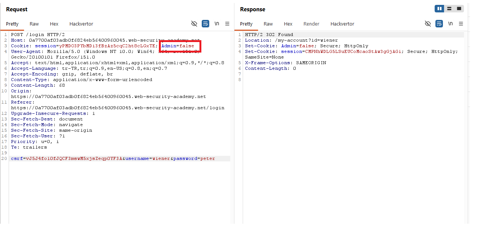
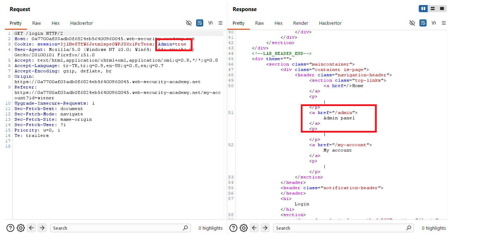
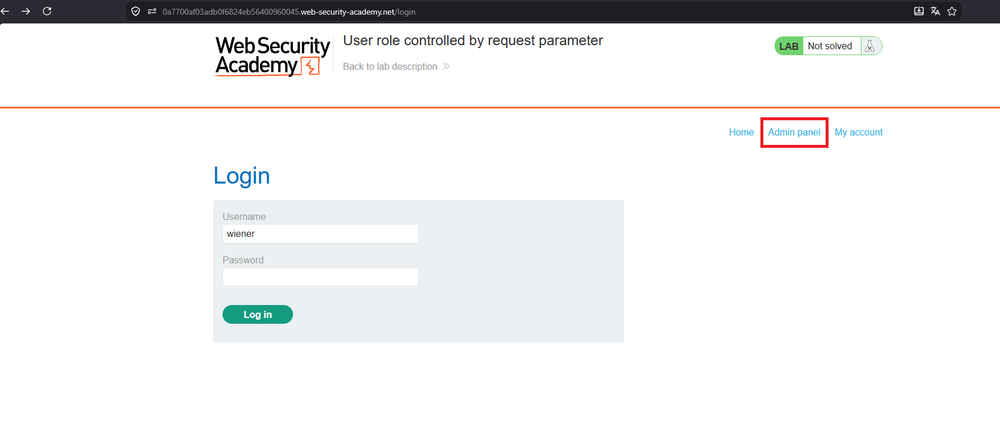
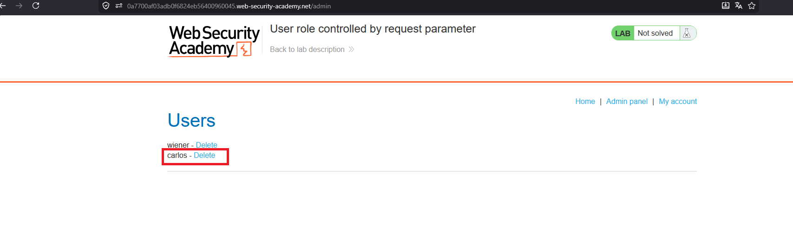
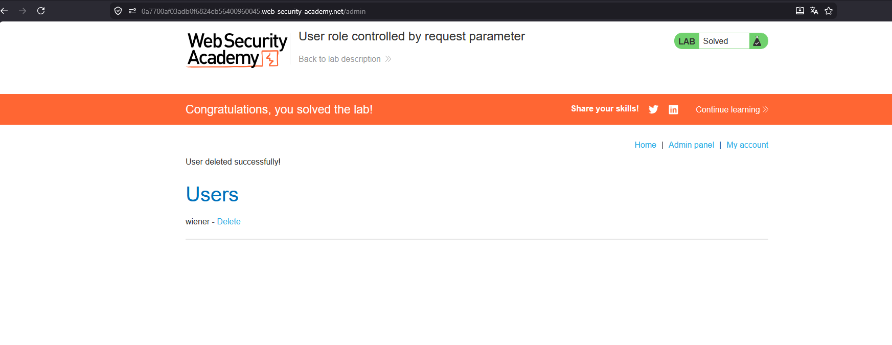

# User role controlled by request parameter

## 1. Lab Bilgisi

**Difficulty:** Apprentice

## 2. Vulnerability Özeti

Bu labda kullanıcı rolü server-side güvenli bir kontrol yerine request içindeki `Admin` cookie değeriyle belirleniyor. Normal kullanıcıyla login olunca response içinde `Admin=false` cookie'si set ediliyor. Bu değeri `Admin=true` olarak değiştirince uygulama kullanıcıyı admin gibi kabul ediyor ve admin paneline erişim sağlanabiliyor.

## 3. Kullanılan Bilgiler

**Username:** `wiener`

**Password:** `peter`

**Değiştirilen cookie:** `Admin=false` -> `Admin=true`

## 4. Exploitation Steps

1. `wiener:peter` bilgileriyle login isteği gönderdim. Response içinde uygulamanın `Admin=false` cookie'si set ettiğini gördüm.

2. Sonraki istekte cookie değerini `Admin=true` olarak değiştirdim. Response içinde admin panel linkinin sayfaya eklendiğini gördüm.

3. Browser tarafında da `Admin panel` linki görünür hale geldi.

4. `/admin` path'ine giderek admin paneline eriştim. Kullanıcı listesinde `carlos` kullanıcısının yanındaki `Delete` linkine tıkladım.

5. `carlos` kullanıcısı silindi ve lab çözüldü.

## 5. Impact

Kullanıcı rolü client tarafından değiştirilebilen bir request parametresine veya cookie değerine bağlı olduğu için normal kullanıcı admin yetkisi kazanabilir. Bu durumda saldırgan admin paneline erişebilir, kullanıcı silebilir ve yönetimsel işlemleri gerçekleştirebilir.

## 6. Remediation

Yetki bilgisi client-side cookie veya request parametresiyle kontrol edilmemelidir. Kullanıcının rolü server tarafında güvenilir session verisi üzerinden doğrulanmalı ve her admin endpoint'i için role-based access control uygulanmalıdır. Client tarafından gönderilen rol, adminlik veya yetki belirten değerler güvenilir kabul edilmemelidir.
