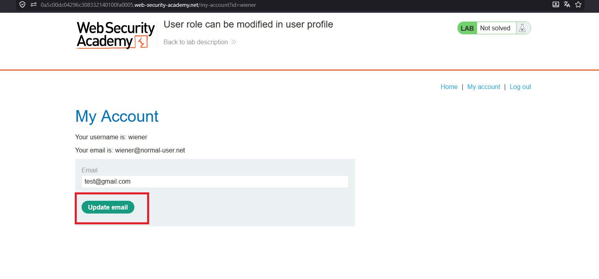
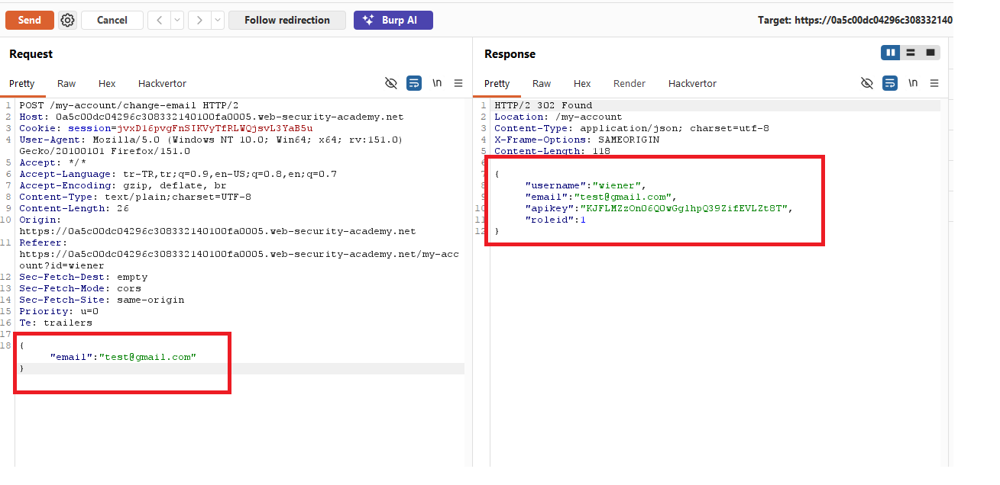
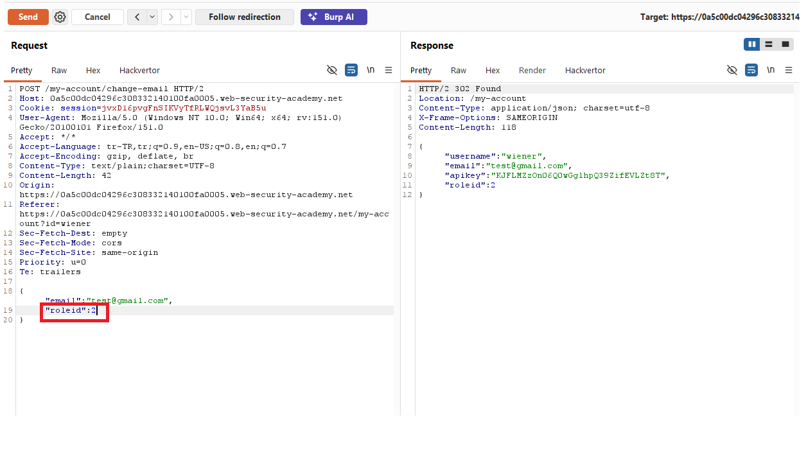
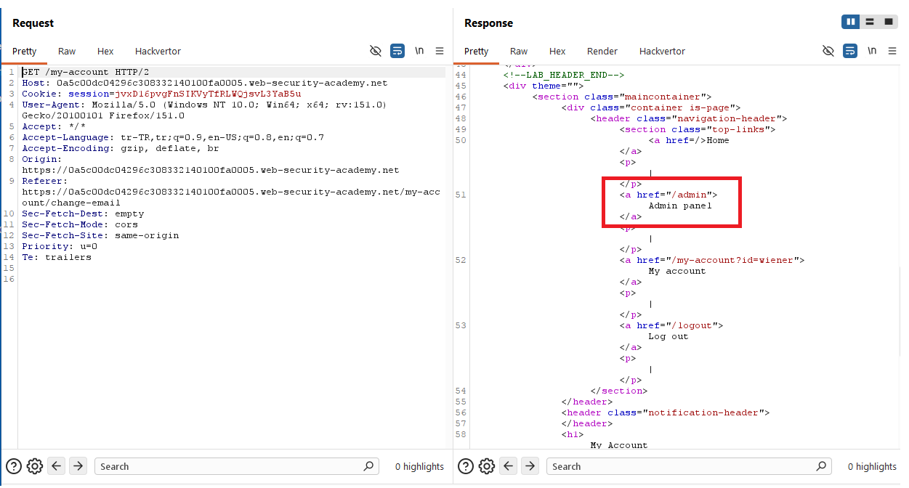
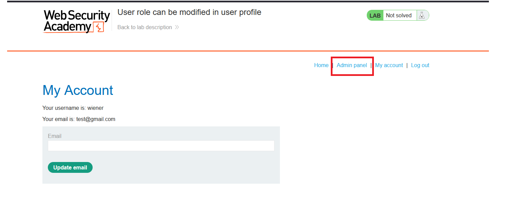
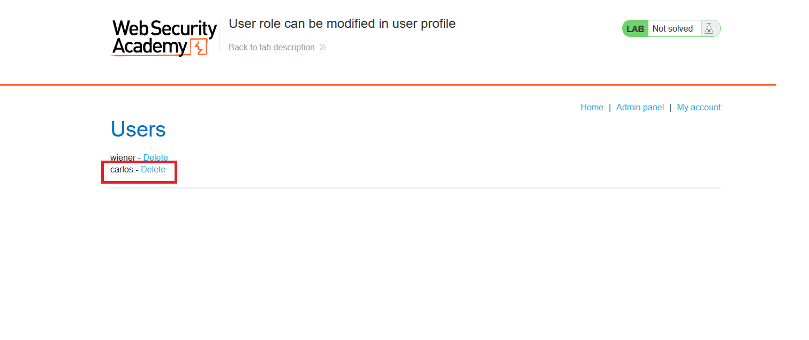
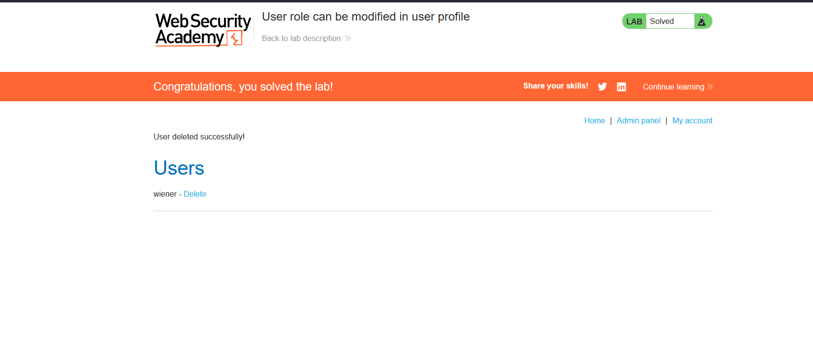

# User role can be modified in user profile

## 1. Lab Bilgisi

**Difficulty:** Apprentice

## 2. Vulnerability Özeti

Bu labda kullanıcı profilindeki email güncelleme fonksiyonu, request body içinde gönderilen ekstra alanları da işliyor. Normalde sadece `email` değeri güncellenmesi gerekirken request'e `roleid` parametresi eklenince kullanıcının rolü de değiştirilebiliyor. `roleid` değerini `2` yaparak `wiener` kullanıcısını admin yetkisine yükselttim ve admin panelinden `carlos` kullanıcısını silebildim.

## 3. Kullanılan Bilgiler

**Username:** `wiener`

**Password:** `peter`

**Endpoint:** `/my-account/change-email`

**Eklenen parametre:** `"roleid": 2`

## 4. Exploitation Steps

1. `wiener:peter` bilgileriyle giriş yaptıktan sonra profil sayfasında email güncelleme formunu kullandım.



2. Email güncelleme isteğini Burp Suite ile yakaladım. Normal request body sadece `email` değerini gönderiyordu. Response içinde kullanıcının mevcut rolünün `roleid: 1` olduğunu gördüm.



3. Aynı isteğe ekstra olarak `"roleid": 2` parametresini ekledim. Response içinde `roleid` değerinin `2` olarak döndüğünü gördüm.

```json
{
  "email": "test@gmail.com",
  "roleid": 2
}
```



4. `/my-account` sayfasını tekrar kontrol ettiğimde response içinde `Admin panel` linkinin eklendiğini gördüm.



5. Browser tarafında da `Admin panel` linki görünür hale geldi.



6. Admin paneline gidip kullanıcı listesinde `carlos` kullanıcısının yanındaki `Delete` linkine tıkladım.



7. `carlos` kullanıcısı silindi ve lab çözüldü.



## 5. Impact

Uygulama kullanıcıdan gelen ekstra JSON alanlarını güvenmeden işlemelidir. Bu zafiyet sayesinde normal bir kullanıcı kendi rolünü admin olarak değiştirebilir. Sonuç olarak admin paneline erişebilir, kullanıcı silebilir ve yetkisi dışında yönetimsel işlemler gerçekleştirebilir.

## 6. Remediation

Profil güncelleme gibi endpoint'lerde sadece izin verilen alanlar işlenmelidir. Kullanıcıdan gelen `roleid`, `isAdmin` veya benzeri yetki alanları dikkate alınmamalıdır. Rol değişiklikleri yalnızca yetkili admin işlemleriyle ve server-side access control kontrolleriyle yapılmalıdır. Ayrıca mass assignment zafiyetlerini önlemek için backend tarafında allowlist tabanlı model binding kullanılmalıdır.
