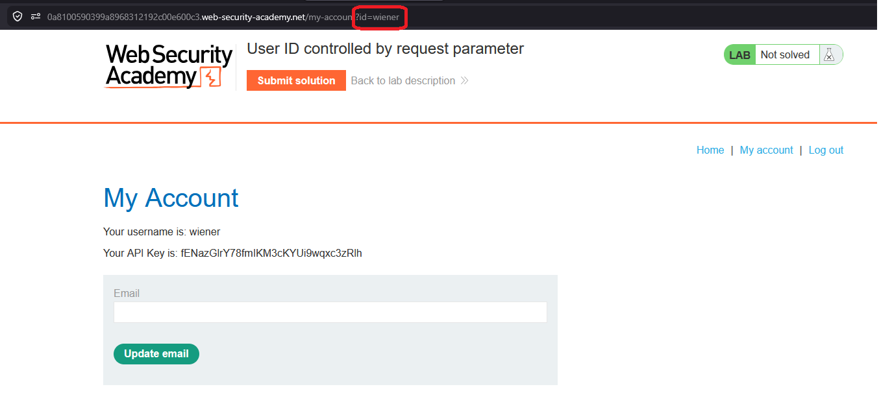
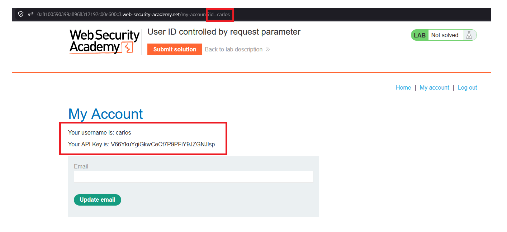
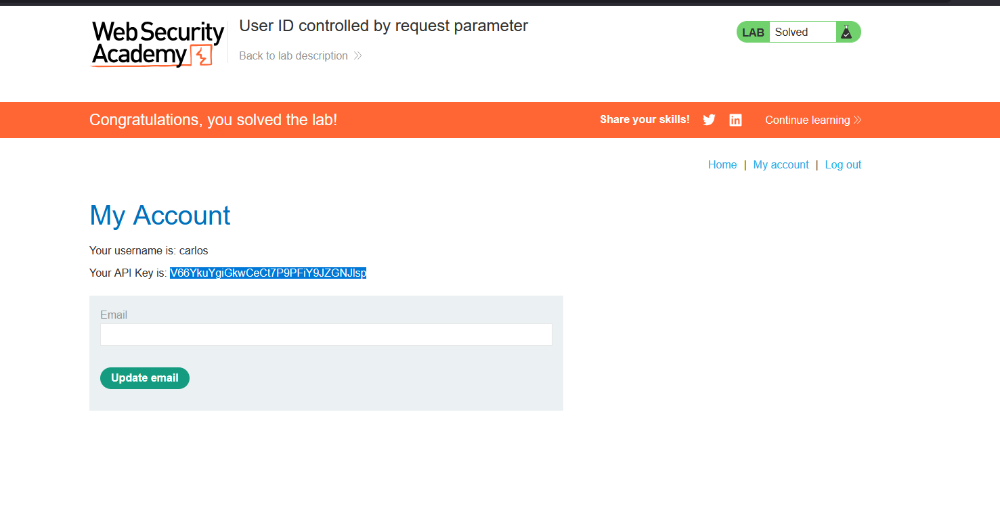

# User ID controlled by request parameter

## 1. Lab Bilgisi

**Difficulty:** Apprentice

## 2. Vulnerability Özeti

Bu labda kullanıcı hesabı sayfası, görüntülenecek kullanıcıyı URL'deki `id` parametresine göre belirliyor. Uygulama bu parametredeki kullanıcı adının oturumdaki kullanıcıyla eşleşip eşleşmediğini kontrol etmediği için `id=wiener` değeri `id=carlos` olarak değiştirildiğinde Carlos kullanıcısının hesap bilgileri ve API key'i görüntülenebiliyor.

## 3. Kullanılan Bilgiler

**Username:** `wiener`

**Password:** `peter`

**Değiştirilen parametre:** `id=wiener` -> `id=carlos`

**Carlos API key:** `V66YkuYgiGkwCeCt7P9PFiY9JZGNJIsp`

## 4. Exploitation Steps

1. `wiener:peter` bilgileriyle giriş yaptıktan sonra `/my-account?id=wiener` adresine yönlendirildim. Hesap sayfasında kendi API key'im görüntüleniyordu.



2. URL'deki `id` parametresini `wiener` yerine `carlos` olarak değiştirdim:

```txt
/my-account?id=carlos
```

3. Uygulama herhangi bir access control kontrolü yapmadan Carlos kullanıcısının hesap sayfasını ve API key bilgisini gösterdi.



4. Carlos kullanıcısının API key değerini submit solution alanına gönderdim.

```txt
V66YkuYgiGkwCeCt7P9PFiY9JZGNJIsp
```

5. API key gönderildikten sonra lab çözüldü.



## 5. Impact

Kullanıcı ID'si request parametresiyle kontrol edildiği ve server tarafında sahiplik doğrulaması yapılmadığı için bir kullanıcı başka kullanıcıların hesap bilgilerine erişebilir. Bu durum API key, kişisel bilgi veya hassas hesap verilerinin sızmasına yol açabilir.

## 6. Remediation

Uygulama, kullanıcıdan gelen `id` gibi parametrelere güvenerek hesap verisi döndürmemelidir. Her request'te oturumdaki kullanıcı ile istenen kaynağın sahibi server tarafında doğrulanmalıdır. Kullanıcı başka bir hesaba ait veriyi istemeye çalışırsa istek `403 Forbidden` ile engellenmelidir.
