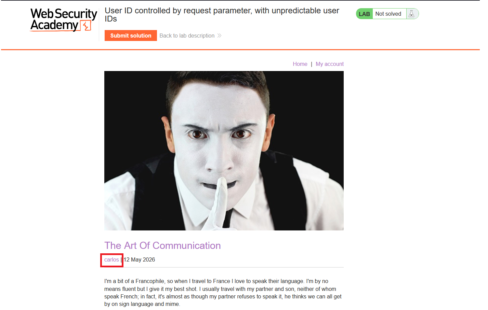
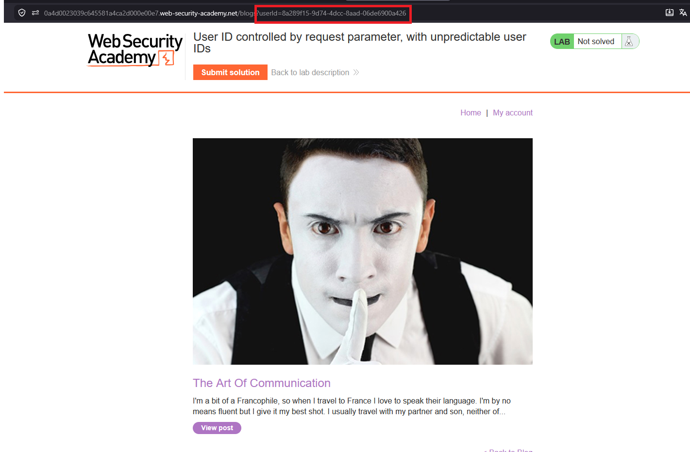
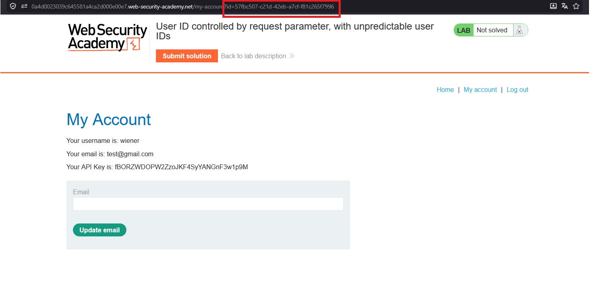
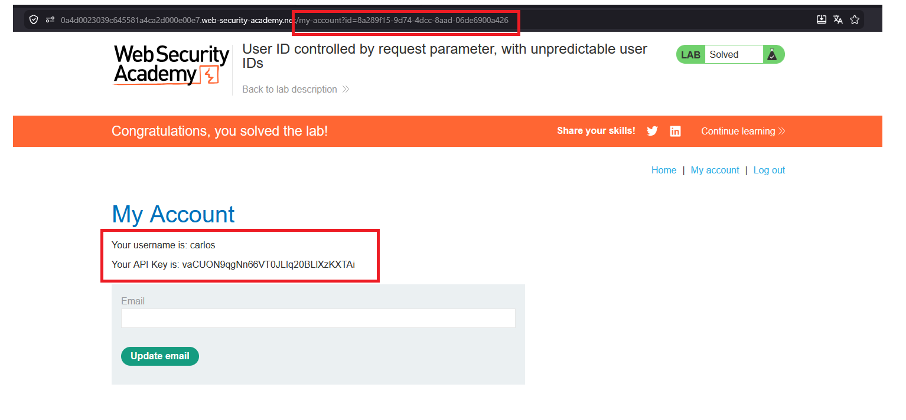

# User ID controlled by request parameter, with unpredictable user IDs

## 1. Lab Bilgisi

**Difficulty:** Apprentice

## 2. Vulnerability Özeti

Bu labda kullanıcı hesap sayfası, görüntülenecek kullanıcıyı URL'deki `id` parametresine göre belirliyor. Kullanıcı ID'leri tahmin edilebilir username yerine UUID formatında olsa da Carlos'un blog yazısındaki profil linkinden bu UUID öğrenilebiliyor. Carlos'un UUID değeri `/my-account?id=` parametresine verildiğinde uygulama access control kontrolü yapmadan Carlos'un API key bilgisini gösteriyor.

## 3. Kullanılan Bilgiler

**Username:** `wiener`

**Password:** `peter`

**Carlos user ID:** `8a289f15-9d74-4dcc-8aad-06de6900a426`

**Carlos API key:** `vaCUON9qgNn66VT0JLlq20BLlXzKXTAi`

## 4. Exploitation Steps

1. Carlos tarafından yazılmış blog postunu açtım. Post altında yazar ismi olan `carlos` linkinin tıklanabilir olduğunu gördüm.



2. `carlos` linkine tıklayınca URL'de Carlos kullanıcısına ait UUID değerinin `userId` parametresiyle gösterildiğini gördüm.

```txt
userId=8a289f15-9d74-4dcc-8aad-06de6900a426
```



3. Kendi hesabımda `/my-account` sayfasının da `id` parametresiyle çalıştığını gördüm.



4. `/my-account?id=` parametresine Carlos'un UUID değerini verdim:

```txt
/my-account?id=8a289f15-9d74-4dcc-8aad-06de6900a426
```

5. Uygulama Carlos kullanıcısının hesap sayfasını açtı ve API key bilgisini gösterdi. Bu API key'i submit solution alanına gönderince lab çözüldü.



## 5. Impact

Kullanıcı ID'lerinin UUID gibi tahmin edilmesi zor değerler olması tek başına yeterli değildir. Bu değerler uygulamanın başka yerlerinden sızıyorsa saldırgan başka kullanıcılara ait hesap bilgilerine erişebilir. Bu durumda API key gibi hassas bilgiler ele geçirilebilir.

## 6. Remediation

Uygulama sadece ID değerinin tahmin edilmesini zorlaştırarak access control sağlamamalıdır. Her request'te oturumdaki kullanıcının istenen kaynağa erişim yetkisi server tarafında doğrulanmalıdır. Başka kullanıcıya ait hesap bilgileri istenirse istek `403 Forbidden` ile engellenmelidir.
