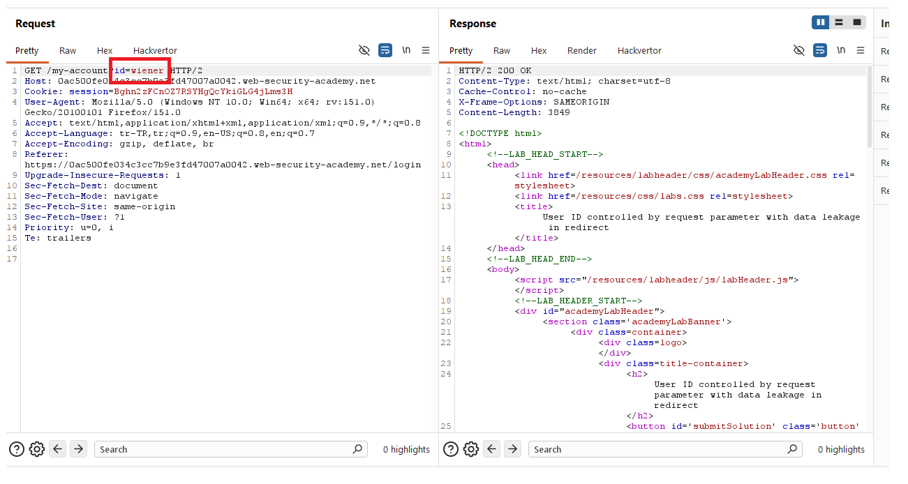
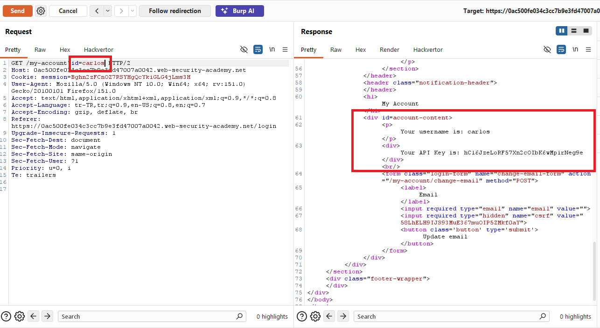
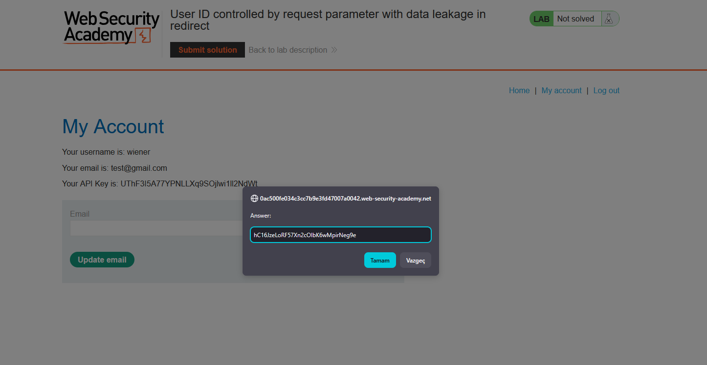
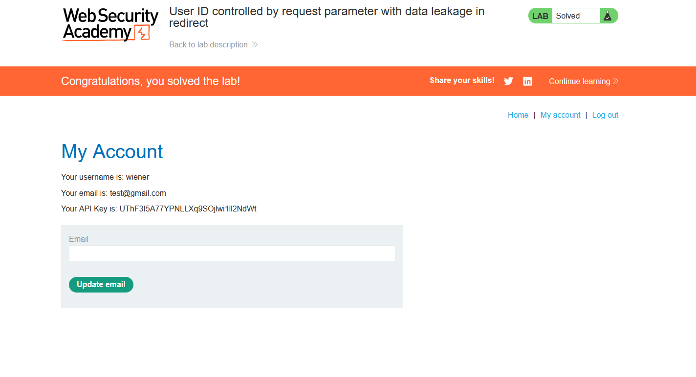

# User ID controlled by request parameter with data leakage in redirect

## 1. Lab Bilgisi

**Difficulty:** Apprentice

## 2. Vulnerability Özeti

Bu labda kullanıcı hesabı sayfası URL'deki `id` parametresine göre veri döndürüyor. Başka bir kullanıcının hesabına erişmeye çalışıldığında uygulama kullanıcıyı kendi hesabına redirect ediyor; ancak redirect response body içinde hedef kullanıcının hesap bilgileri ve API key değeri sızıyor. `id=carlos` isteğinin response body kısmından Carlos'un API key bilgisini alabildim.

## 3. Kullanılan Bilgiler

**Username:** `wiener`

**Password:** `peter`

**Değiştirilen parametre:** `id=wiener` -> `id=carlos`

**Carlos API key:** `hC16JzeLoRF57Xn2cOIbK6wMpirNeg9e`

## 4. Exploitation Steps

1. `wiener:peter` bilgileriyle giriş yaptıktan sonra `/my-account?id=wiener` isteğini Burp Suite ile inceledim.



2. `id` parametresini `carlos` olarak değiştirdim:

```txt
/my-account?id=carlos
```

3. Uygulama browser tarafında redirect yapsa da Burp Suite response body içinde Carlos kullanıcısına ait hesap bilgilerini ve API key değerini gösteriyordu.



4. Response body içinden Carlos API key değerini aldım ve submit solution alanına gönderdim.

```txt
hC16JzeLoRF57Xn2cOIbK6wMpirNeg9e
```



5. API key gönderildikten sonra lab çözüldü.



## 5. Impact

Redirect yapılması tek başına veri sızıntısını engellemez. Uygulama response body içinde yetkisiz kullanıcının verilerini döndürdüğü için saldırgan Burp Suite gibi bir proxy ile redirect öncesindeki response'u okuyabilir. Bu durum API key ve benzeri hassas bilgilerin ele geçirilmesine yol açabilir.

## 6. Remediation

Yetkisiz erişim durumunda uygulama hassas veriyi hiç üretmemeli ve response body içine koymamalıdır. Server tarafında kaynak sahipliği kontrolü yapılmalı, kullanıcı başka bir hesaba ait veriyi istemeye çalışırsa doğrudan `403 Forbidden` veya güvenli bir redirect response'u dönülmelidir. Redirect response'larında yetkisiz kaynağa ait veri bulunmamalıdır.
