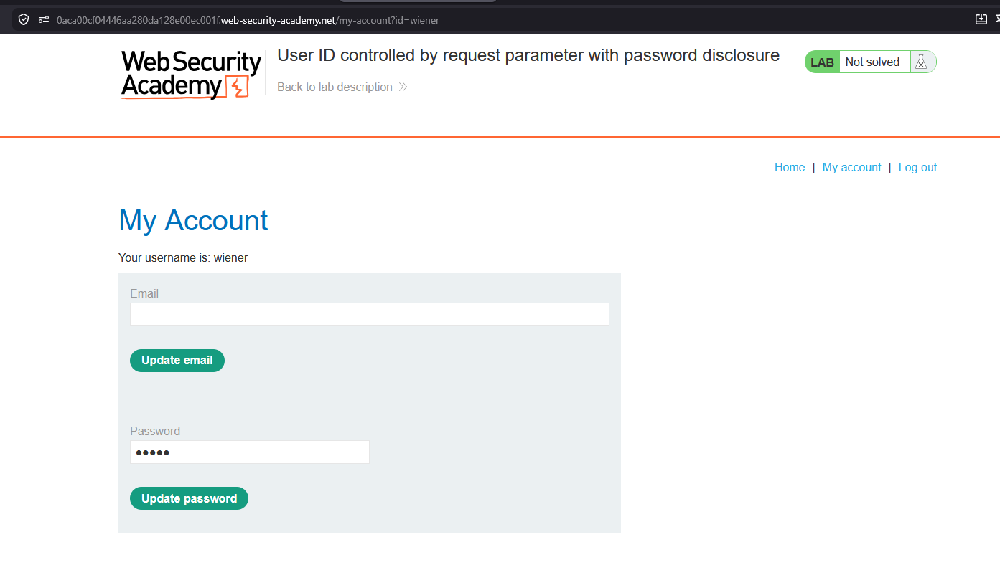
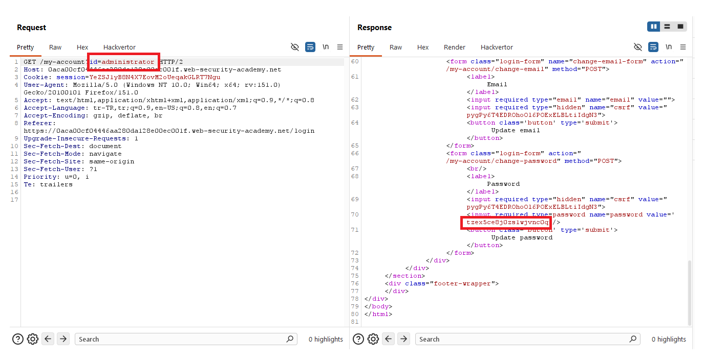
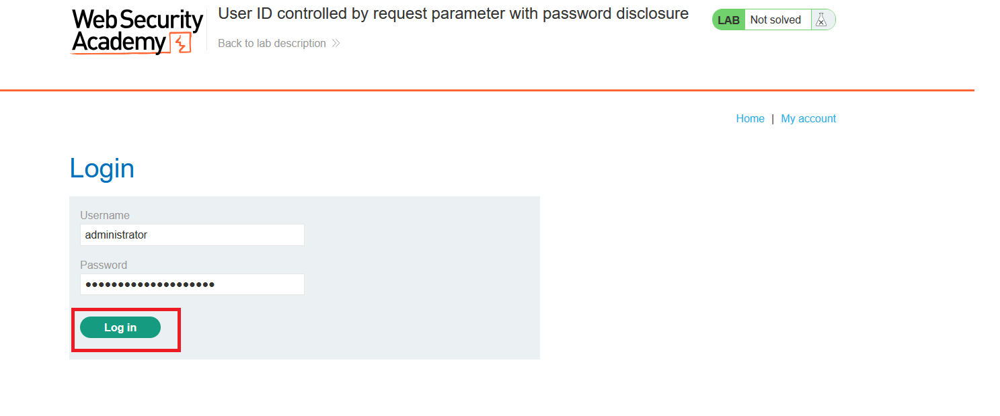
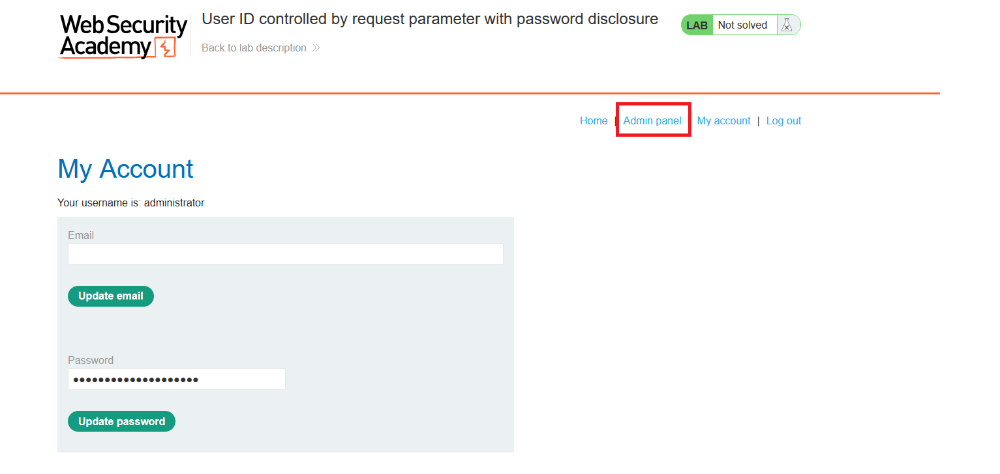
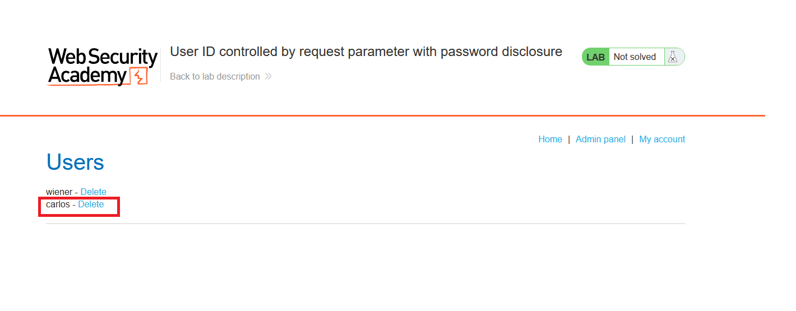
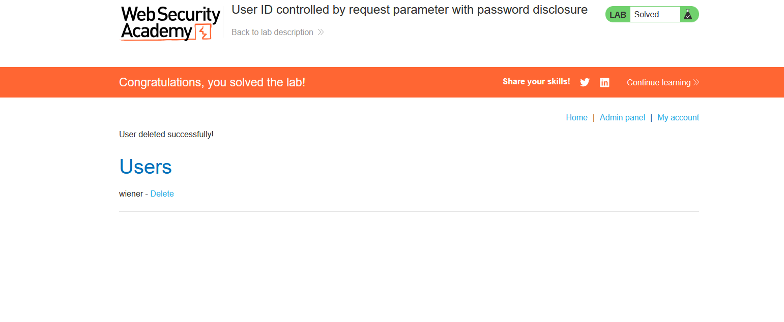

# User ID controlled by request parameter with password disclosure

## 1. Lab Bilgisi

**Difficulty:** Apprentice

## 2. Vulnerability Özeti

Bu labda kullanıcı hesabı sayfası URL'deki `id` parametresine göre veri döndürüyor. Normal kullanıcıyla oturum açtıktan sonra `id=wiener` parametresi `id=administrator` olarak değiştirildiğinde administrator hesabının profil sayfası görüntülenebiliyor. Response içinde password input alanının `value` attribute'unda administrator parolası açık şekilde yer aldığı için admin hesabına giriş yapılabiliyor.

## 3. Kullanılan Bilgiler

**Normal kullanıcı:** `wiener`

**Normal kullanıcı parolası:** `peter`

**Hedef kullanıcı:** `administrator`

**Administrator password:** `tzex5ce8j0zslwjnvc0q`

**Değiştirilen parametre:** `id=wiener` -> `id=administrator`

## 4. Exploitation Steps

1. `wiener:peter` bilgileriyle giriş yaptıktan sonra `/my-account?id=wiener` sayfasına gittim. Hesap sayfasında password alanının bulunduğunu gördüm.



2. Burp Suite ile `/my-account?id=wiener` isteğini yakaladım ve `id` parametresini `administrator` olarak değiştirdim:

```txt
/my-account?id=administrator
```

3. Response içinde administrator hesabına ait password input alanı dönüyordu. `value` attribute'undan administrator parolasını aldım.

```html
<input required type=password name=password value="tzex5ce8j0zslwjnvc0q">
```



4. Login sayfasına gidip `administrator` kullanıcısı ve elde ettiğim parola ile giriş yaptım.



5. Giriş başarılı olduktan sonra admin panel linkinin göründüğünü gördüm.



6. Admin paneline gidip `carlos` kullanıcısının yanındaki `Delete` linkine tıkladım.



7. `carlos` kullanıcısı silindi ve lab çözüldü.



## 5. Impact

Kullanıcı ID'si request parametresiyle kontrol edildiği ve server tarafında yetki kontrolü yapılmadığı için bir kullanıcı başka kullanıcıların hesap sayfasına erişebilir. Ayrıca password değerinin response içinde açık şekilde dönmesi, administrator hesabının ele geçirilmesine ve admin fonksiyonlarının kötüye kullanılmasına yol açar.

## 6. Remediation

Hesap sayfası gibi hassas endpoint'lerde oturumdaki kullanıcı ile istenen hesabın sahibi server tarafında doğrulanmalıdır. Kullanıcı başka bir hesaba ait veriyi istemeye çalışırsa istek `403 Forbidden` ile engellenmelidir. Parolalar hiçbir zaman response içinde açık metin olarak döndürülmemeli, backend tarafında güvenli hash formatında saklanmalıdır.
