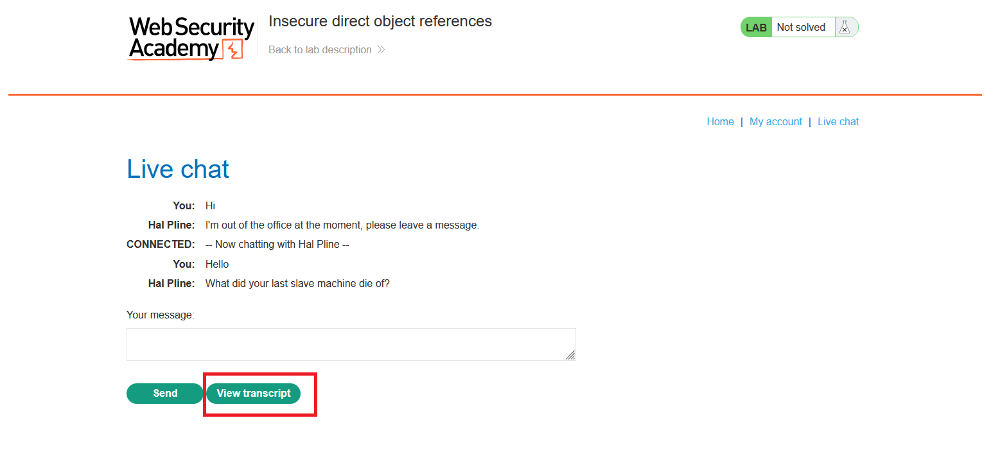
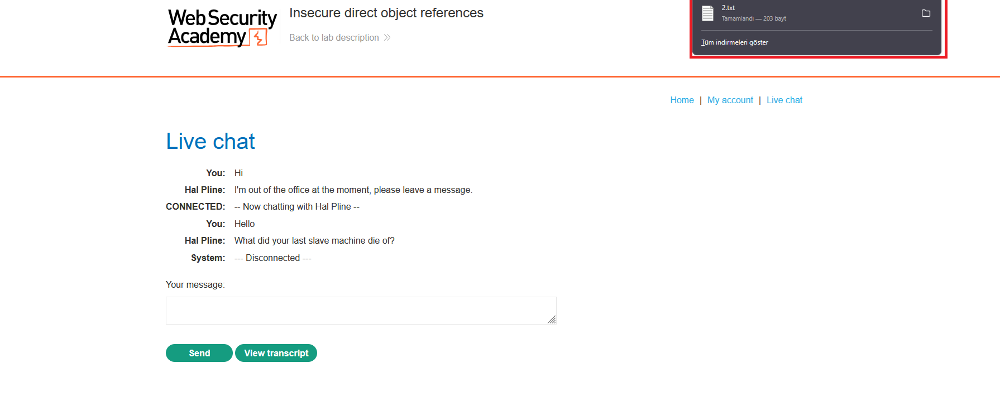
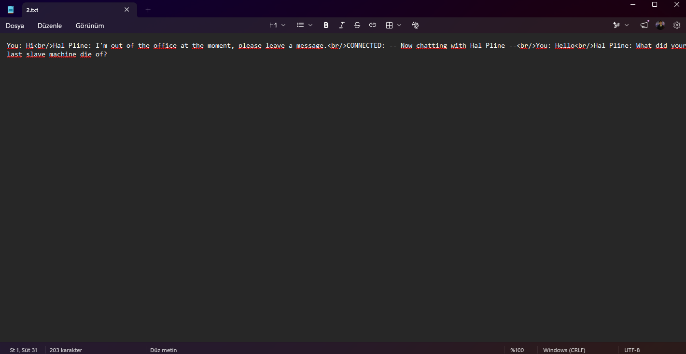
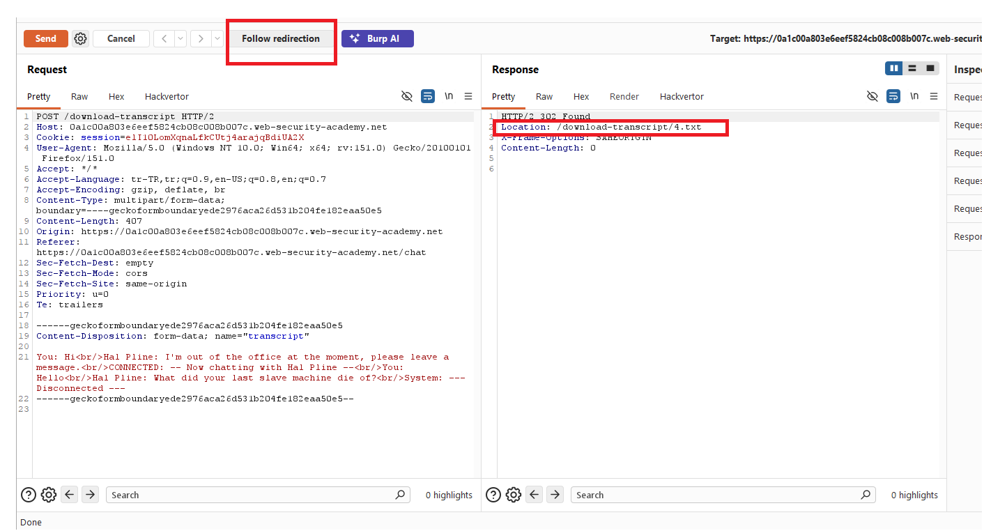
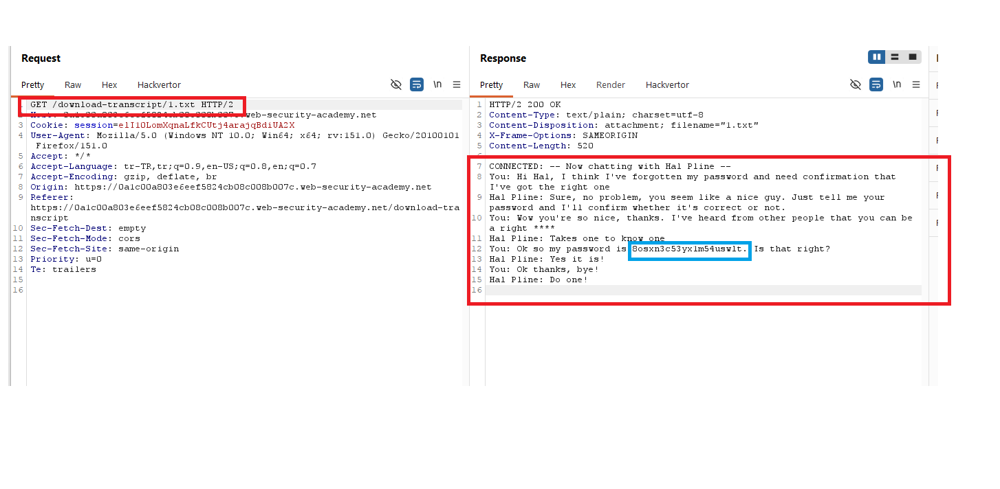
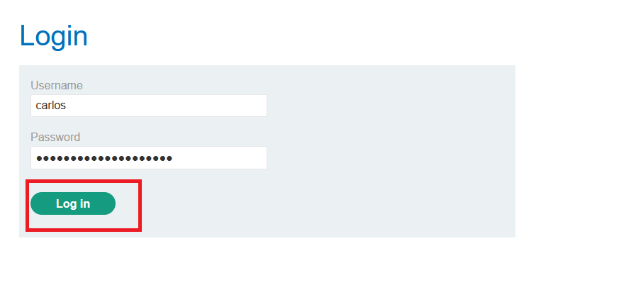
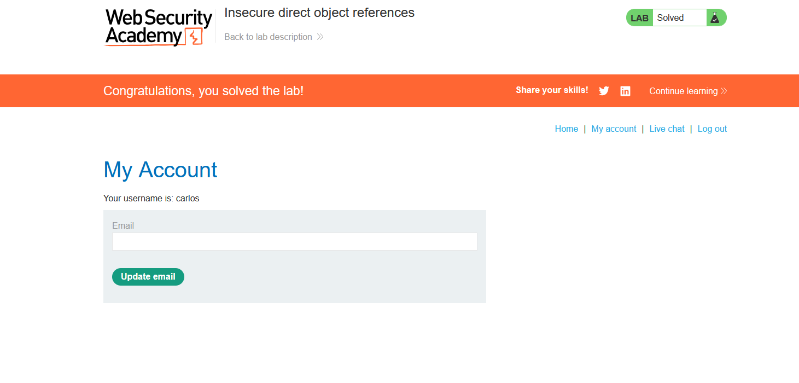

# Insecure direct object references

## 1. Lab Bilgisi

**Difficulty:** Apprentice

## 2. Vulnerability Özeti

Bu labda canlı destek konuşmalarının transcript dosyaları tahmin edilebilir dosya isimleriyle indiriliyor. Kendi transcript dosyam `2.txt` veya `4.txt` gibi bir isimle indirildi. Bu dosya adı değiştirilerek `/download-transcript/1.txt` istendiğinde başka bir kullanıcıya ait destek konuşması görüntülenebiliyor. Sızan transcript içinde Carlos'un parolası yer aldığı için Carlos hesabına giriş yapılabildi.

## 3. Kullanılan Bilgiler

**Hedef kullanıcı:** `carlos`

**Carlos password:** `8osxn3c53yxlm54uswlt`

**Zafiyetli endpoint:** `/download-transcript/{id}.txt`

**Erişilen dosya:** `/download-transcript/1.txt`

## 4. Exploitation Steps

1. Live chat sayfasında kısa bir konuşma başlattım ve `View transcript` butonuna tıkladım.



2. Transcript dosyasının indirildiğini gördüm. Dosya adı sıralı bir değer olarak geliyordu.



3. İndirilen transcript dosyasının kendi konuşmamı içerdiğini doğruladım.



4. Burp Suite üzerinden transcript indirme isteğini inceledim. Uygulama transcript dosyasını `/download-transcript/4.txt` gibi doğrudan dosya adıyla döndürüyordu.



5. Aynı endpoint'te dosya adını değiştirerek farklı transcript dosyalarını denedim.

```txt
/download-transcript/1.txt
```

6. `1.txt` dosyası başka bir kullanıcıya ait destek konuşmasını döndürdü. Bu konuşma içinde Carlos kullanıcısının parolası açık şekilde görünüyordu.

```txt
8osxn3c53yxlm54uswlt
```



7. Login sayfasında `carlos` kullanıcısı ve elde ettiğim parola ile giriş yaptım.



8. Carlos hesabına giriş yapılınca lab çözüldü.



## 5. Impact

Transcript dosyaları tahmin edilebilir ID veya dosya adıyla erişilebilir olduğu için kullanıcılar başka kullanıcıların destek konuşmalarını okuyabilir. Bu konuşmalarda parola, kişisel veri veya hesap bilgisi bulunuyorsa hesap ele geçirme ve veri sızıntısı oluşabilir.

## 6. Remediation

Dosya veya nesne erişimlerinde sadece tahmin edilmesi zor ID kullanmak yeterli değildir; her request'te kullanıcının ilgili nesneye erişim yetkisi server tarafında kontrol edilmelidir. Transcript dosyaları kullanıcı oturumuyla ilişkilendirilmeli ve başka kullanıcıya ait transcript istekleri `403 Forbidden` ile engellenmelidir. Ayrıca destek konuşmalarında parolaların açık şekilde paylaşılması ve saklanması engellenmelidir.
