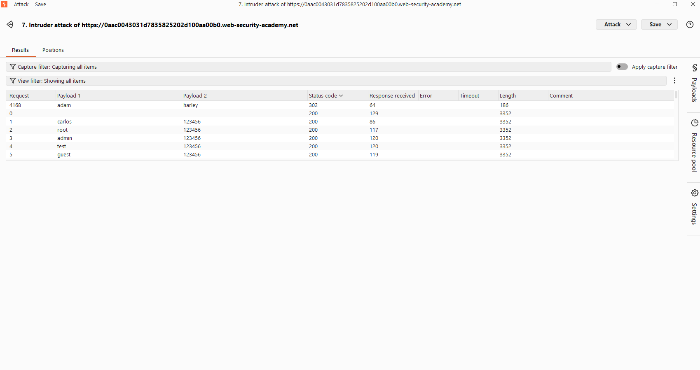
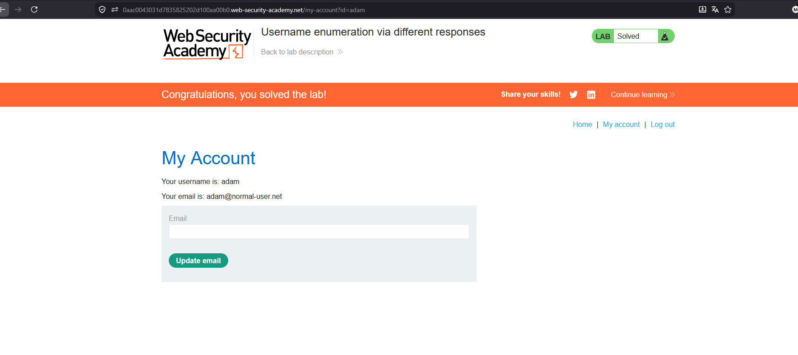

# Username enumeration via different responses

## 1. Lab Bilgisi

**Difficulty:** Apprentice

## 2. Vulnerability Özeti

Bu labda login formu, hatalı giriş denemelerinde kullanıcı adı ve parola durumuna göre farklı response davranışları döndürüyor. Burp Suite Intruder'da `Cluster bomb` attack kullanarak username ve password listelerini aynı anda denedim. Başarılı kombinasyon diğer denemelerden farklı olarak `302` status code döndürdü ve hesaba giriş yapılabildi.

## 3. Kullanılan Bilgiler

**Username wordlist:** PortSwigger candidate usernames

**Password wordlist:** PortSwigger candidate passwords

**Bulunan kullanıcı adı:** `adam`

**Bulunan parola:** `harley`

## 4. Exploitation Steps

1. Login sayfasında herhangi bir username ve password ile giriş denemesi yaptım. Giden login request'ini Burp Suite ile yakalayıp Intruder'a gönderdim.

2. Intruder'da `username` ve `password` parametrelerini payload position olarak işaretledim. Attack type olarak `Cluster bomb` seçtim.

3. Payload 1 alanına PortSwigger candidate usernames listesini, Payload 2 alanına ise candidate passwords listesini ekledim.

4. Attack sonucunda `adam:harley` kombinasyonunun diğer denemelerden farklı olarak `302` status code döndürdüğünü gördüm. Diğer başarısız denemeler `200` dönerken bu isteğin redirect alması login işleminin başarılı olduğunu gösterdi.

5. Bulunan `adam:harley` bilgileriyle giriş yapınca `/my-account` sayfasına yönlendirildim ve lab çözüldü.

## 5. Impact

Uygulama farklı hata mesajları veya farklı response davranışları döndürdüğü için saldırgan geçerli kullanıcı adlarını tespit edebilir. Bu bilgi parola brute-force saldırılarıyla birleştirildiğinde kullanıcı hesabı ele geçirilebilir.

## 6. Remediation

Login formunda geçersiz kullanıcı adı ve hatalı parola için aynı genel hata mesajı döndürülmelidir. Ayrıca brute-force saldırılarını azaltmak için rate limiting, account lockout, IP bazlı kısıtlama ve güçlü parola politikaları uygulanmalıdır.
