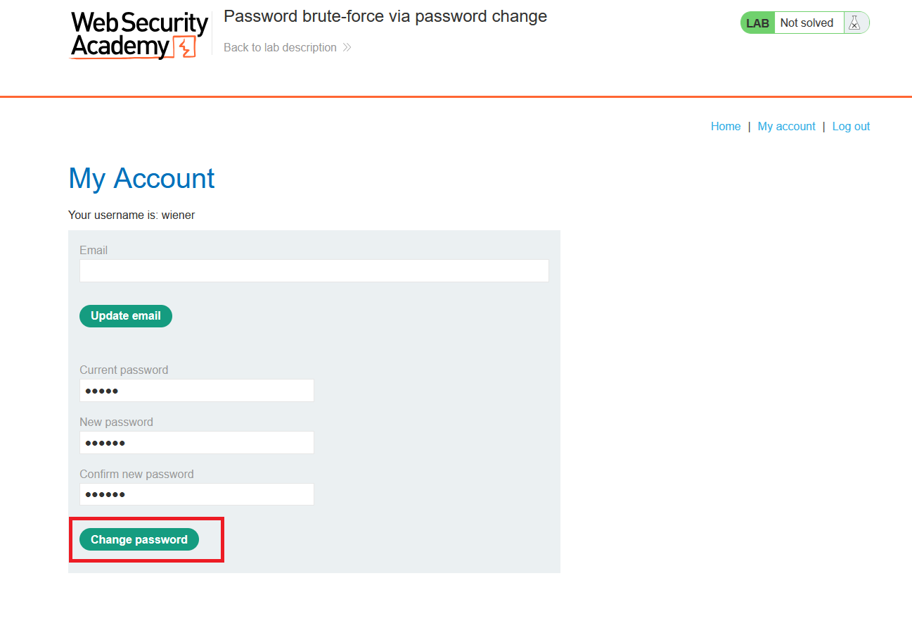
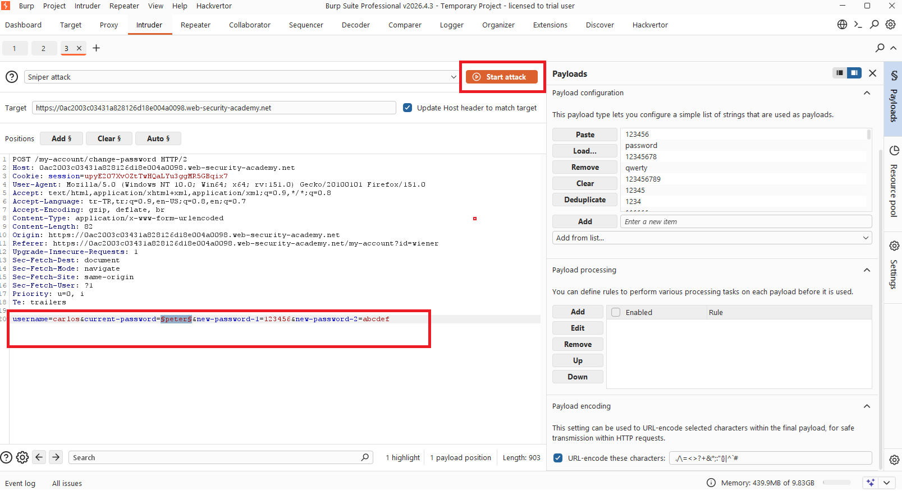
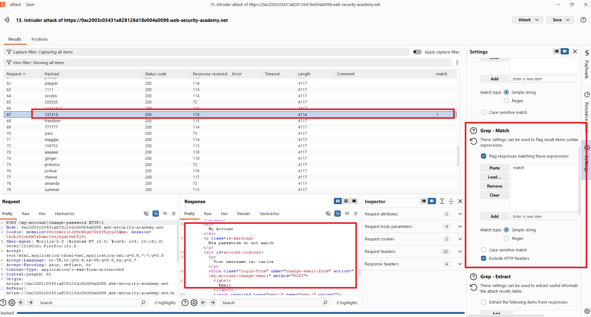
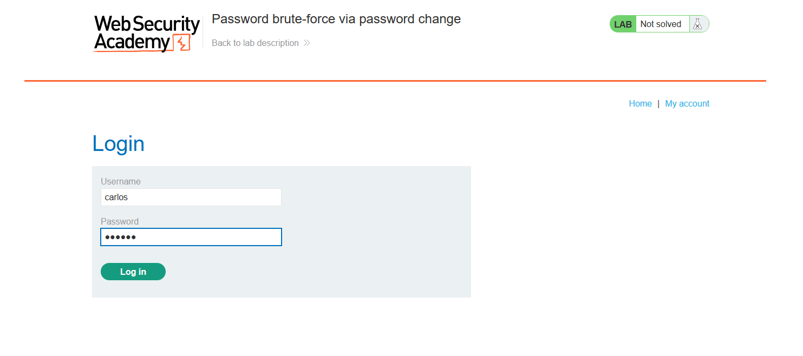
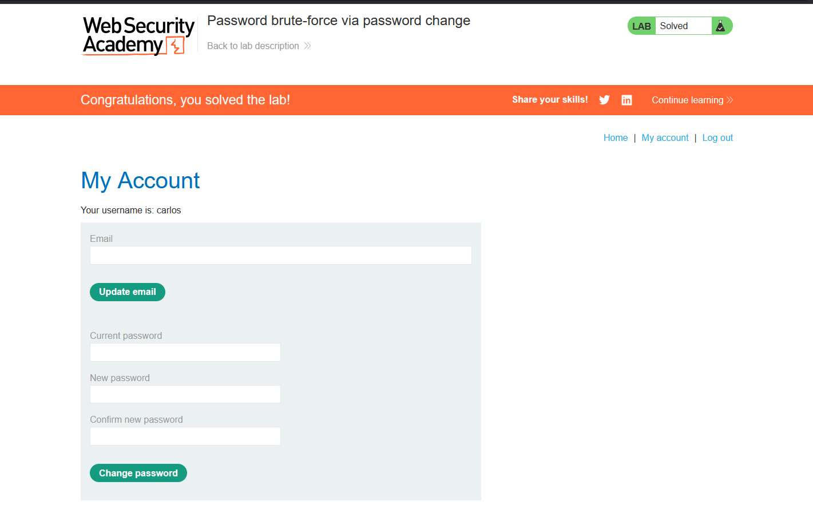

# Password brute-force via password change

## 1. Lab Bilgisi

**Difficulty:** Practitioner

## 2. Vulnerability Özeti

Bu labda uygulamanın parola değiştirme fonksiyonu hatalı tasarlanmış. Kullanıcı login olduktan sonra parola değiştirme request'i içinde `username` parametresi client tarafından gönderiliyor ve uygulama bu değere güveniyor. Ayrıca mevcut parola doğru girildiğinde, yeni parola alanları birbiriyle eşleşmiyorsa farklı bir hata mesajı dönüyor. Bu davranış sayesinde saldırgan, kendi hesabıyla oturum açmışken `username` değerini hedef kullanıcıya çevirip mevcut parola alanını brute-force edebiliyor.

## 3. Kullanılan Bilgiler

**Kendi kullanıcı bilgilerimiz:** `wiener:peter`

**Hedef kullanıcı:** `carlos`

**Brute-force edilen parametre:** `current-password`

**Ayırt edici response:** `New passwords do not match`

**Bulunan parola:** `131313`

**Kullanılan teknik:** Password change fonksiyonu üzerinden brute-force

## 4. Exploitation Steps

1. İlk olarak kendi kullanıcımız olan `wiener:peter` ile login oldum ve `/my-account` sayfasındaki parola değiştirme formunu inceledim. Formda mevcut parola, yeni parola ve yeni parola tekrar alanları bulunuyordu.



2. Parola değiştirme request'ini Burp Intruder'a gönderdim. Request body içinde `username=wiener` değeri bulunuyordu. Bu değeri `username=carlos` olarak değiştirdim. `current-password` parametresini payload position olarak işaretledim. Yeni parola alanlarını ise bilerek farklı verdim:

```http
username=carlos&current-password=§peter§&new-password-1=123456&new-password-2=abcdef
```



3. Payload olarak PortSwigger candidate passwords listesini kullandım. Mantık şu şekildeydi: Eğer `current-password` yanlışsa uygulama mevcut parolanın hatalı olduğunu söyleyecekti. Eğer `current-password` doğruysa bu sefer yeni parola alanları farklı olduğu için response içinde `New passwords do not match` mesajı dönecekti.

4. Intruder sonucunda `131313` payload'ının response içinde `New passwords do not match` mesajını döndürdüğünü gördüm. Bu farklı response, `carlos` kullanıcısının mevcut parolasının `131313` olduğunu gösterdi.



5. Bulduğum `carlos:131313` bilgileriyle login sayfasından giriş yaptım.



6. `carlos` hesabına başarılı şekilde erişince lab çözüldü.



## 5. Impact

Parola değiştirme fonksiyonu `username` gibi kritik bir değeri client tarafından gelen parametreden aldığı için saldırgan kendi oturumuyla başka kullanıcılar adına parola kontrolü yapabilir. Response mesajlarındaki fark da doğru mevcut parolanın tespit edilmesini sağlar. Bu durum hedef kullanıcının parolasının brute-force ile bulunmasına ve hesabın ele geçirilmesine yol açabilir.

## 6. Remediation

Parola değiştirme işlemlerinde kullanıcı kimliği request içindeki `username` parametresinden değil, server-side oturum bilgisinden alınmalıdır. Kullanıcı yalnızca kendi hesabının parolasını değiştirebilmelidir. Mevcut parola hatalı olduğunda veya yeni parola alanları eşleşmediğinde dönen hata mesajları saldırgana parola doğrulama oracle'ı oluşturmayacak şekilde tasarlanmalıdır. Ayrıca parola değiştirme endpoint'leri için rate limiting, yeniden kimlik doğrulama, MFA ve şüpheli denemelere karşı izleme mekanizmaları uygulanmalıdır.
