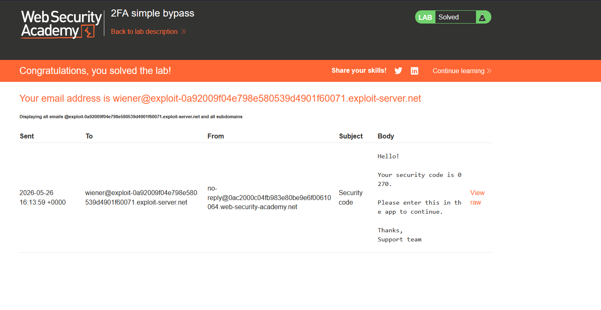
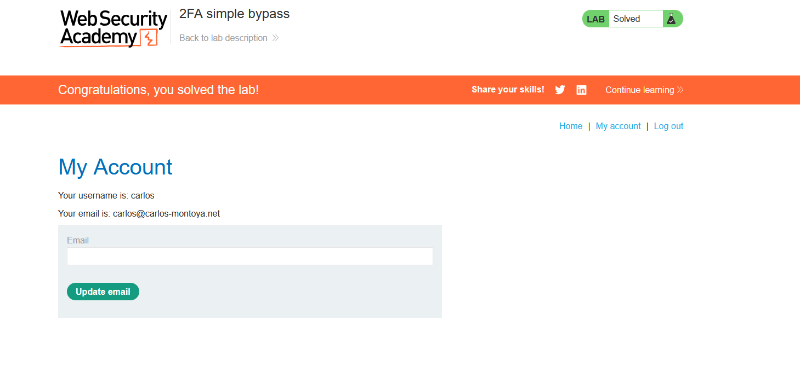

# 2FA simple bypass

## 1. Lab Bilgisi

**Difficulty:** Apprentice

## 2. Vulnerability Özeti

Bu labda uygulama, kullanıcı adı ve parola doğrulandıktan sonra 2FA kodu istiyor. Ancak 2FA adımı backend tarafında zorunlu olarak kontrol edilmediği için, parola doğrulamasından sonra direkt `/my-account` endpoint'ine gidilerek 2FA ekranı bypass edilebiliyor.

## 3. Kullanılan Bilgiler

**Kendi kullanıcı bilgilerimiz:** `wiener:peter`

**Hedef kullanıcı bilgileri:** `carlos:montoya`

## 4. Exploitation Steps

1. Önce kendi hesabımla login olup uygulamanın 2FA akışını inceledim. Login işleminden sonra mail adresine security code gönderildiğini gördüm.

2. Daha sonra hedef kullanıcı bilgileri olan `carlos:montoya` ile login oldum.

3. Uygulama 2FA kodu istediği ekrana yönlendirdi. Bu noktada kodu bilmediğim için 2FA formunu doldurmak yerine URL'i direkt `/my-account` olarak değiştirdim.

4. Uygulama 2FA kontrolünü zorunlu tutmadığı için `carlos` kullanıcısının hesap sayfasına erişebildim ve lab çözüldü.

## 5. Impact

Saldırgan hedef kullanıcının username ve password bilgisini ele geçirirse, ikinci faktör kodunu bilmeden hesaba erişebilir. Bu durumda 2FA mekanizması hesap güvenliği sağlamaz hale gelir.

## 6. Remediation

2FA doğrulaması tamamlanmadan kullanıcıya authenticated session verilmemelidir. Backend tarafında her hassas endpoint için kullanıcının 2FA aşamasını başarıyla geçtiği kontrol edilmelidir. Sadece frontend yönlendirmesine güvenilmemeli, `/my-account` gibi sayfalarda server-side authorization kontrolü yapılmalıdır.
