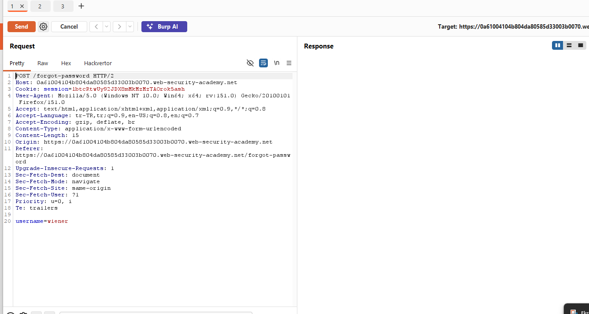
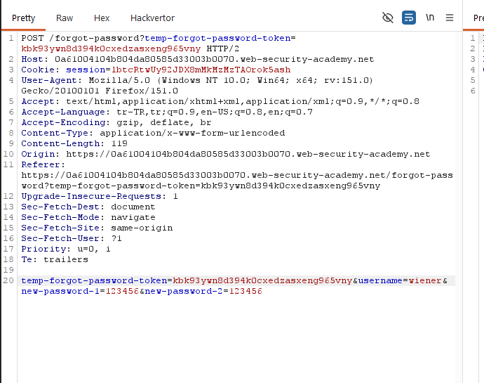
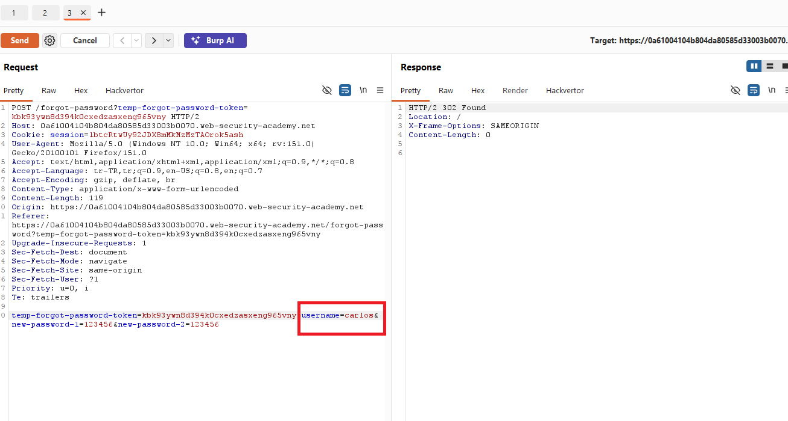
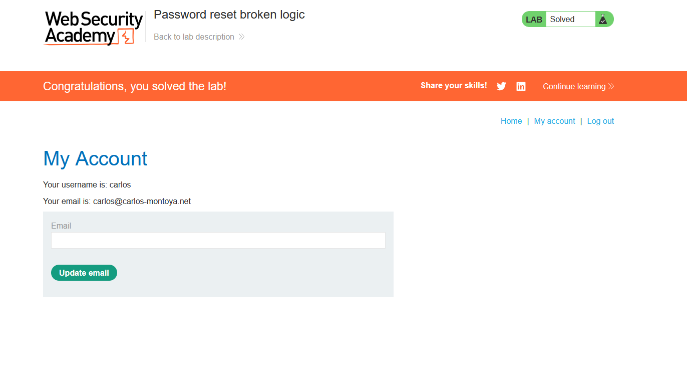

# Password reset broken logic

## 1. Lab Bilgisi

**Difficulty:** Apprentice

## 2. Vulnerability Özeti

Bu labda password reset akışında üretilen token doğru şekilde kullanıcı hesabına bağlanmıyor. Reset linki kendi hesabım için oluşturulmasına rağmen, parola değiştirme isteğinde gönderilen `username` parametresi değiştirilerek farklı bir kullanıcının parolası sıfırlanabiliyor.

## 3. Kullanılan Bilgiler

**Kendi kullanıcı bilgilerimiz:** `wiener:peter`

**Hedef kullanıcı:** `carlos`

**Yeni parola:** `123456`

## 4. Exploitation Steps

1. Önce `wiener` kullanıcısı için password reset isteği oluşturdum. Uygulama reset linkini email client'a gönderdi.

2. Email client üzerinden gelen reset linkine tıkladım ve yeni parola belirleme sayfasına gittim.

3. Yeni parola formunu doldurup isteği Burp Suite ile yakaladım. İstek içinde hem reset token hem de `username=wiener` parametresi gönderildiğini gördüm.

4. İstekteki `username` değerini `wiener` yerine `carlos` olarak değiştirdim ve yeni parolayı `123456` yaptım. Uygulama token'ın hangi kullanıcıya ait olduğunu kontrol etmek yerine request içindeki `username` parametresine güvendiği için `carlos` kullanıcısının parolası değiştirildi.

5. Daha sonra `carlos:123456` bilgileriyle login oldum ve lab çözüldü.

## 5. Impact

Saldırgan kendi hesabı için geçerli bir password reset token'ı alıp request içindeki kullanıcı adını değiştirerek başka kullanıcıların parolasını sıfırlayabilir. Bu durum hedef hesabın tamamen ele geçirilmesine yol açar.

## 6. Remediation

Password reset token'ları server tarafında tek bir kullanıcı hesabına bağlı tutulmalıdır. Parola değiştirme aşamasında hangi kullanıcının parolasının değiştirileceği client tarafından gönderilen `username` parametresine göre değil, token'ın server-side kaydına göre belirlenmelidir. Token tek kullanımlık olmalı, kısa süreli geçerli kalmalı ve başarılı kullanımdan sonra invalid edilmelidir.
