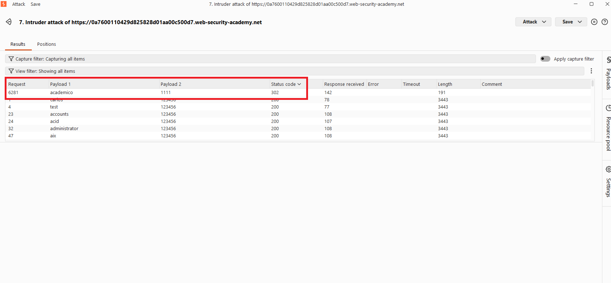
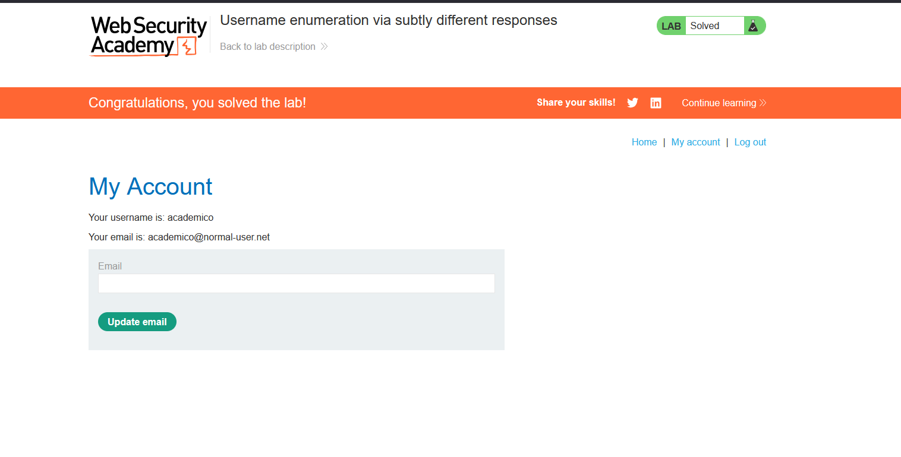

# Username enumeration via subtly different responses

## 1. Lab Bilgisi

**Difficulty:** Apprentice

## 2. Vulnerability Özeti

Bu labda login formu geçersiz kullanıcı adı ve hatalı parola durumlarında neredeyse aynı görünen response'lar döndürüyor. Ancak response'lardaki küçük farklar sayesinde doğru username-password kombinasyonu tespit edilebiliyor. Burp Suite Intruder'da `Cluster bomb` attack kullanarak kullanıcı adı ve parola listelerini aynı anda denedim.

## 3. Kullanılan Bilgiler

**Username wordlist:** PortSwigger candidate usernames

**Password wordlist:** PortSwigger candidate passwords

**Bulunan kullanıcı adı:** `academico`

**Bulunan parola:** `1111`

## 4. Exploitation Steps

1. Login sayfasında rastgele bir kullanıcı adı ve parola ile giriş denemesi yaptım. Giden login request'ini Burp Suite ile yakalayıp Intruder'a gönderdim.

2. Intruder'da `username` ve `password` parametrelerini payload position olarak işaretledim. Attack type olarak `Cluster bomb` seçtim.

3. Payload 1 alanına PortSwigger candidate usernames listesini, Payload 2 alanına ise candidate passwords listesini ekledim.

4. Attack sonucunda `academico:1111` kombinasyonunun diğer denemelerden farklı olarak `302` status code döndürdüğünü gördüm. Diğer başarısız denemeler `200` dönerken bu isteğin redirect alması login işleminin başarılı olduğunu gösterdi.

5. Bulunan `academico:1111` bilgileriyle giriş yaptım ve `/my-account` sayfasına erişince lab çözüldü.

## 5. Impact

Uygulama hata mesajlarında çok küçük de olsa ayırt edilebilir farklar döndürdüğü için saldırgan geçerli kullanıcı adlarını enumerate edebilir. Bu bilgi parola brute-force saldırılarıyla birleştirildiğinde kullanıcı hesabı ele geçirilebilir.

## 6. Remediation

Login formunda geçersiz kullanıcı adı ve hatalı parola için tamamen aynı hata mesajı, aynı status code ve mümkün olduğunca benzer response süresi döndürülmelidir. Kullanıcı adı enumeration riskini azaltmak için rate limiting, brute-force koruması, hesap kilitleme politikaları ve güçlü parola kontrolleri uygulanmalıdır.
