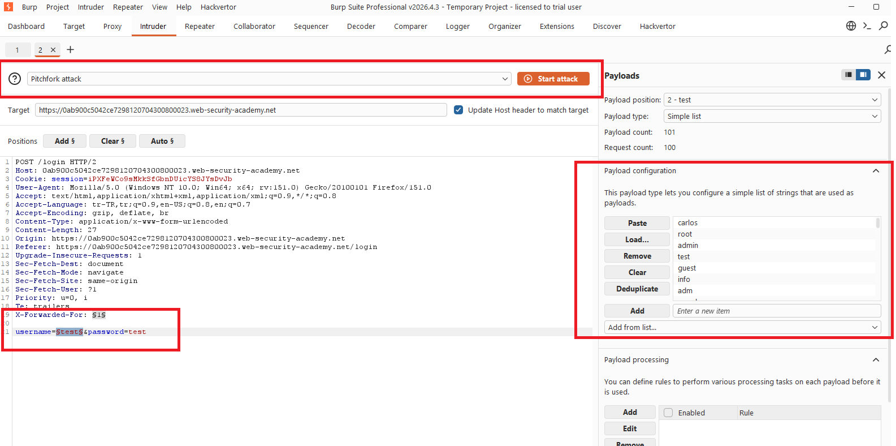
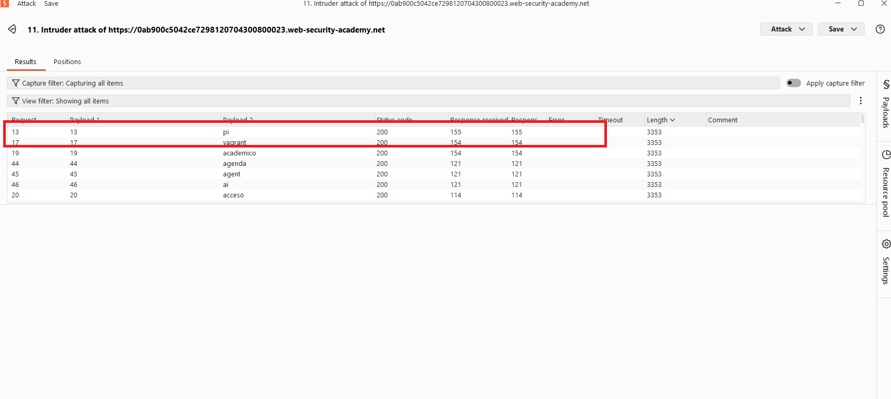
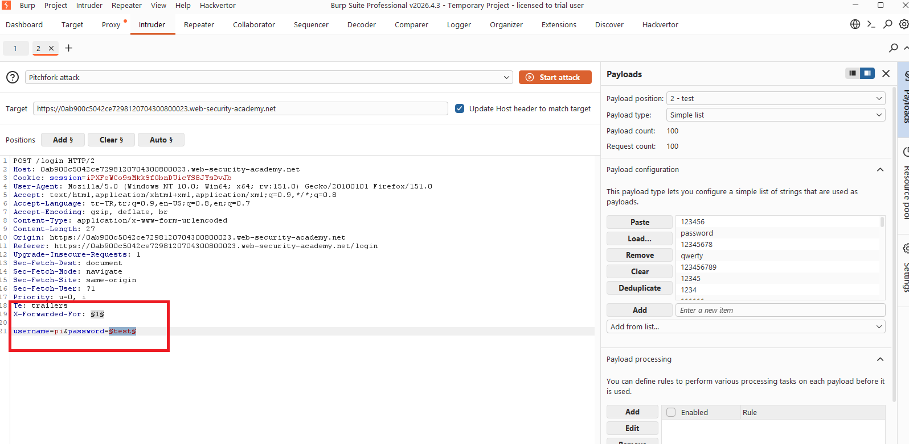
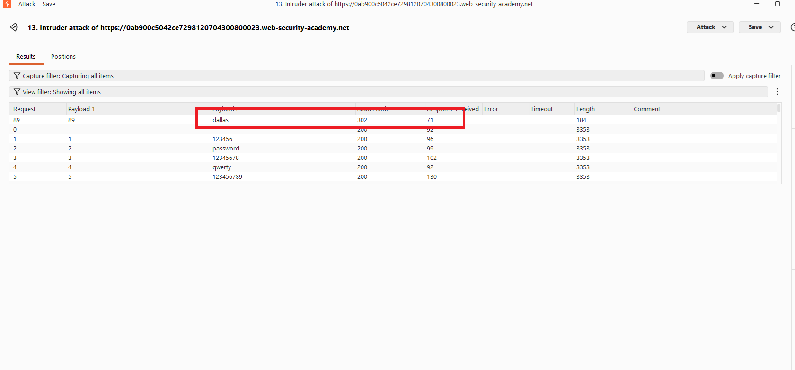
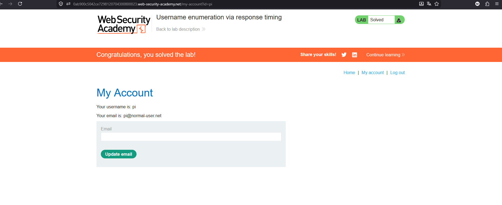

# Username enumeration via response timing

## 1. Lab Bilgisi

**Difficulty:** Apprentice

## 2. Vulnerability Özeti

Bu labda login formu, geçersiz kullanıcı adı ve hatalı parola denemelerinde görünürde benzer response'lar döndürse de response süreleri üzerinden geçerli kullanıcı adı tespit edilebiliyor. Geçerli bir kullanıcı adı gönderildiğinde uygulama parola kontrolü için daha fazla işlem yaptığı için response süresi diğer denemelere göre uzuyor. Ayrıca brute-force korumasını aşmak için `X-Forwarded-For` header'ı değiştirilerek her isteğin farklı IP'den geliyormuş gibi görünmesi sağlanabiliyor.

## 3. Kullanılan Bilgiler

**Username wordlist:** PortSwigger candidate usernames

**Password wordlist:** PortSwigger candidate passwords

**Eklenen header:** `X-Forwarded-For`

**Bulunan kullanıcı adı:** `pi`

**Bulunan parola:** `dallas`

## 4. Exploitation Steps

1. Login sayfasında rastgele bir kullanıcı adı ve parola ile giriş denemesi yaptım. Giden `POST /login` request'ini Burp Suite ile yakalayıp Intruder'a gönderdim.

2. IP bazlı brute-force korumasına takılmamak için request'e `X-Forwarded-For` header'ı ekledim. Intruder'da `X-Forwarded-For` değeri ve `username` parametresini payload position olarak işaretledim. Attack type olarak `Pitchfork` seçtim.

3. Payload 1 alanına her denemede değişecek sayısal değerleri, Payload 2 alanına ise PortSwigger candidate usernames listesini ekledim. Password alanını sabit tuttum.

4. Attack sonucunda response sürelerini karşılaştırdım. Diğer kullanıcı adlarına göre daha uzun response süresi döndüren `pi` kullanıcısının geçerli kullanıcı adı olduğunu tespit ettim.

5. Geçerli kullanıcı adı olarak `pi` değerini sabitledim. Bu kez `X-Forwarded-For` header'ı ve `password` parametresini payload position olarak işaretledim. Payload 1 için yine değişen IP değerleri, Payload 2 için candidate passwords listesini kullandım.

6. Password brute-force sonucunda `dallas` parolasının diğer denemelerden farklı olarak `302` status code döndürdüğünü gördüm. Bu redirect, login işleminin başarılı olduğunu gösterdi.

7. Bulunan `pi:dallas` bilgileriyle giriş yaptım ve `/my-account` sayfasına erişince lab çözüldü.

## 5. Impact

Uygulama response sürelerinde ayırt edilebilir farklar oluşturduğu için saldırgan geçerli kullanıcı adlarını enumerate edebilir. Bu bilgi parola brute-force saldırılarıyla birleştirildiğinde kullanıcı hesabı ele geçirilebilir. `X-Forwarded-For` gibi client tarafından kontrol edilebilen header'lara güvenilmesi de rate limiting veya lockout mekanizmalarının aşılmasına neden olabilir.

## 6. Remediation

Login akışında geçersiz kullanıcı adı ve hatalı parola durumları için aynı genel hata mesajı, aynı status code ve mümkün olduğunca benzer response süresi döndürülmelidir. Parola doğrulama süreci timing farkı oluşturmayacak şekilde tasarlanmalı, kullanıcı adı kontrolü erken dönüşlerle ayırt edilebilir hale getirilmemelidir. Rate limiting ve brute-force korumaları client tarafından değiştirilebilen `X-Forwarded-For` header'ına doğrudan güvenmemeli; güvenilir proxy zinciri ve server-side IP doğrulaması kullanılmalıdır.
