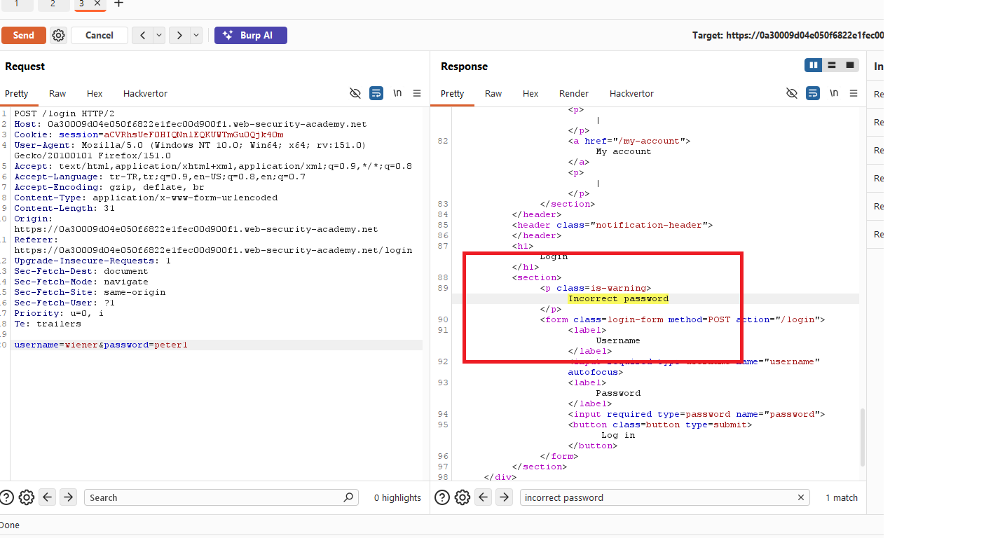
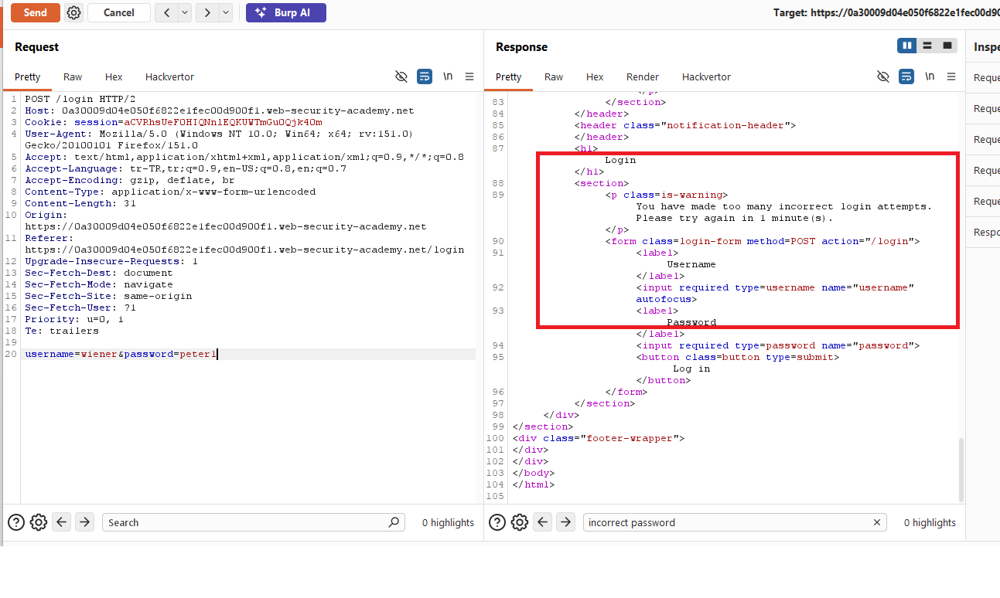
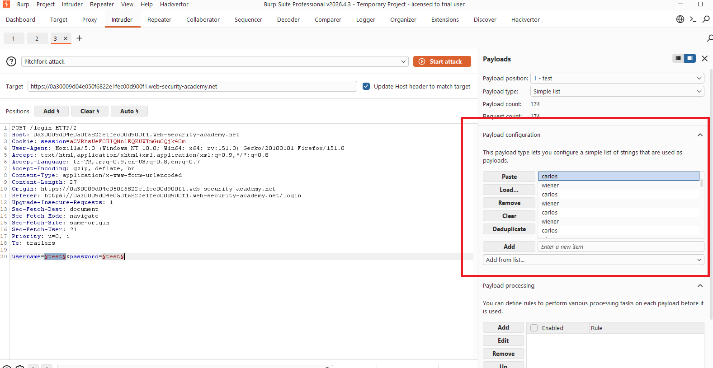
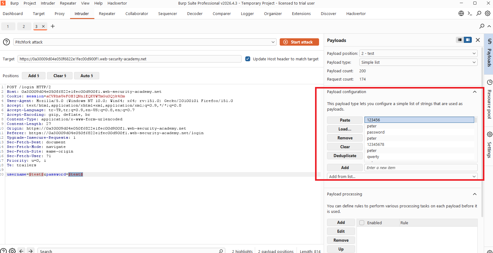
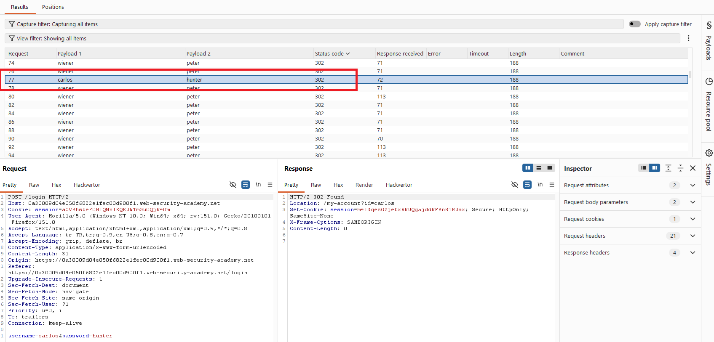
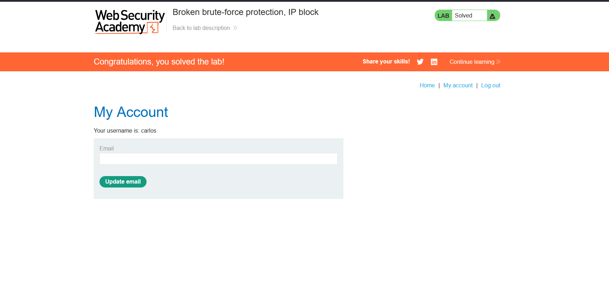

# Broken brute-force protection, IP block

## 1. Lab Bilgisi

**Difficulty:** Practitioner

## 2. Vulnerability Özeti

Bu labda uygulama belirli sayıda hatalı login denemesinden sonra IP adresini geçici olarak blokluyor. Ancak aynı IP üzerinden başarılı bir login yapıldığında hatalı deneme sayacı sıfırlanıyor. Bu nedenle saldırgan, kendi geçerli hesabıyla düzenli aralıklarla başarılı giriş yaparak IP block mekanizmasını bypass edebilir ve hedef kullanıcının parolasını brute-force edebilir.

## 3. Kullanılan Bilgiler

**Kendi kullanıcı bilgilerimiz:** `wiener:peter`

**Hedef kullanıcı:** `carlos`

**Password wordlist:** PortSwigger candidate passwords

**Bulunan parola:** `hunter`

## 4. Exploitation Steps

1. İlk olarak `wiener` kullanıcısı için yanlış parola denemeleri yaptım. Birkaç hatalı denemeden sonra uygulamanın `You have made too many incorrect login attempts. Please try again in 1 minute(s).` mesajı döndürerek IP adresini geçici olarak blokladığını gördüm.

2. Daha sonra geçerli kullanıcı bilgilerimiz olan `wiener:peter` ile başarılı login denemesi yapıldığında bu bloklama sayacının sıfırlanabildiğini test ettim. Bu davranış, brute-force denemeleri arasına başarılı giriş istekleri eklenerek IP block kontrolünün aşılabileceğini gösterdi.

3. Login request'ini Burp Suite Intruder'a gönderdim. `username` ve `password` parametrelerini payload position olarak işaretledim. Attack type olarak `Pitchfork` seçtim.

4. Payload 1 alanında hedef kullanıcı `carlos` denemeleri arasına düzenli olarak `wiener` kullanıcısını ekledim. Böylece belirli sayıda hatalı `carlos` denemesinden sonra `wiener:peter` ile başarılı login yapılarak hata sayacının sıfırlanması sağlandı.

5. Payload 2 alanında PortSwigger candidate passwords listesini kullandım ve aynı aralıklara `peter` parolasını ekledim. Bu sayede `wiener` satırları her zaman doğru parola ile eşleşti.

6. Attack sonucunda çoğu başarılı `wiener:peter` denemesi `302` status code döndürürken, `carlos:hunter` kombinasyonunun da `302` status code döndürdüğünü gördüm. Response header'ındaki `Location: /my-account?id=carlos` değeri login işleminin hedef kullanıcı için başarılı olduğunu doğruladı.

7. Bulunan `carlos:hunter` bilgileriyle giriş yaptım ve `/my-account` sayfasına erişince lab çözüldü.

## 5. Impact

IP bazlı brute-force koruması başarılı login sonrası sıfırlandığı için saldırgan kendi geçerli hesabını kullanarak korumayı aşabilir. Bu durum hedef kullanıcıların parolalarının brute-force ile bulunmasına ve hesapların ele geçirilmesine yol açabilir.

## 6. Remediation

Brute-force koruması yalnızca IP bazlı uygulanmamalıdır. Hatalı login denemeleri kullanıcı hesabı, IP adresi, cihaz/parmak izi ve oturum gibi birden fazla sinyale göre takip edilmelidir. Başarılı bir login denemesi, aynı IP'den yapılan önceki hatalı denemeleri tamamen sıfırlamamalıdır. Ayrıca rate limiting, kademeli gecikme, hesap bazlı lockout, MFA ve şüpheli denemeler için izleme/alert mekanizmaları uygulanmalıdır.
