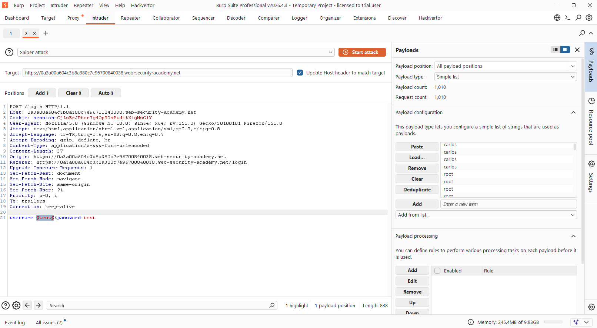
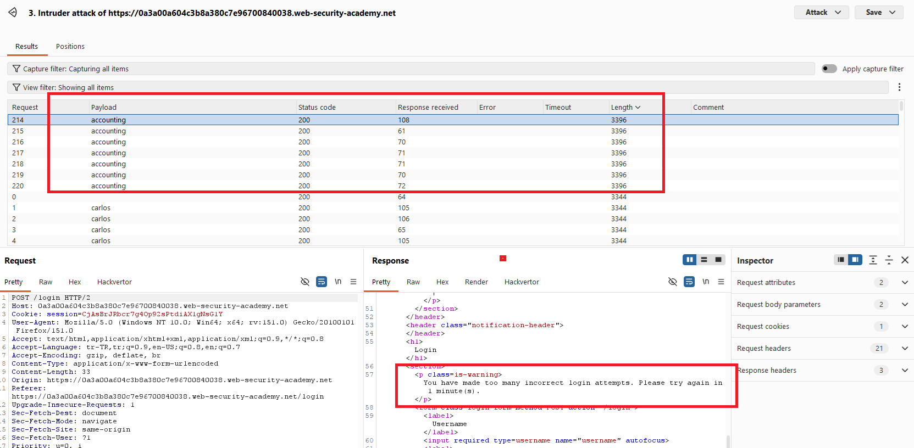
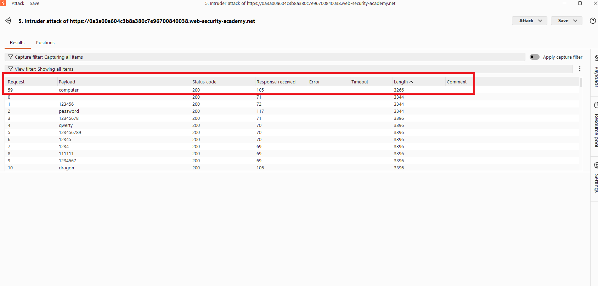
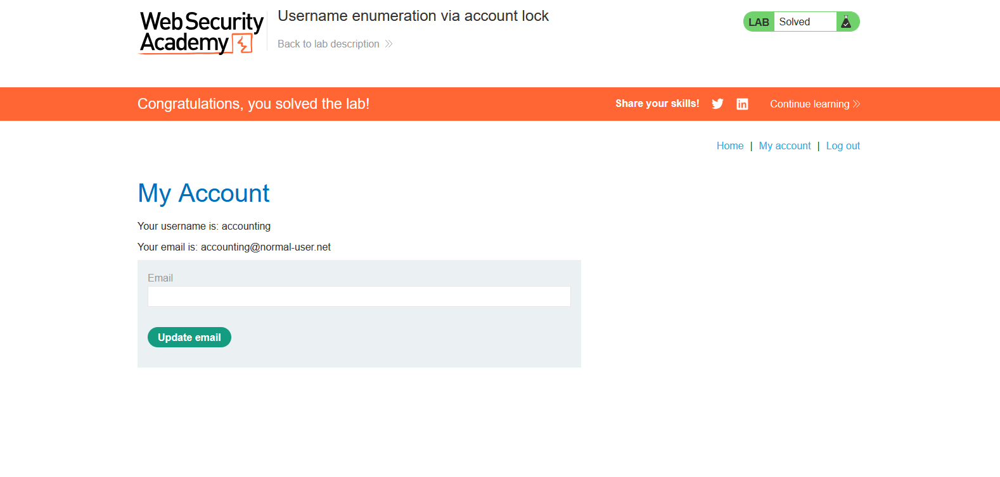

# Username enumeration via account lock

## 1. Lab Bilgisi

**Difficulty:** Practitioner

## 2. Vulnerability Özeti

Bu labda uygulama, geçerli bir kullanıcı adı için belirli sayıda hatalı parola denemesinden sonra hesabı geçici olarak kilitliyor. Geçersiz kullanıcı adlarında ise aynı kilitleme davranışı oluşmuyor. Bu farklı davranış, saldırganın kullanıcı adlarını enumerate etmesine imkan veriyor. Geçerli kullanıcı adı belirlendikten sonra parola brute-force edilerek hesaba erişilebiliyor.

## 3. Kullanılan Bilgiler

**Username wordlist:** PortSwigger candidate usernames

**Password wordlist:** PortSwigger candidate passwords

**Bulunan kullanıcı adı:** `accounting`

**Bulunan parola:** `computer`

## 4. Exploitation Steps

1. Login sayfasında rastgele bir kullanıcı adı ve parola ile giriş denemesi yaptım. Giden `POST /login` request'ini Burp Suite ile yakalayıp Intruder'a gönderdim.

2. İlk aşamada `username` parametresini payload position olarak işaretledim ve attack type olarak `Sniper` seçtim. `password` değerini sabit tuttum. Her kullanıcı adını birden fazla kez denemek için username listesindeki değerleri tekrar edecek şekilde payload listesine ekledim.

3. Attack sonucunda response'ları inceledim. Geçersiz kullanıcı adlarında normal hata response'u dönerken, `accounting` kullanıcısı için birkaç hatalı denemeden sonra `You have made too many incorrect login attempts. Please try again in 1 minute(s).` mesajı döndü. Bu farklılık, `accounting` kullanıcısının geçerli olduğunu gösterdi.

4. Geçerli kullanıcı adını bulduktan sonra `username` değerini `accounting` olarak sabitledim. Bu kez `password` parametresini payload position olarak işaretledim ve PortSwigger candidate passwords listesini kullandım.

5. Password brute-force sonucunda response length değerlerini karşılaştırdım. `computer` payload'ının diğer denemelerden farklı response length döndürdüğünü gördüm. Bu farklılık, doğru parolanın `computer` olduğunu gösterdi.

6. Bulunan `accounting:computer` bilgileriyle giriş yaptım ve `/my-account` sayfasına erişince lab çözüldü.

## 5. Impact

Account lock mekanizması yalnızca geçerli kullanıcı adları için tetiklendiğinden, saldırgan bu davranış farkını kullanarak sistemde kayıtlı kullanıcı adlarını tespit edebilir. Geçerli kullanıcı adı elde edildikten sonra parola brute-force saldırıları daha hedefli hale gelir ve hesap ele geçirme riski artar.

## 6. Remediation

Login akışında geçerli ve geçersiz kullanıcı adları için ayırt edilebilir davranışlar oluşturulmamalıdır. Hata mesajları, status code'lar, response length değerleri ve account lock davranışı kullanıcı adının varlığını sızdırmayacak şekilde tutarlı olmalıdır. Brute-force koruması hesap bazlı kilitlemenin yanında IP, cihaz, oturum ve davranışsal sinyallerle desteklenmeli; kademeli gecikme, MFA ve şüpheli denemeler için izleme/alert mekanizmaları uygulanmalıdır.
