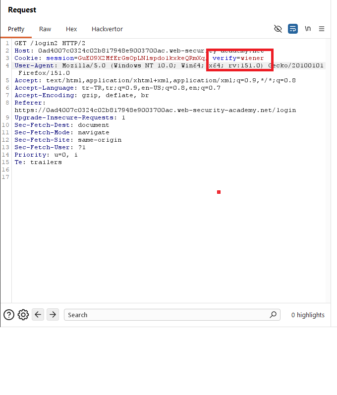
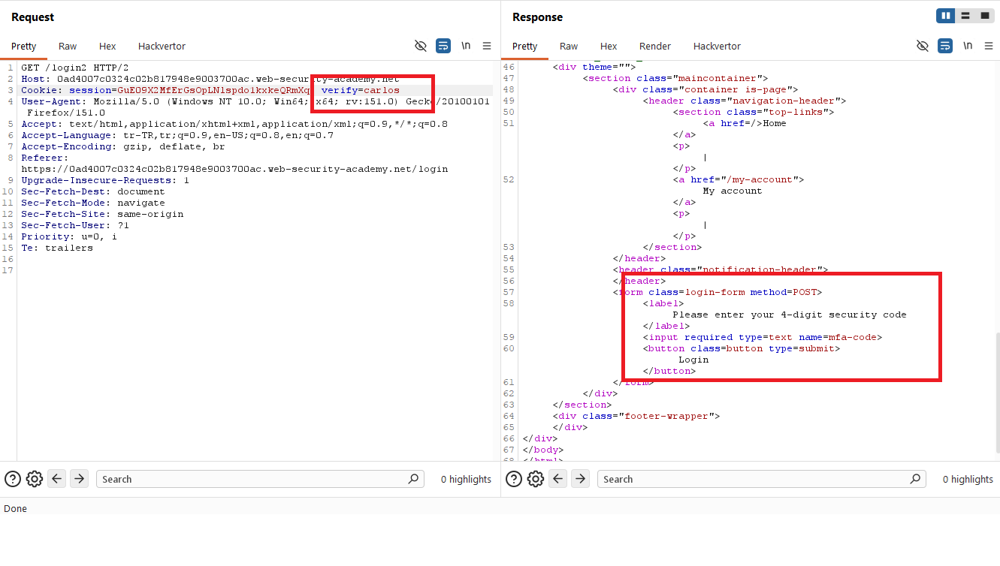
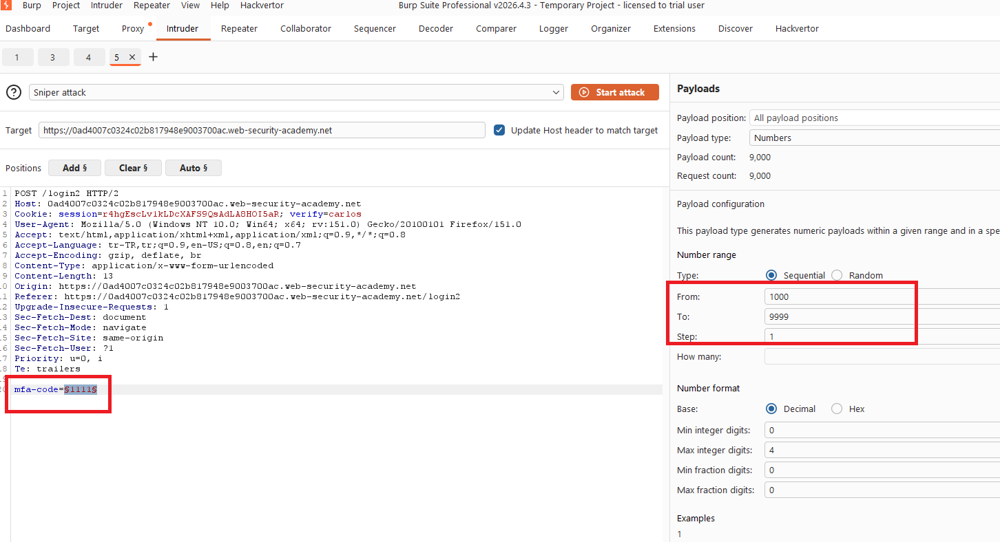
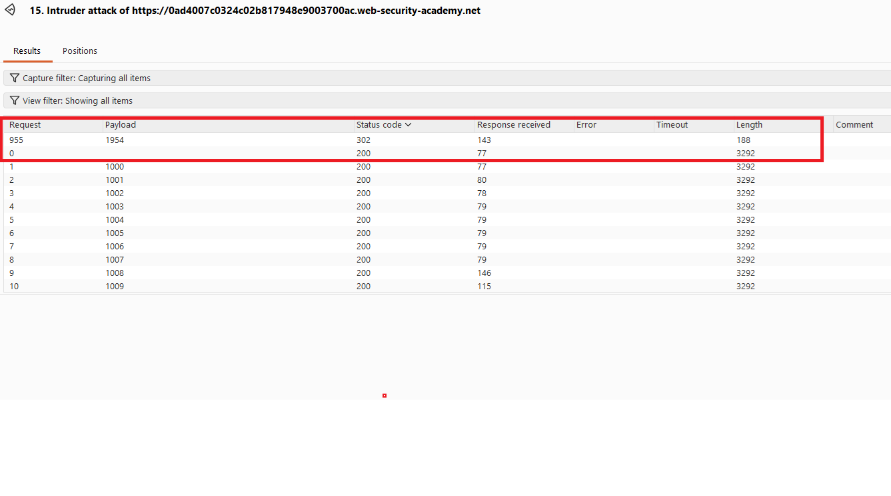
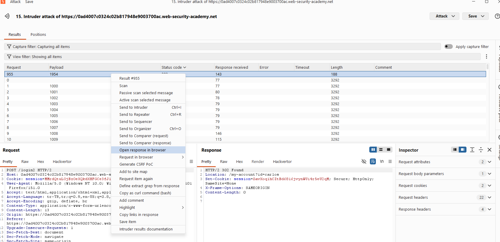
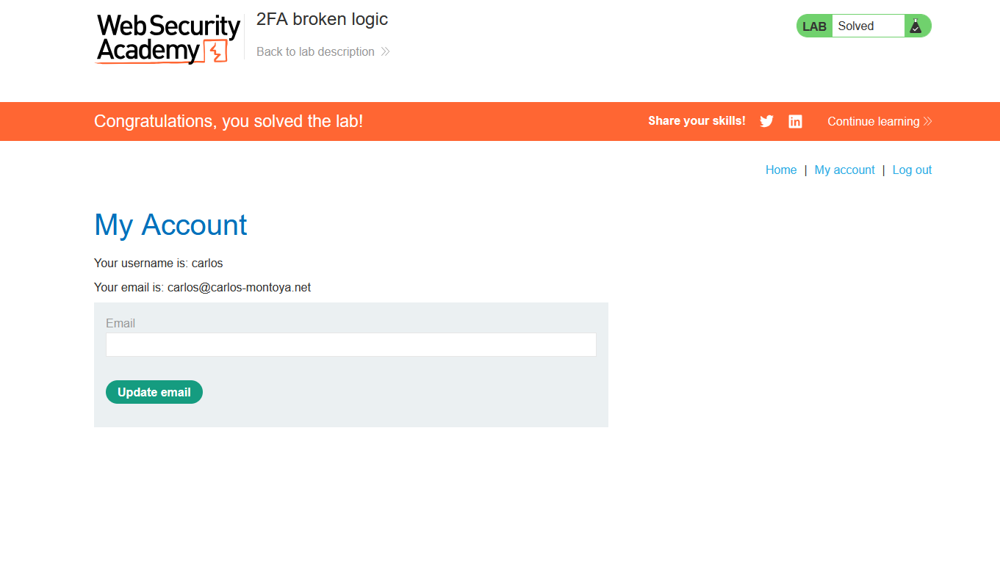

# 2FA broken logic

## 1. Lab Bilgisi

**Difficulty:** Apprentice

## 2. Vulnerability Özeti

Bu labda iki faktörlü doğrulama akışı, doğrulanacak kullanıcıyı server-side oturumdan güvenilir şekilde takip etmek yerine client tarafından kontrol edilebilen `verify` cookie değerine göre belirliyor. Bu nedenle saldırgan, kendi hesabıyla 2FA adımına geldikten sonra `verify` cookie değerini hedef kullanıcı adıyla değiştirerek hedef kullanıcı için MFA doğrulama sürecini başlatabiliyor. Ardından 4 haneli MFA kodu brute-force edilerek hedef hesaba erişilebiliyor.

## 3. Kullanılan Bilgiler

**Kendi kullanıcı bilgilerimiz:** `wiener:peter`

**Hedef kullanıcı:** `carlos`

**Manipüle edilen cookie:** `verify`

**Bulunan MFA kodu:** `1954`

## 4. Exploitation Steps

1. İlk olarak kendi kullanıcı bilgilerimiz olan `wiener:peter` ile login oldum ve uygulamanın `/login2` adresindeki 2FA doğrulama adımına yönlendirdiğini gördüm. Bu aşamada request içinde `verify=wiener` cookie değeri bulunuyordu.

2. `/login2` request'ini Burp Repeater'a gönderdim ve `verify` cookie değerini `wiener` yerine `carlos` olarak değiştirdim. Uygulama bu değeri kabul ederek hedef kullanıcı için 4 haneli security code isteyen 2FA formunu döndürdü.

3. 2FA formuna gönderilen `POST /login2` request'ini Burp Intruder'a gönderdim. Request'te `verify=carlos` cookie değerini korudum ve `mfa-code` parametresini payload position olarak işaretledim.

4. Payload type olarak `Numbers` seçtim. 4 haneli MFA kodunu brute-force etmek için payload aralığını `1000` - `9999` olarak ayarladım.

5. Attack sonucunda status code değerlerini karşılaştırdım. `1954` payload'ı diğer denemelerden farklı olarak `302` status code döndürdü. Response header'ındaki `Location: /my-account?id=carlos` değeri, hedef kullanıcı için login işleminin başarılı olduğunu doğruladı.

6. Başarılı sonucu browser'da açarak `carlos` kullanıcısının hesabına eriştim.

7. `/my-account` sayfasına erişince lab çözüldü.

## 5. Impact

2FA doğrulama sürecinde kullanıcı bağlamı client tarafından değiştirilebilen bir cookie değerine dayandığı için saldırgan hedef kullanıcı adına MFA doğrulaması başlatabilir. MFA kodu kısa ve brute-force edilebilir olduğunda bu zafiyet hesap ele geçirmeye yol açar. Bu durum, 2FA'nın beklenen güvenlik etkisini ortadan kaldırır.

## 6. Remediation

2FA akışında doğrulanacak kullanıcı bilgisi client tarafında taşınan ve değiştirilebilen değerlere güvenilerek belirlenmemelidir. Kullanıcı bağlamı server-side session içinde tutulmalı ve MFA kodu yalnızca o oturumla ilişkilendirilmelidir. MFA kodları yeterli entropiye sahip olmalı, kısa süre içinde geçersiz hale gelmeli ve hatalı denemeler için hesap/oturum bazlı rate limiting uygulanmalıdır. Ayrıca başarılı parola doğrulaması ile MFA doğrulaması arasındaki tüm adımlarda kullanıcı kimliği server tarafında tutarlı şekilde doğrulanmalıdır.
