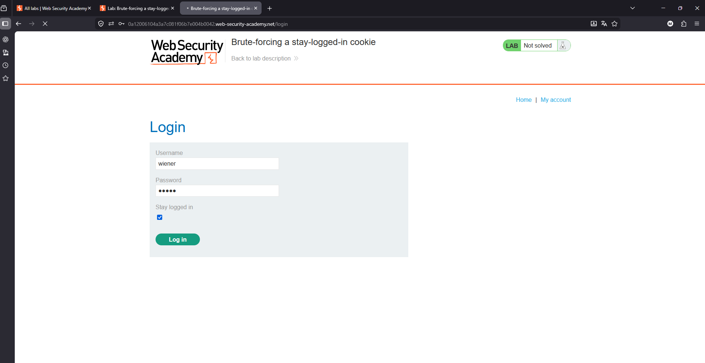
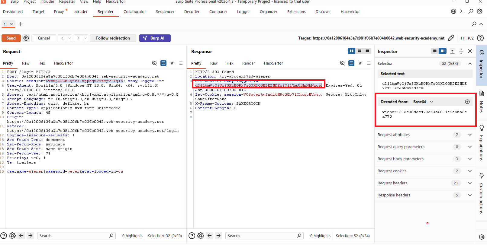
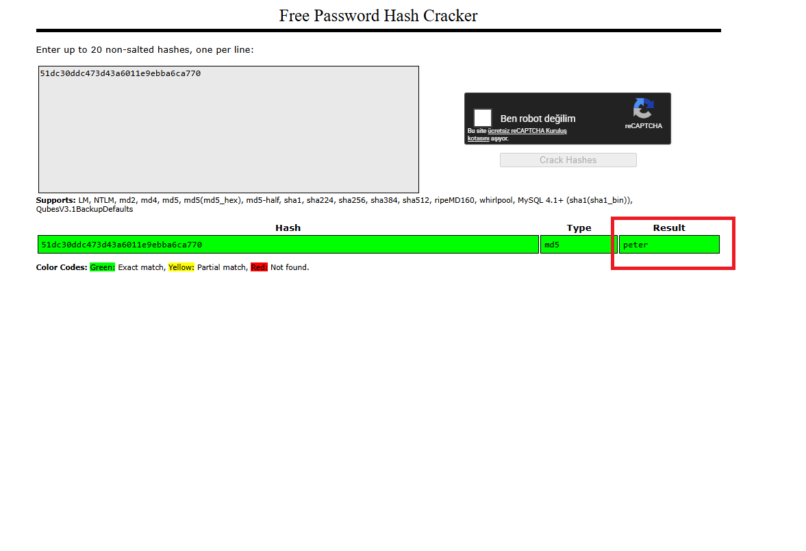
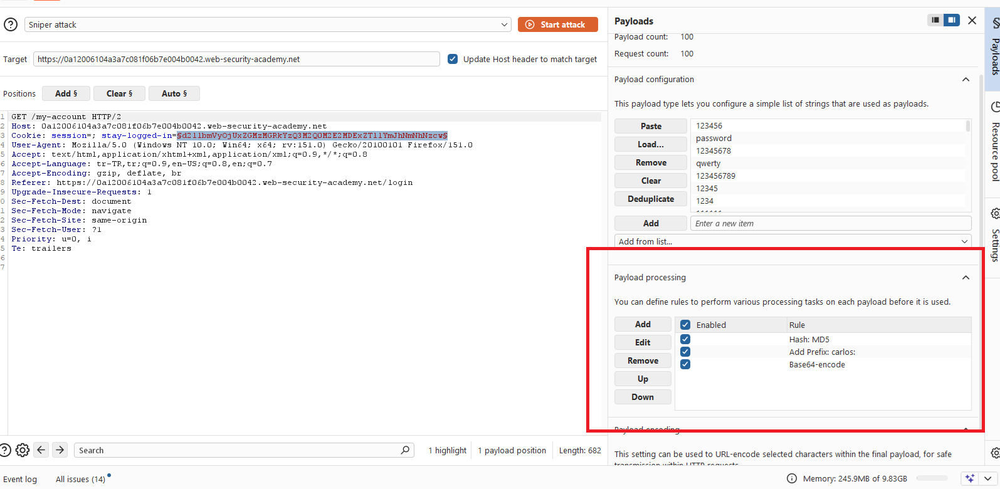
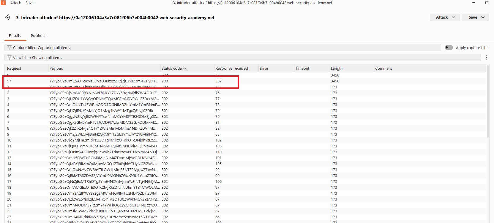
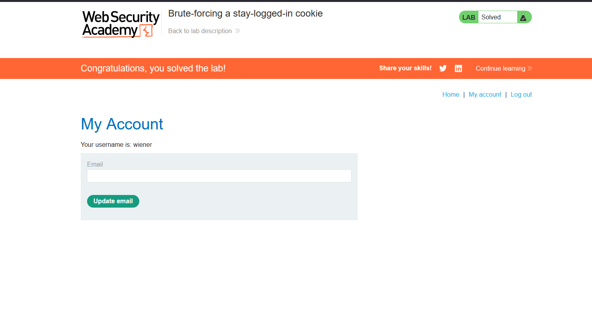

# Brute-forcing a stay-logged-in cookie

## 1. Lab Bilgisi

**Difficulty:** Practitioner

## 2. Vulnerability Özeti

Bu labda uygulamanın `stay-logged-in` cookie değeri güvenli şekilde üretilmiyor. Cookie değeri Base64 decode edildiğinde formatın `username:md5(password)` olduğu görülüyor. Parola hash'i salt kullanılmadan MD5 ile oluşturulduğu için saldırgan, hedef kullanıcı için parola wordlist'indeki değerleri aynı formatta cookie'ye dönüştürerek brute-force yapabiliyor.

## 3. Kullanılan Bilgiler

**Kendi kullanıcı bilgilerimiz:** `wiener:peter`

**Hedef kullanıcı:** `carlos`

**Brute-force edilen cookie:** `stay-logged-in`

**Cookie formatı:** `base64(username:md5(password))`

**Bulunan parola:** `112233`

## 4. Exploitation Steps

1. İlk olarak kendi kullanıcı bilgilerimiz olan `wiener:peter` ile login oldum. Login sırasında `Stay logged in` seçeneğini işaretleyerek uygulamanın kalıcı oturum cookie'si üretmesini sağladım.

2. Login request'ini Burp Repeater'da inceledim. Response içinde `stay-logged-in` cookie'sinin set edildiğini gördüm. Cookie değerini Base64 decode ettiğimde `wiener:51dc30ddc473d43a6011e9ebba6ca770` formatında olduğunu tespit ettim.

3. Decode edilen değerdeki hash kısmını kontrol ettim. `51dc30ddc473d43a6011e9ebba6ca770` MD5 hash'inin `peter` parolasına ait olduğunu gördüm. Bu sonuç, cookie yapısının `username:md5(password)` olduğunu doğruladı.

4. Hedef kullanıcı `carlos` için cookie brute-force etmek üzere `/my-account` request'ini Burp Intruder'a gönderdim. `stay-logged-in` cookie değerini payload position olarak işaretledim.

5. Payload olarak PortSwigger candidate passwords listesini kullandım. Payload processing kısmında her parola için sırasıyla şu işlemleri uyguladım:

   - Parolayı MD5 hash'e çevirme
   - Başına `carlos:` prefix'i ekleme
   - Son değeri Base64 encode etme

6. Attack sonucunda çoğu payload `302` status code ile login sayfasına yönlenirken bir payload `200` status code döndürdü. Bu farklı response, üretilen `stay-logged-in` cookie'sinin geçerli olduğunu ve `carlos` hesabına erişim sağladığını gösterdi. Başarılı payload `carlos:d0970714757783e6cf17b26fb8e2298f` değerinin Base64 encode edilmiş haliydi ve bu MD5 hash `112233` parolasına aitti.

7. Geçerli cookie ile `/my-account` sayfasına erişince lab çözüldü.

## 5. Impact

Kalıcı oturum cookie'si tahmin edilebilir bir formatta ve salt kullanılmadan MD5 hash ile üretildiği için saldırgan hedef kullanıcı adına geçerli cookie oluşturmayı deneyebilir. Parola zayıf veya wordlist içinde yer alıyorsa, saldırgan parolayı doğrudan bilmeden geçerli `stay-logged-in` cookie'si elde ederek hesaba erişebilir.

## 6. Remediation

Kalıcı oturum cookie'leri kullanıcı adı ve parola hash'i gibi tahmin edilebilir bilgilerden türetilmemelidir. Bunun yerine yeterli entropiye sahip, kriptografik olarak rastgele ve server-side doğrulanan token'lar kullanılmalıdır. Token'lar kullanıcıya ve cihaza bağlanmalı, süreli olmalı, logout veya parola değişimi gibi durumlarda geçersiz kılınmalıdır. Parolalar ise MD5 gibi hızlı ve zayıf algoritmalarla değil, salt içeren `bcrypt`, `scrypt` veya `Argon2` gibi parola saklama algoritmalarıyla korunmalıdır.
