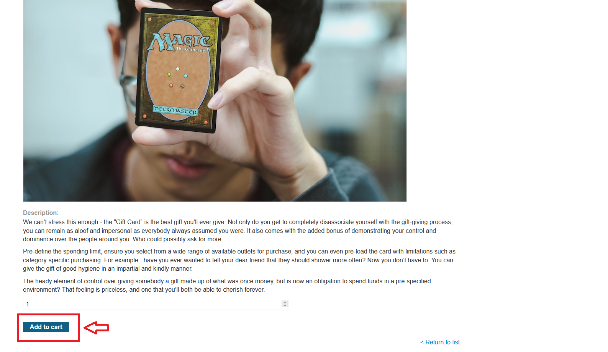
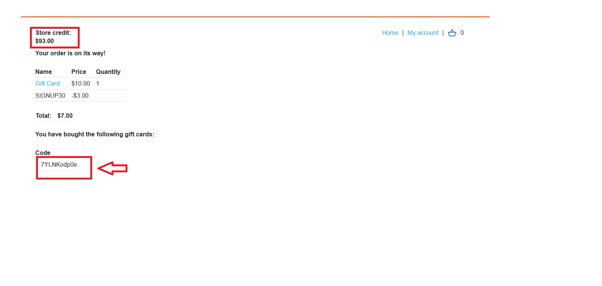
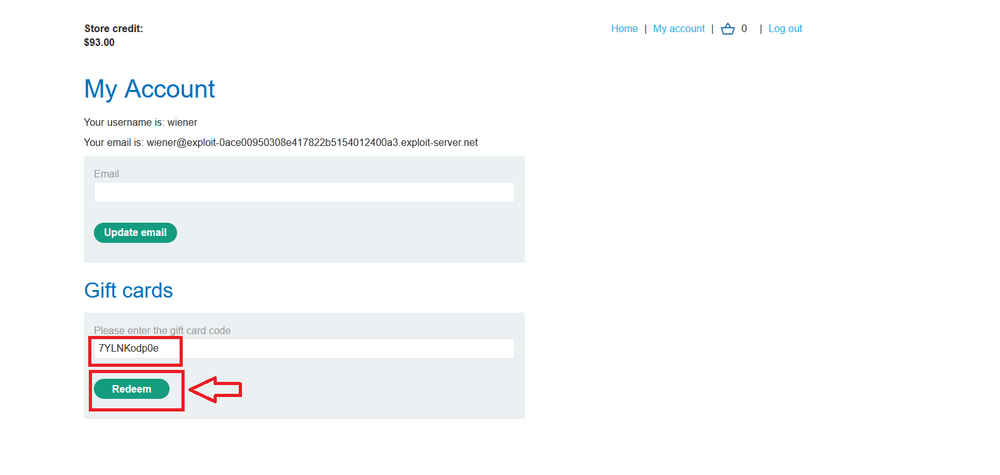
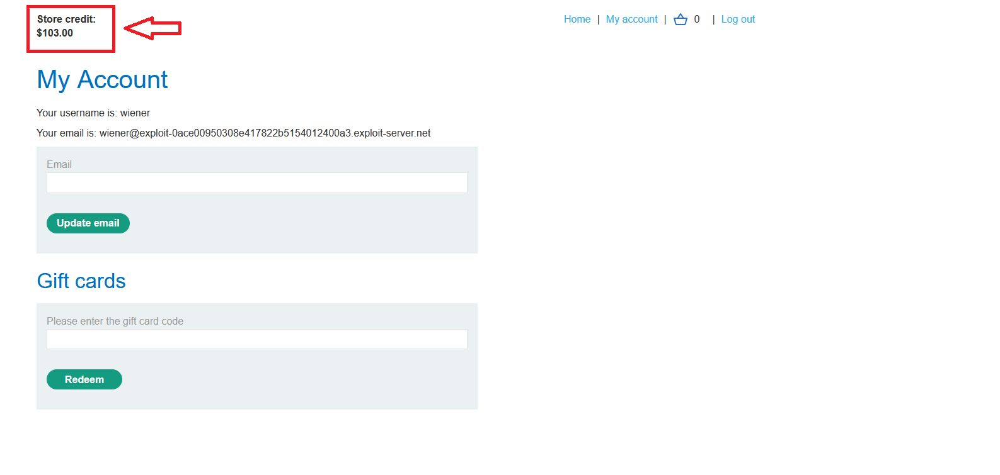
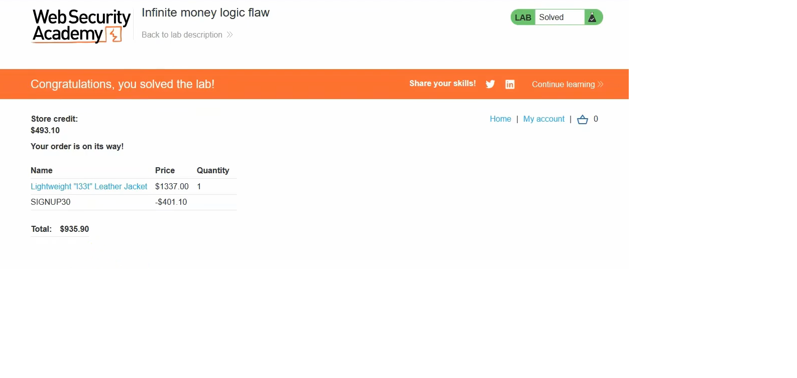

# Infinite money logic flaw

## 1. Lab Bilgisi

**Difficulty:** Practitioner

## 2. Vulnerability Özeti

Bu lab’de hediye kartı indirimli alınabiliyor ama hesaba tam değeriyle ekleniyor. Bu yüzden kullanıcı her döngüde kâr ederek store credit değerini artırabiliyor.

## 3. Exploitation Steps

1. Önce hesaba giriş yaptım ve sitedeki kupon kodunu buldum.
2. Sepete `10$` değerindeki gift card ürününü ekledim.

3. Checkout kısmında `SIGNUP30` kuponunu uyguladım ve gift card daha ucuza satın alındı.

4. Satın aldıktan sonra gelen gift card kodunu My account kısmında redeem ettim.

5. Gift card indirimli alınmasına rağmen hesaba `10$` olarak eklendi.

6. Bu işlemi birkaç kere tekrar ederek store credit değerini artırdım.
7. Yeterli bakiye oluşunca pahalı ürünü satın aldım ve lab tamamlandı.

## 4. Impact

Kullanıcı indirimli gift card alıp tam değerinden hesaba ekleyerek sınırsız bakiye oluşturabilir.

## 5. Remediation

Gift card ve kupon kullanımı server tarafında doğru kontrol edilmeli. İndirimli alınan gift card tam değerinden hesaba eklenmemeli veya gift card alımlarında kupon kullanımına izin verilmemeli.
