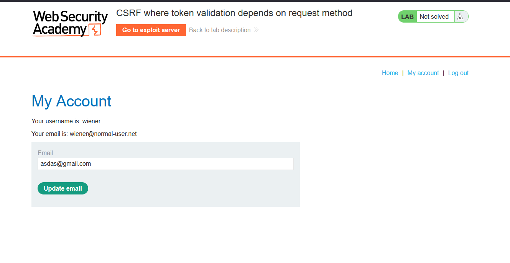
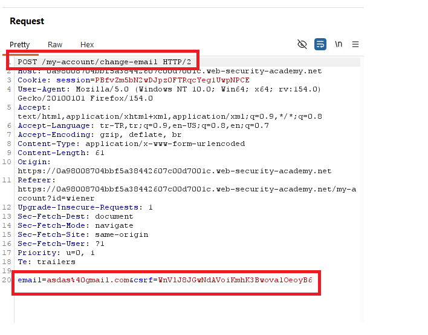
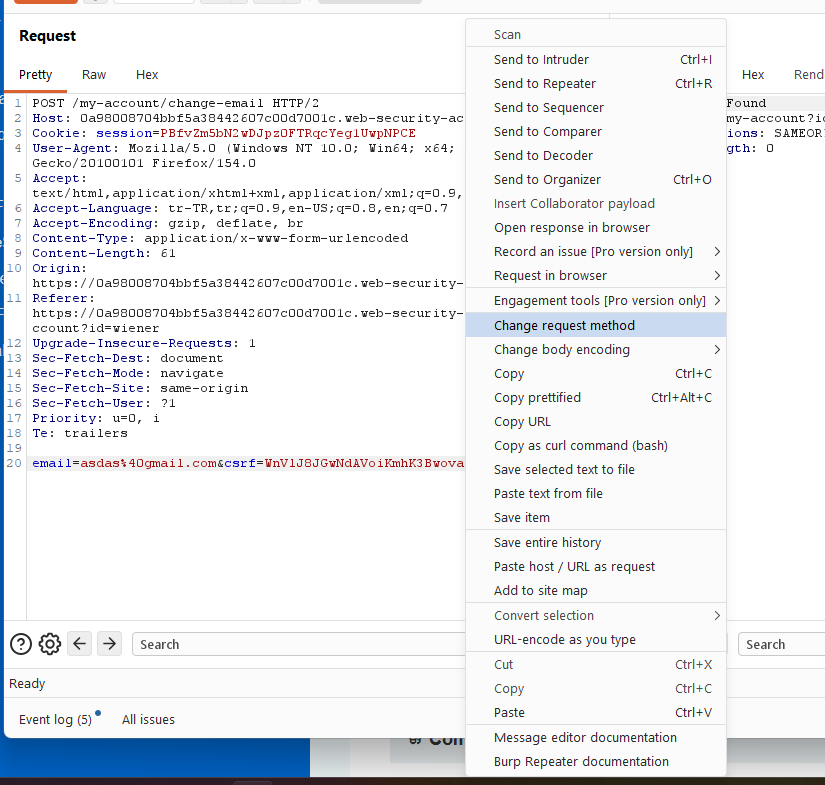
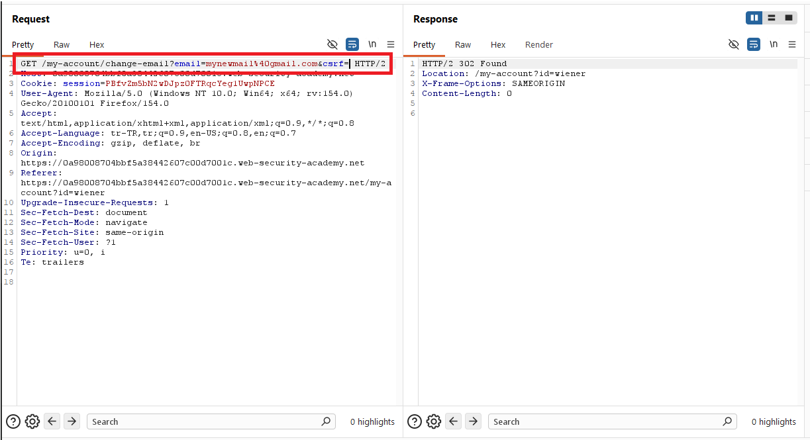
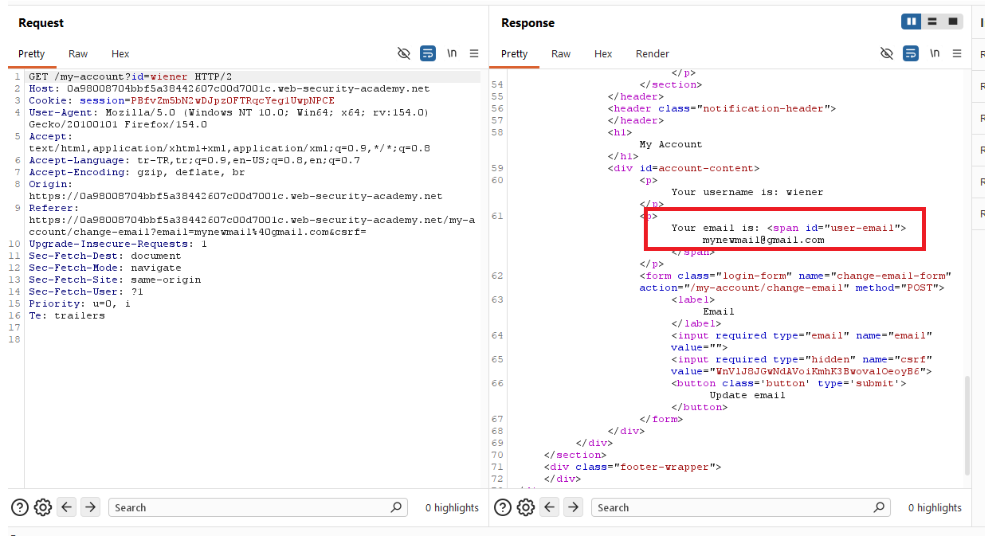
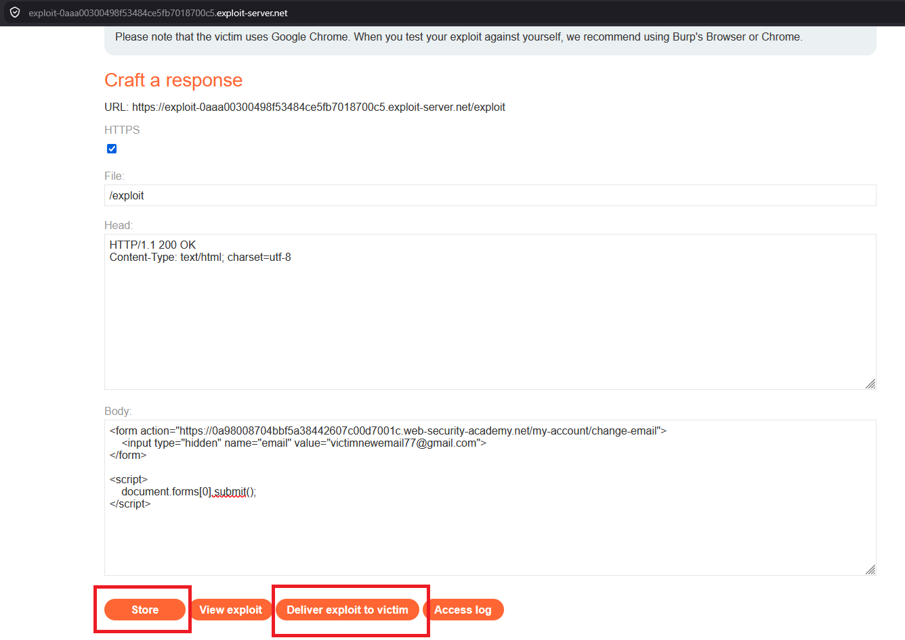
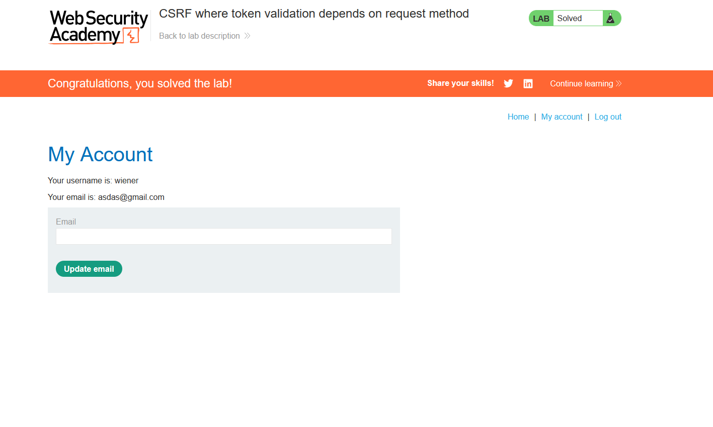

# CSRF where token validation depends on request method

## 1. Lab Bilgisi

**Difficulty:** Practitioner

## 2. Vulnerability Özeti

Bu labda email değiştirme fonksiyonunda CSRF token kullanılıyor gibi görünse de token doğrulaması yalnızca `POST` metodunda çalışıyor. İstek metodu `GET` olarak değiştirildiğinde uygulama `csrf` parametresini doğrulamadan email değişikliğini kabul ediyor. Bu davranışı kullanarak exploit server üzerinde otomatik gönderilen bir GET formu hazırladım ve kurban kullanıcının email adresini değiştirdim.

## 3. Kullanılan Payload

```html
<form action="https://0a98008704bbf5a38442607c00d7001c.web-security-academy.net/my-account/change-email">
  <input type="hidden" name="email" value="victimnewemail77@gmail.com">
</form>

<script>
  document.forms[0].submit();
</script>
```

## 4. Exploitation Steps

1. Verilen kullanıcı bilgileriyle uygulamaya giriş yaptım ve `/my-account` sayfasında email değiştirme formunu tespit ettim.



2. Email değiştirme isteğini Burp Suite ile yakaladım. Normal akışta isteğin `POST /my-account/change-email` endpoint'ine gönderildiğini ve body kısmında `email` parametresiyle birlikte `csrf` token bulunduğunu gördüm.



3. Burp Suite üzerinde isteğe sağ tıklayıp `Change request method` seçeneğini kullandım. Bu işlem isteği `POST` metodundan `GET` metoduna çevirdi.



4. `GET /my-account/change-email` isteğini query string üzerinden gönderdim. `csrf` parametresi boş bırakılmasına rağmen uygulama isteği kabul etti ve `302 Found` ile `/my-account?id=wiener` sayfasına yönlendirdi.

```http
GET /my-account/change-email?email=mynewmail%40gmail.com&csrf= HTTP/2
```



5. Hesap sayfasını tekrar çağırdığımda email adresinin değiştiğini gördüm. Bu durum token doğrulamasının GET metodunda uygulanmadığını doğruladı.



6. Exploit server üzerinde `method` attribute'u kullanmadan bir form hazırladım. HTML formlarında varsayılan metod `GET` olduğu için kurban bu sayfayı açtığında email değiştirme isteği GET olarak gönderilecekti.

```html
<form action="https://0a98008704bbf5a38442607c00d7001c.web-security-academy.net/my-account/change-email">
  <input type="hidden" name="email" value="victimnewemail77@gmail.com">
</form>

<script>
  document.forms[0].submit();
</script>
```



7. Exploit'i kaydedip kurbana gönderdim. Kurbanın tarayıcısı kendi oturum cookie'siyle GET isteğini gönderdi ve uygulama CSRF token doğrulaması yapmadan email adresini değiştirdi. Böylece lab başarıyla çözüldü.



## 5. Impact

Token doğrulamasının yalnızca belirli HTTP metodlarında yapılması CSRF korumasını etkisiz hale getirebilir. Saldırgan, state-changing endpoint'i farklı bir metodla çağırarak kurban kullanıcının oturumu üzerinden email değiştirme gibi işlemler yaptırabilir. Email değişikliği bazı uygulamalarda parola sıfırlama akışını da etkileyebileceği için hesap ele geçirmeye kadar gidebilir.

## 6. Remediation

State-changing işlemler yalnızca beklenen HTTP metodlarıyla kabul edilmeli ve tüm metodlarda aynı CSRF doğrulaması uygulanmalıdır. `GET` istekleri veri değiştiren işlemler için kullanılmamalı, endpoint beklenmeyen metodları `405 Method Not Allowed` ile reddetmelidir. CSRF token her state-changing istekte zorunlu tutulmalı, boş veya eksik token değerleri kabul edilmemelidir.
