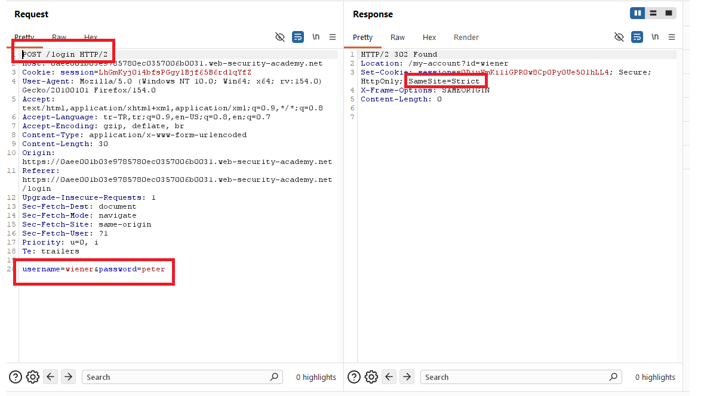
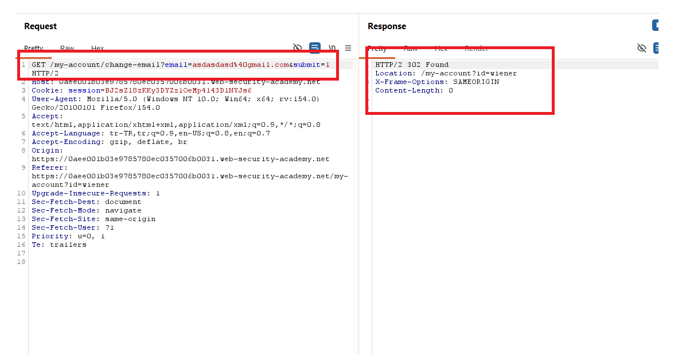
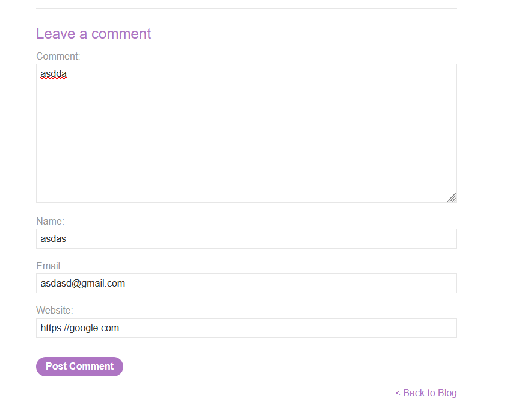
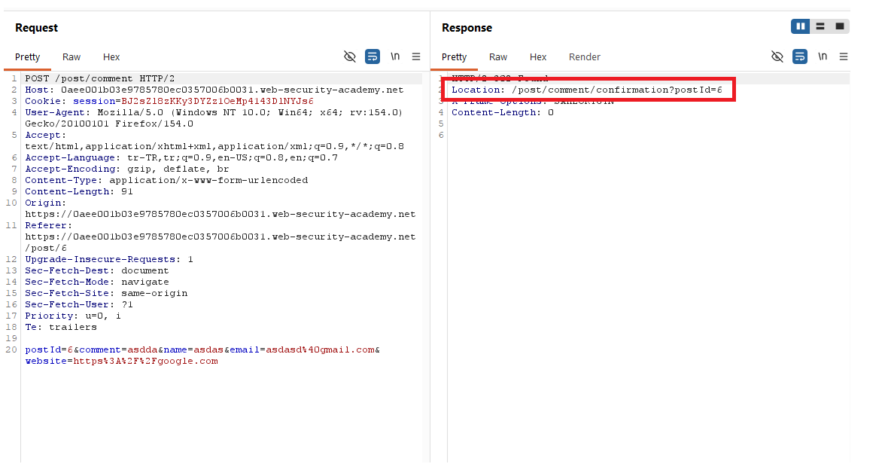
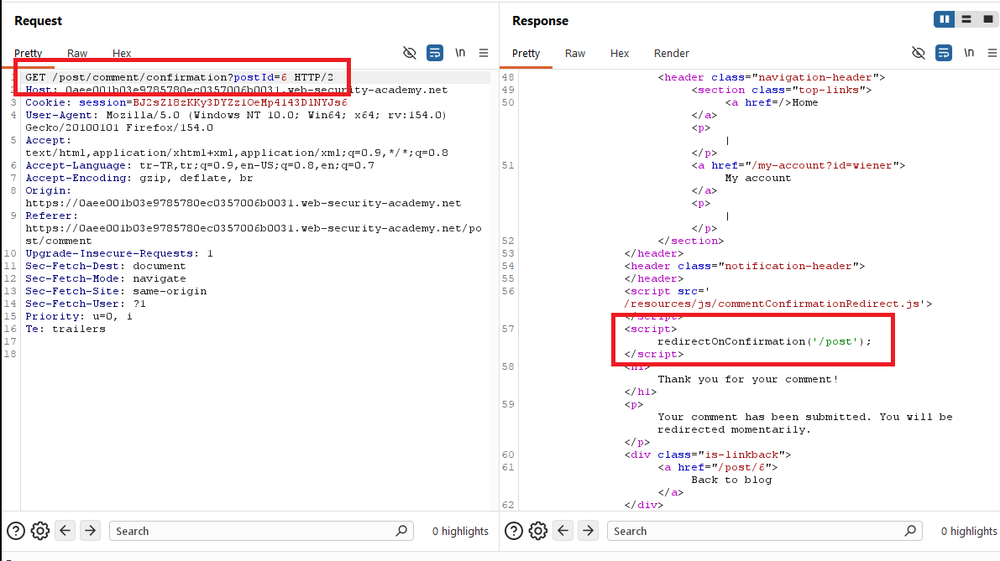
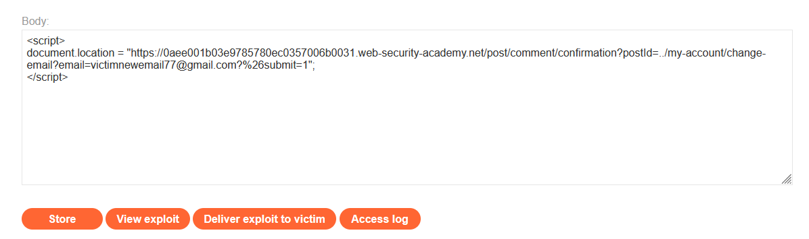
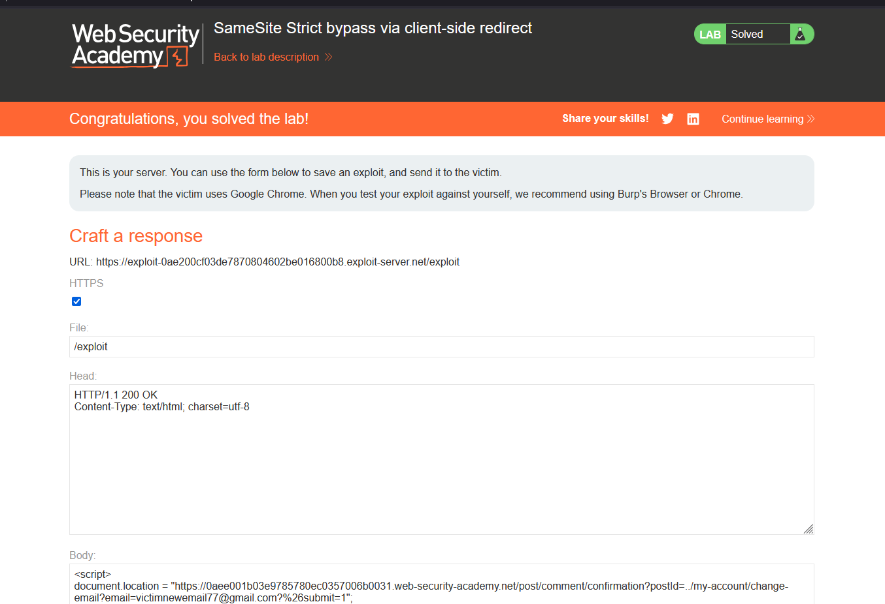

# SameSite Strict bypass via client-side redirect

## 1. Lab Bilgisi

**Difficulty:** Practitioner

## 2. Vulnerability Özeti

Bu labda email değiştirme fonksiyonunda CSRF token gibi unpredictable bir koruma bulunmuyor. Uygulama session cookie'sini `SameSite=Strict` attribute'u ile set ediyor. Bu nedenle doğrudan exploit server gibi farklı bir siteden hedef uygulamaya cross-site istek gönderildiğinde tarayıcı session cookie'yi eklemiyor.

Ancak uygulamada yorum gönderildikten sonra kullanılan comment confirmation sayfası, `postId` parametresini client-side JavaScript ile redirect hedefi oluşturmak için kullanıyor. Bu redirect hedefi saldırgan tarafından kontrol edilebildiği için, exploit server'dan önce hedef site üzerindeki bu gadget'a gidip ardından aynı site içinde `/my-account/change-email` endpoint'ine yönlendirme yaptırılabiliyor. İkinci istek artık same-site kabul edildiğinden `SameSite=Strict` cookie de gönderiliyor ve CSRF işlemi başarıyla tetikleniyor.

## 3. Kullanılan Payload

```html
<script>
document.location = "https://0aee001b03e9785780ec0357006b0031.web-security-academy.net/post/comment/confirmation?postId=../my-account/change-email?email=victimnewemail77@gmail.com%26submit=1";
</script>
```

## 4. Exploitation Steps

1. Uygulamaya `wiener:peter` bilgileriyle giriş yaptım. Login response'unda session cookie'nin `SameSite=Strict` olarak set edildiğini gördüm. Bu, doğrudan cross-site isteklerde cookie'nin gönderilmeyeceğini gösteriyordu.

```http
Set-Cookie: session=...; Secure; HttpOnly; SameSite=Strict
```



2. Email değiştirme fonksiyonunu test ettim. Burp Suite üzerinden isteği `GET` methoduna çevirdiğimde endpoint'in `email` ve `submit` parametreleriyle email değişikliğini kabul ettiğini gördüm.

```http
GET /my-account/change-email?email=asdasdasd%40gmail.com&submit=1 HTTP/2
Host: 0aee001b03e9785780ec0357006b0031.web-security-academy.net
Cookie: session=...
```



3. SameSite Strict kısıtlamasını aşmak için uygulama içinde kullanılabilecek bir gadget aradım. Blog postlarından birine yorum göndererek yorum akışını inceledim.



4. Yorum gönderildikten sonra uygulamanın `/post/comment/confirmation?postId=6` sayfasına yönlendirdiğini gördüm. Bu sayfa yorum onaylandıktan sonra kullanıcıyı tekrar blog postuna götürüyordu.

```http
POST /post/comment HTTP/2

postId=6&comment=asdda&name=asdas&email=asdasd%40gmail.com&website=https%3A%2F%2Fgoogle.com
```

```http
Location: /post/comment/confirmation?postId=6
```



5. Comment confirmation sayfasının response'unu incelediğimde `/resources/js/commentConfirmationRedirect.js` dosyasının yüklendiğini ve sayfada `redirectOnConfirmation('/post')` fonksiyonunun çağrıldığını gördüm. Bu davranış, `postId` parametresinin client-side redirect içinde kullanıldığını gösteriyordu.

```html
<script src="/resources/js/commentConfirmationRedirect.js"></script>
<script>
    redirectOnConfirmation('/post');
</script>
```



6. Exploit server üzerinde `postId` parametresine path traversal içeren bir değer verdim. Amaç, kurbanı önce hedef sitedeki confirmation sayfasına götürmek, ardından client-side redirect ile aynı site içinde email değiştirme endpoint'ine yönlendirmekti. `submit` parametresinden önceki `&` karakterini `%26` olarak encode ettim; aksi halde bu parametre ilk URL'in query string'inden ayrılacaktı.

```html
<script>
document.location = "https://0aee001b03e9785780ec0357006b0031.web-security-academy.net/post/comment/confirmation?postId=../my-account/change-email?email=victimnewemail77@gmail.com%26submit=1";
</script>
```



7. Exploit'i kurbana gönderdim. Kurban exploit sayfasını açtığında ilk istek cross-site olarak comment confirmation endpoint'ine gitti. Ardından sayfadaki client-side redirect, tarayıcıyı hedef site içinde `/my-account/change-email?email=...&submit=1` adresine yönlendirdi. Bu ikinci istek same-site olarak değerlendirildiği için `SameSite=Strict` session cookie gönderildi ve email değiştirme işlemi gerçekleşti.



## 5. Impact

SameSite Strict cookie ayarı, doğrudan cross-site isteklerde güçlü bir bariyer sağlar; ancak uygulama içinde saldırgan kontrollü client-side redirect gadget'ları varsa bu koruma bypass edilebilir. CSRF token bulunmayan state-changing endpoint'ler, aynı site içinden tetiklenen bu tür yönlendirmelerle kurban oturumu kullanılarak çalıştırılabilir. Bu labda email değişikliği yapıldı; benzer zafiyetler hesap ele geçirme veya yetkisiz kritik işlem riskini artırabilir.

## 6. Remediation

State-changing işlemler için session'a bağlı, tahmin edilemez CSRF token kullanılmalı ve sunucu tarafında doğrulanmalıdır. Email değiştirme gibi işlemler GET methoduyla çalışmamalı, yalnızca uygun POST istekleriyle ve CSRF kontrolüyle kabul edilmelidir. Client-side redirect mekanizmalarında kullanıcı kontrollü parametrelerle path oluşturulmamalı; gerekiyorsa hedefler allowlist ile sınırlandırılmalı ve path traversal dizileri normalize edilip reddedilmelidir. `SameSite=Strict` faydalı bir ek savunmadır, ancak tek başına CSRF koruması olarak görülmemelidir.
