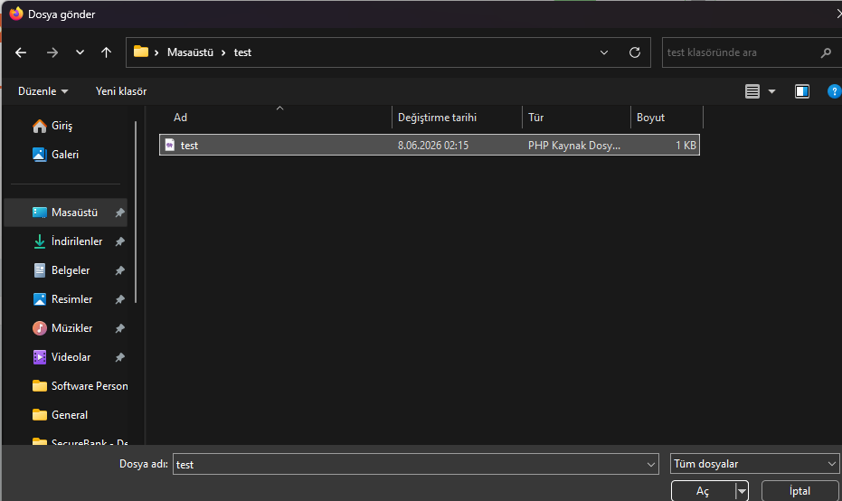
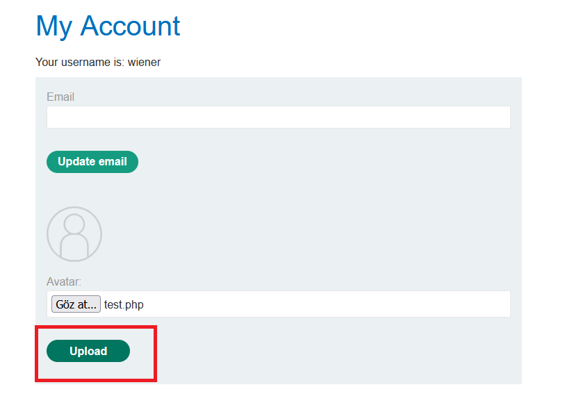
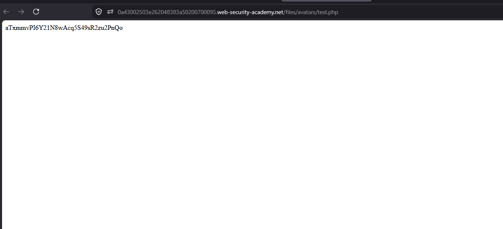
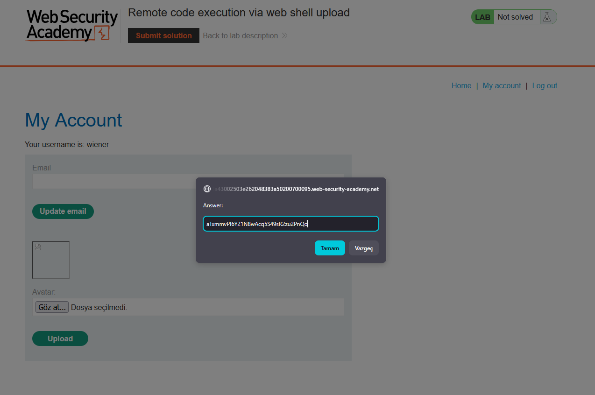
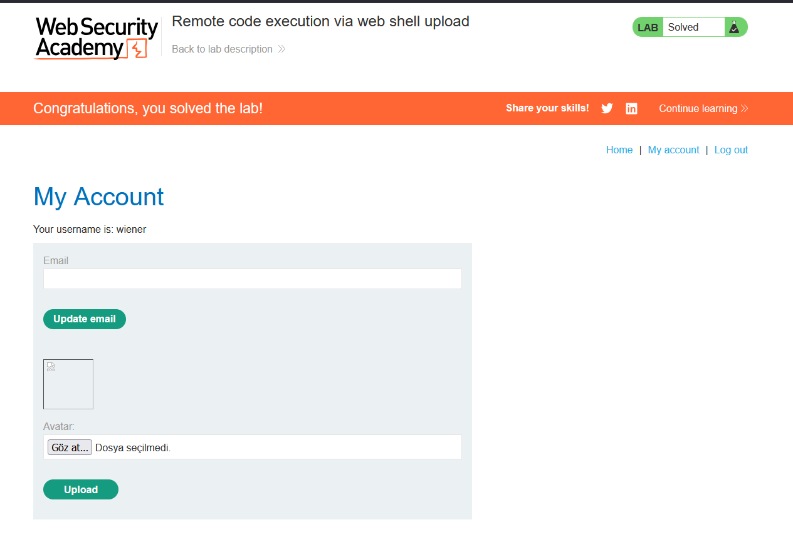

# Remote code execution via web shell upload

## 1. Lab Bilgisi

**Difficulty:** Apprentice

## 2. Vulnerability Özeti

Bu labda kullanıcı profil fotoğrafı yükleme fonksiyonu, yüklenen dosyanın içeriğini ve uzantısını güvenli şekilde doğrulamadığı için PHP web shell yüklenebiliyor. Sunucu yüklenen `.php` dosyasını avatar dizininde çalıştırdığı için web shell üzerinden komut çalıştırarak Carlos kullanıcısının secret dosyasını okuyabildim.

## 3. Kullanılan Bilgiler

**Username:** `wiener`

**Password:** `peter`

**Web shell dosyası:** `test.php`

**Payload:**

```php
<?php echo file_get_contents('/home/carlos/secret'); ?>
```

## 4. Exploitation Steps

1. Verilen bilgilerle uygulamaya giriş yaptım ve `/my-account` sayfasındaki avatar upload alanına geldim.


2. PHP web shell içeren `test.php` dosyasını hazırladım.

```php
<?php echo file_get_contents('/home/carlos/secret'); ?>
```

3. Dosya seçim penceresinden `test.php` dosyasını seçtim.



4. Dosyanın içeriğinde Carlos kullanıcısının secret dosyasını okuyan PHP payload'ı vardı.


5. `test.php` dosyasını avatar alanında seçip upload butonuna bastım. Uygulama `.php` uzantılı dosyayı engellemedi ve upload işlemi başarılı oldu.



6. My Account sayfasındaki kırık avatar görselini yeni sekmede açarak yüklenen dosyanın direkt URL'ine gittim.


7. `/files/avatars/test.php` çağrıldığında PHP dosyası çalıştı ve response body içinde Carlos kullanıcısının secret değeri göründü.

```http
GET /files/avatars/test.php HTTP/2
```



8. Elde ettiğim secret değerini lab çözüm ekranına gönderdim.



9. Secret doğru olduğu için lab başarıyla çözüldü.



## 5. Impact

Saldırgan, dosya yükleme fonksiyonu üzerinden sunucuda çalıştırılabilir bir dosya yükleyebilirse remote code execution elde edebilir. Bu durum hassas dosyaların okunmasına, sistem komutlarının çalıştırılmasına, uygulama verilerinin ele geçirilmesine ve sunucunun tamamen kompromize edilmesine yol açabilir.

## 6. Remediation

Dosya yükleme işlemlerinde sadece izin verilen dosya tipleri kabul edilmelidir. Kontrol yalnızca `Content-Type` veya dosya uzantısına bırakılmamalı; dosya içeriği doğrulanmalı, yüklenen dosyalar web root dışında saklanmalı ve çalıştırma izni olmayan bir dizinden servis edilmelidir. Ayrıca dosya adları normalize edilmeli, rastgeleleştirilmeli ve sunucu tarafında `.php`, `.jsp`, `.aspx` gibi çalıştırılabilir uzantılar kesin olarak engellenmelidir.
