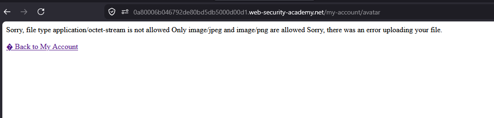
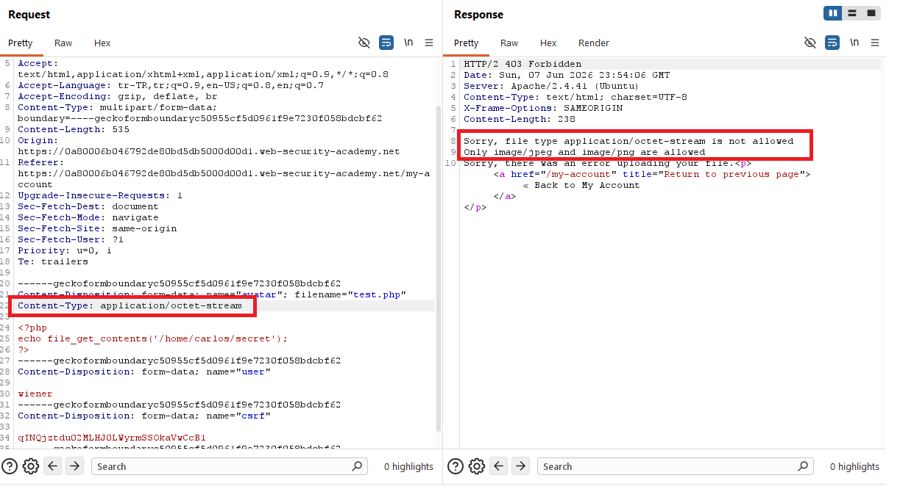
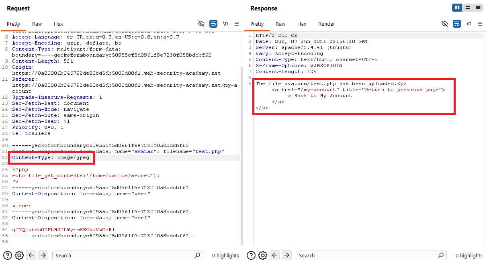
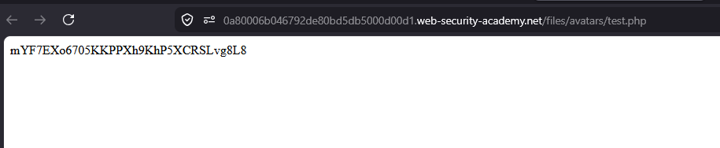
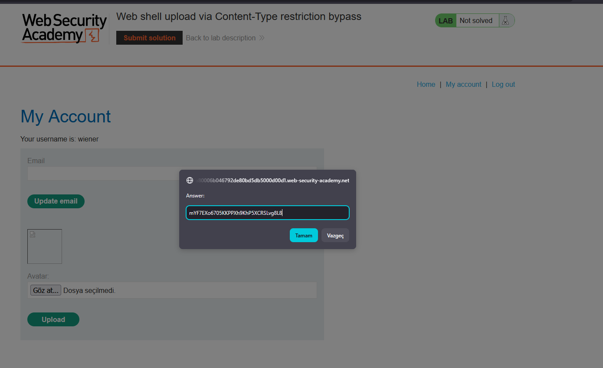
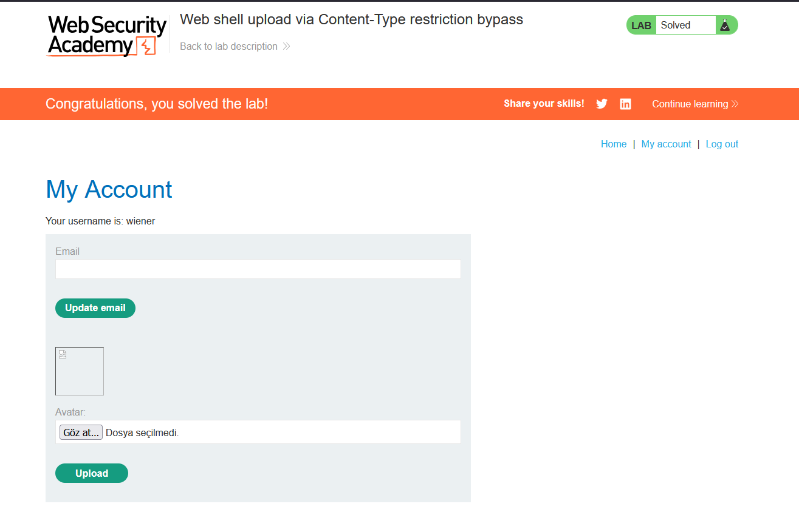

# Web shell upload via Content-Type restriction bypass

## 1. Lab Bilgisi

**Difficulty:** Apprentice

## 2. Vulnerability Özeti

Bu labda avatar upload fonksiyonu `.php` dosya uzantısını doğrudan engellemedi, ancak multipart request içindeki dosya parçasının `Content-Type` değerini kontrol etti. İlk yükleme denemesinde `test.php` dosyası `application/octet-stream` olarak gönderildiği için reddedildi. Burp Suite ile upload request'ini yakalayıp dosya parçasındaki `Content-Type` değerini `image/jpeg` olarak değiştirince uygulama dosyayı kabul etti ve PHP web shell çalıştırılabildi.

## 3. Kullanılan Bilgiler

**Username:** `wiener`

**Password:** `peter`

**Web shell dosyası:** `test.php`

**Payload:**

```php
<?php echo file_get_contents('/home/carlos/secret'); ?>
```

**Bypass edilen header:**

```http
Content-Type: image/jpeg
```

## 4. Exploitation Steps

1. Verilen bilgilerle uygulamaya giriş yaptım ve `/my-account` sayfasındaki avatar upload alanına geldim.


2. PHP web shell içeren `test.php` dosyasını seçtim.


3. Dosyanın içeriğinde Carlos kullanıcısının secret dosyasını okuyan PHP payload'ı vardı.

```php
<?php echo file_get_contents('/home/carlos/secret'); ?>
```


4. Dosyayı normal şekilde yüklemeyi denedim.


5. Uygulama dosya tipini `application/octet-stream` olarak gördüğü için yüklemeyi reddetti.



6. Aynı upload işlemini Burp Suite ile yakaladım. Request içinde dosya parçasının `Content-Type` değerinin `application/octet-stream` olduğunu ve response tarafında yalnızca `image/jpeg` ile `image/png` tiplerine izin verildiğini gördüm.



7. Request'i tekrar gönderirken dosya parçasındaki `Content-Type` değerini `image/jpeg` olarak değiştirdim.

```http
Content-Type: image/jpeg
```



8. Değişiklikten sonra uygulama dosyayı kabul etti ve `avatars/test.php` yoluna yükledi.


9. My Account sayfasındaki kırık avatar görselini yeni sekmede açarak yüklenen dosyanın direkt URL'ine gittim.


10. `/files/avatars/test.php` çağrıldığında PHP dosyası çalıştı ve response body içinde Carlos kullanıcısının secret değeri göründü.



11. Elde ettiğim secret değerini lab çözüm ekranına gönderdim.



12. Secret doğru olduğu için lab başarıyla çözüldü.



## 5. Impact

Saldırgan, yalnızca istemciden gönderilen `Content-Type` değerini değiştirerek upload kontrolünü bypass edebilir ve sunucuda çalıştırılabilir bir dosya yükleyebilir. Bu durum remote code execution, hassas dosya okuma, veri sızıntısı ve sunucu üzerinde daha geniş yetki elde edilmesiyle sonuçlanabilir.

## 6. Remediation

Dosya yükleme kontrolleri istemcinin gönderdiği `Content-Type` header'ına güvenmemelidir. Uygulama dosya içeriğini sunucu tarafında doğrulamalı, yalnızca izin verilen uzantı ve MIME tiplerini kabul etmeli, yüklenen dosyaları web root dışında tutmalı ve upload dizininde script execution kapatılmalıdır. Dosya adları da güvenli şekilde yeniden adlandırılmalı ve çalıştırılabilir uzantılar kesin olarak engellenmelidir.
