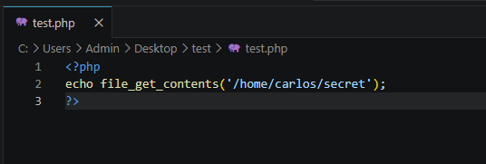
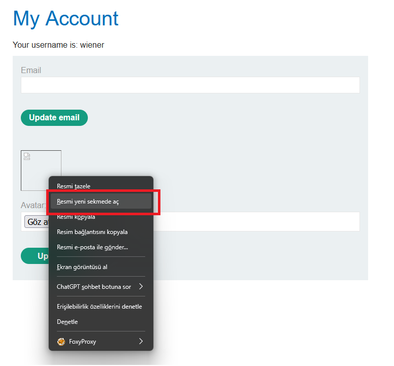
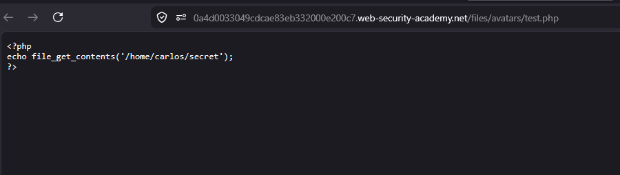
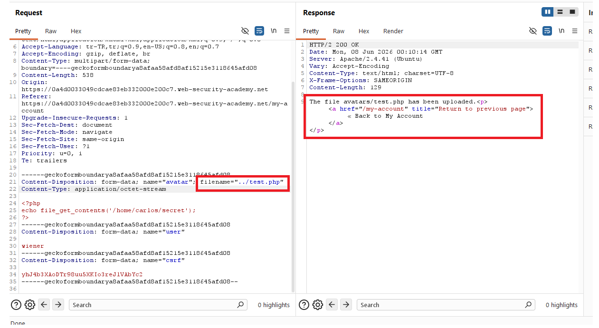
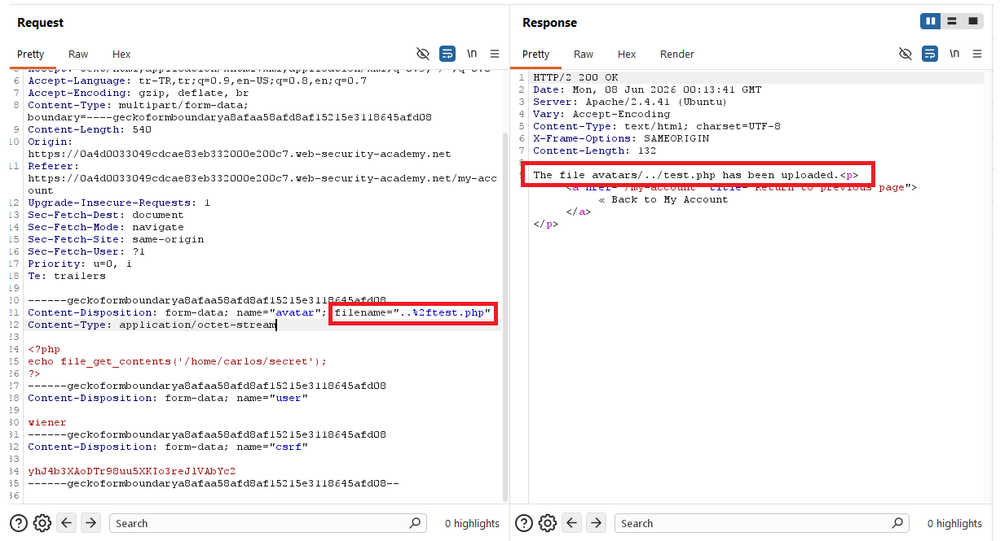
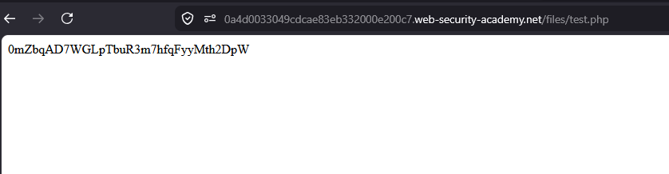
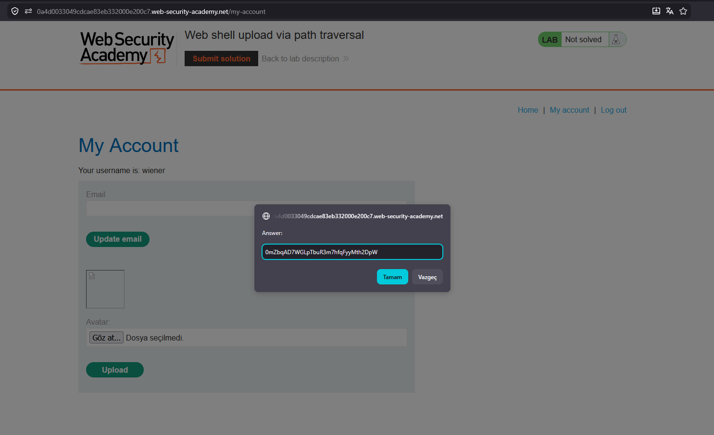
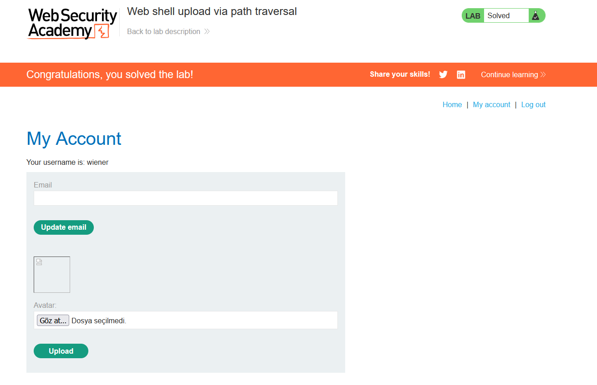

# Web shell upload via path traversal

## 1. Lab Bilgisi

**Difficulty:** Apprentice

## 2. Vulnerability Özeti

Bu labda avatar upload fonksiyonu `.php` dosyasını kabul ediyor, ancak dosyayı varsayılan olarak `avatars` dizinine kaydediyor. Bu dizinde PHP execution kapalı olduğu için `/files/avatars/test.php` çağrıldığında payload çalışmak yerine kaynak kodu düz metin olarak görüntüleniyor. Burp Suite ile upload request'indeki `filename` değeri path traversal kullanılarak değiştirildiğinde dosya bir üst dizine, yani PHP execution açık olan `/files/test.php` konumuna yazdırılabildi ve web shell çalıştırıldı.

## 3. Kullanılan Bilgiler

**Username:** `wiener`

**Password:** `peter`

**Web shell dosyası:** `test.php`

**Payload:**

```php
<?php echo file_get_contents('/home/carlos/secret'); ?>
```

**Path traversal filename:**

```http
filename="..%2ftest.php"
```

## 4. Exploitation Steps

1. Verilen bilgilerle uygulamaya giriş yaptım ve `/my-account` sayfasındaki avatar upload alanına geldim.


2. Dosya seçim penceresinden `test.php` dosyasını seçtim.


3. Dosyanın içeriğinde Carlos kullanıcısının secret dosyasını okuyan PHP payload'ı vardı.

```php
<?php echo file_get_contents('/home/carlos/secret'); ?>
```



4. Dosyayı normal şekilde upload ettikten sonra avatar görselini yeni sekmede açtım.



5. `/files/avatars/test.php` çağrıldığında PHP kodunun çalışmadığını, kaynak kodun düz metin olarak döndüğünü gördüm.



6. Aynı dosyayı tekrar seçip upload request'ini Burp Suite ile yakalamaya hazırlandım.


7. Burp Suite üzerinde multipart request içindeki dosya parçasında `filename` değerini önce `../test.php` olarak değiştirdim. Uygulama bu değeri normalize ettiği için dosya yine `avatars/test.php` olarak kaydedildi.

```http
filename="../test.php"
```



8. Slash karakterini URL encode ederek `filename` değerini `..%2ftest.php` yaptım. Bu kez response içinde dosyanın `avatars/../test.php` olarak yüklendiğini gördüm.

```http
filename="..%2ftest.php"
```



9. Dosyayı `/files/test.php` yolundan çağırdığımda PHP payload çalıştı ve response body içinde Carlos kullanıcısının secret değeri göründü.

```http
GET /files/test.php HTTP/2
```



10. Elde ettiğim secret değerini lab çözüm ekranına gönderdim.



11. Secret doğru olduğu için lab başarıyla çözüldü.



## 5. Impact

Saldırgan, upload request'indeki dosya adını path traversal ile manipüle ederek dosyayı beklenen upload dizininin dışına yazdırabilir. Eğer hedef dizinde script execution açıksa bu durum remote code execution elde edilmesine, hassas dosyaların okunmasına ve sunucunun kompromize edilmesine yol açabilir.

## 6. Remediation

Upload edilen dosyaların adı ve yolu kullanıcı girdisinden doğrudan alınmamalıdır. Uygulama dosya adını sunucu tarafında güvenli ve rastgele bir değerle yeniden üretmeli, path traversal karakterlerini normalize edip reddetmeli ve dosyanın yalnızca beklenen upload dizini altında kaldığını doğrulamalıdır. Upload dizinlerinde script execution kapatılmalı, yüklenen dosyalar mümkünse web root dışında saklanmalı ve dosya içeriği sunucu tarafında doğrulanmalıdır.
