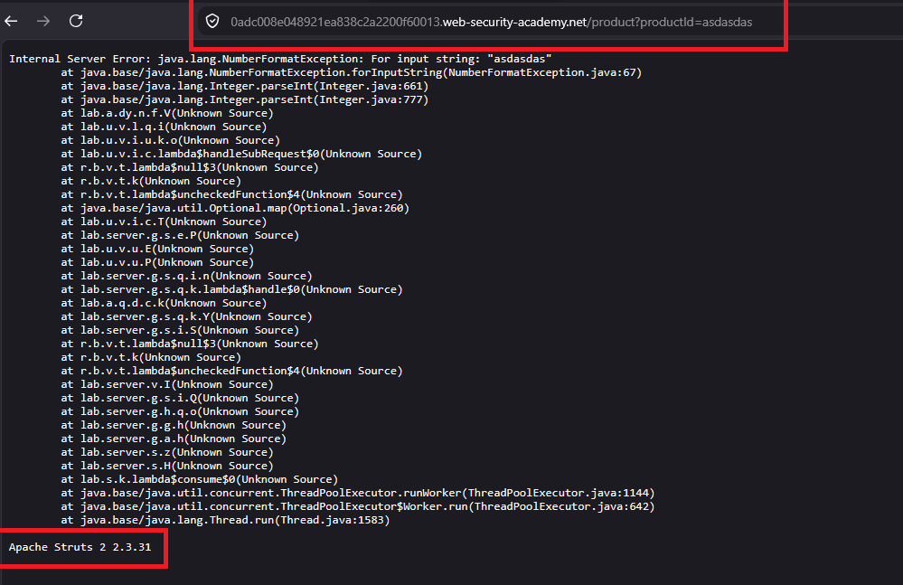

# Information disclosure in error messages

## 1. Lab Bilgisi

**Difficulty:** Apprentice

## 2. Vulnerability Özeti

Bu labda ürün detay sayfasında gönderilen `productId` parametresini manipüle ederek uygulamanın hata mesajı üretmesini sağladım. Hata mesajı içinde framework ve sürüm bilgisi açıklandığı için uygulamanın kullandığı teknoloji hakkında hassas bilgi elde edildi.

## 3. Kullanılan Payload

```http
GET /product?productId=asd HTTP/2
```

## 4. Exploitation Steps

1. İlk olarak ürün detay sayfasına giderek ürünün `productId` parametresiyle getirildiğini tespit ettim.


2. `productId` parametresine beklenen sayısal değer yerine geçersiz bir string değer verdim.

```http
GET /product?productId=asd HTTP/2
```



3. Sunucu bu isteğe detaylı bir hata mesajı döndürdü. Hata mesajı içinde uygulamanın kullandığı framework ve versiyon bilgisi göründü.


4. Hata mesajından elde edilen sürüm bilgisini lab cevabı olarak girdiğimde lab başarıyla çözüldü.

## 5. Impact

Detaylı hata mesajları saldırgana uygulamanın kullandığı framework, kütüphane, sürüm veya backend yapısı hakkında bilgi verebilir. Bu bilgiler, bilinen zafiyetlerin hedeflenmesini ve saldırı yüzeyinin daha kolay haritalanmasını sağlayabilir.

## 6. Remediation

Production ortamında detaylı hata mesajları kullanıcıya gösterilmemelidir. Uygulama genel ve güvenli hata sayfaları döndürmeli, teknik detaylar yalnızca sunucu tarafındaki loglarda tutulmalıdır. Ayrıca dependency ve framework sürümleri güncel tutulmalı, hata yönetimi merkezi ve kontrollü bir şekilde uygulanmalıdır.
