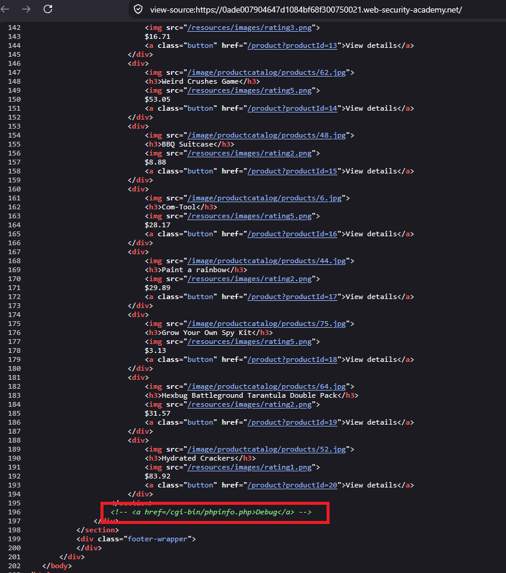
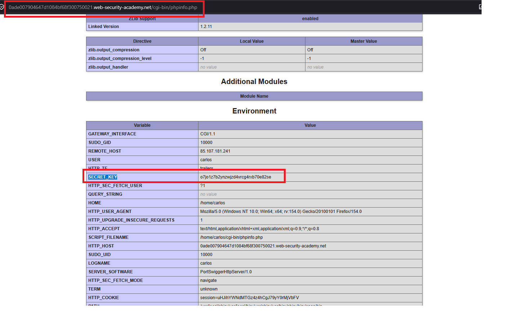
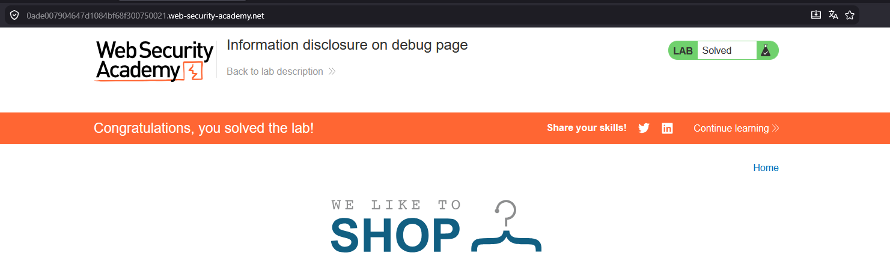

# Information disclosure on debug page

## 1. Lab Bilgisi

**Difficulty:** Apprentice

## 2. Vulnerability Özeti

Bu labda ana sayfanın kaynak kodunda yorum satırı içinde bırakılmış bir debug endpoint'i tespit ettim. `/cgi-bin/phpinfo.php` adresindeki PHP debug sayfası ortam değişkenlerini gösteriyordu. Bu sayfada yer alan `SECRET_KEY` değeri hassas bilgi olarak açığa çıktığı için lab cevabı olarak kullanılabildi.

## 3. Kullanılan Payload

```http
GET /cgi-bin/phpinfo.php HTTP/2
```

## 4. Exploitation Steps

1. İlk olarak ana sayfanın kaynak kodunu görüntüledim ve yorum satırı içinde debug sayfasına ait bir bağlantı olduğunu fark ettim.

```html
<!-- <a href=/cgi-bin/phpinfo.php>Debug</a> -->
```



2. Yorum satırında bulunan `/cgi-bin/phpinfo.php` endpoint'ine doğrudan istek attım.

```http
GET /cgi-bin/phpinfo.php HTTP/2
```

3. Açılan `phpinfo()` sayfasında ortam değişkenleri listeleniyordu. `Environment` bölümünde `SECRET_KEY` değerinin açık şekilde gösterildiğini tespit ettim.



4. Elde ettiğim `SECRET_KEY` değerini lab çözüm formuna girdim.


5. Doğru secret key gönderildiği için lab başarıyla çözüldü.



## 5. Impact

Debug sayfalarının production ortamında erişilebilir kalması, uygulamanın çalışma ortamı, dosya yolları, kullanıcı bilgileri, sunucu yazılımı, environment değişkenleri ve secret değerleri gibi hassas bilgilerin sızmasına neden olabilir. Bu bilgiler saldırganın sonraki adımlarında kimlik bilgisi ele geçirme, hedefli exploit seçimi veya altyapı keşfi için kullanılabilir.

## 6. Remediation

Debug endpoint'leri production ortamında tamamen kapatılmalı veya yalnızca yetkili iç ağlardan erişilebilir hale getirilmelidir. `phpinfo()` gibi detaylı sistem bilgisi veren sayfalar yayına alınmamalı, kaynak kodda kullanılmayan debug bağlantıları bırakılmamalıdır. Secret değerleri environment içinde tutulsa bile bu değerlerin kullanıcıya dönebilecek hata, debug veya bilgi sayfalarında görünmediği doğrulanmalıdır.
