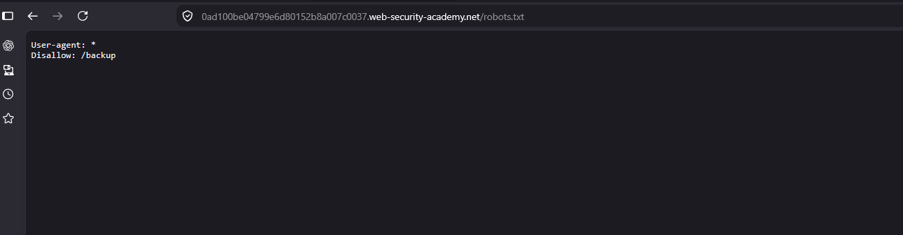
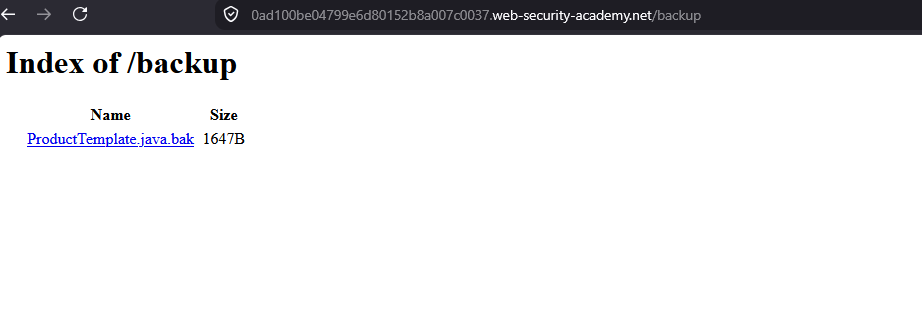
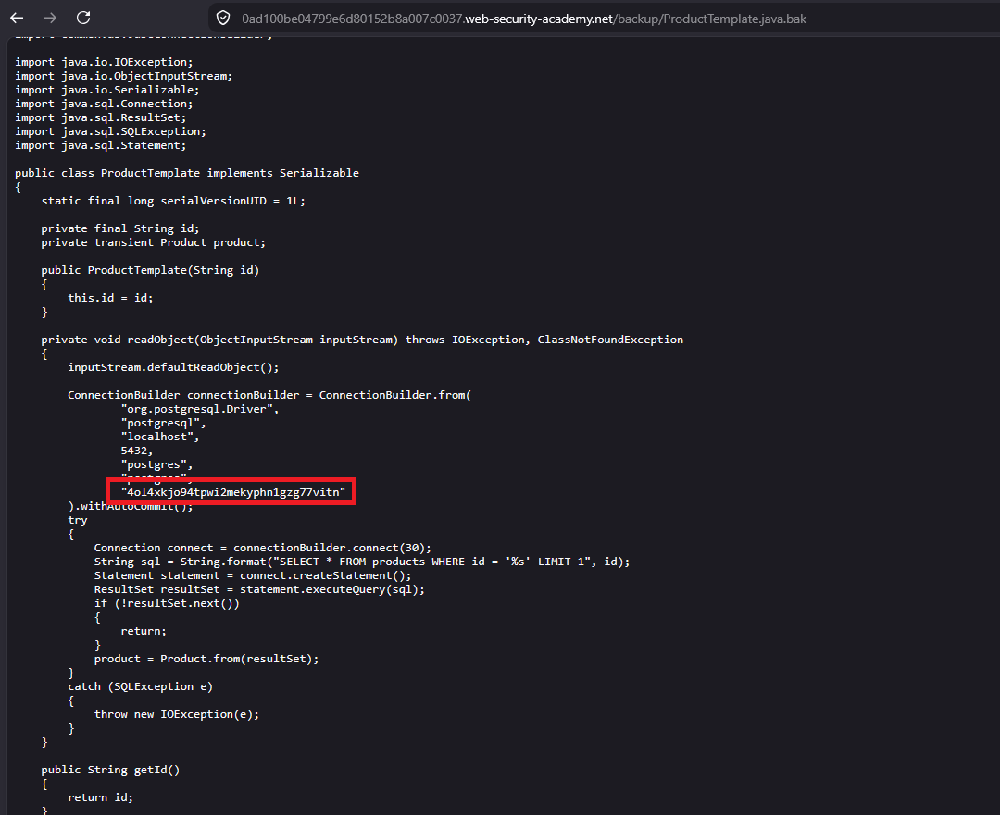
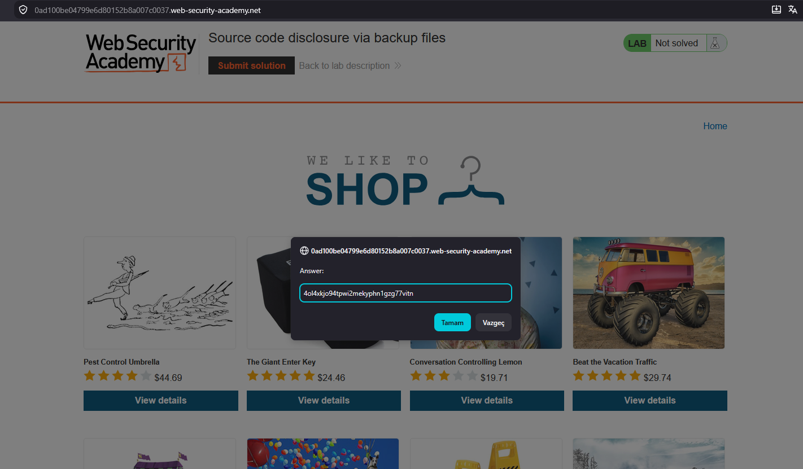

# Source code disclosure via backup files

## 1. Lab Bilgisi

**Difficulty:** Apprentice

## 2. Vulnerability Özeti

Bu labda `robots.txt` dosyasında `/backup` dizininin işaret edildiğini gördüm. Bu dizinde erişilebilir durumda bırakılmış bir `.bak` kaynak kod yedeği vardı. Yedek dosya içinde veritabanı bağlantı bilgileri ve parola açık şekilde bulunduğu için hassas bilgi sızıntısı gerçekleşti.

## 3. Kullanılan Payload

```http
GET /robots.txt HTTP/2
GET /backup/ProductTemplate.java.bak HTTP/2
```

## 4. Exploitation Steps

1. İlk olarak uygulamanın `robots.txt` dosyasını kontrol ettim. Dosyada `/backup` dizininin tarayıcılardan gizlenmeye çalışıldığını gördüm.

```text
User-agent: *
Disallow: /backup
```



2. `/backup` dizinine gittiğimde directory listing'in açık olduğunu ve `ProductTemplate.java.bak` isimli bir yedek dosyanın listelendiğini tespit ettim.



3. `ProductTemplate.java.bak` dosyasını açtığımda uygulamanın kaynak koduna erişebildim. Dosya içinde PostgreSQL bağlantı bilgileri ve veritabanı parolası açık şekilde yer alıyordu.

```java
ConnectionBuilder.from(
    "org.postgresql.Driver",
    "postgresql",
    "localhost",
    5432,
    "postgres",
    "40l4xkjo94tpwi2mekyphn1gzg77vitn"
)
```



4. Kaynak koddan elde ettiğim parolayı lab çözüm formuna girdim.



5. Doğru parola gönderildiği için lab başarıyla çözüldü.

## 5. Impact

Erişilebilir yedek dosyalar kaynak kodun, veritabanı bağlantı bilgilerinin, secret değerlerinin ve uygulama mimarisine ait detayların sızmasına neden olabilir. Saldırgan bu bilgileri kullanarak veritabanına erişmeyi, bilinen zafiyetleri hedeflemeyi veya uygulamaya özel daha etkili saldırılar geliştirmeyi deneyebilir.

## 6. Remediation

Kaynak kod yedekleri, `.bak` dosyaları ve geçici geliştirme çıktıları web root altında tutulmamalıdır. Production ortamına deploy edilen dosyalar allowlist mantığıyla sınırlandırılmalı, directory listing kapatılmalı ve hassas bilgiler kaynak kod içinde hardcoded olarak saklanmamalıdır. Ayrıca `robots.txt` güvenlik kontrolü olarak görülmemeli; hassas dizinlere erişim sunucu tarafında yetkilendirme ile engellenmelidir.
