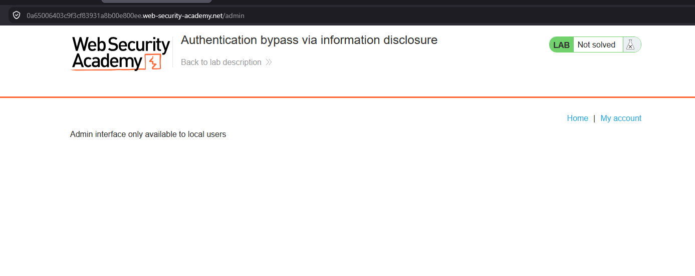
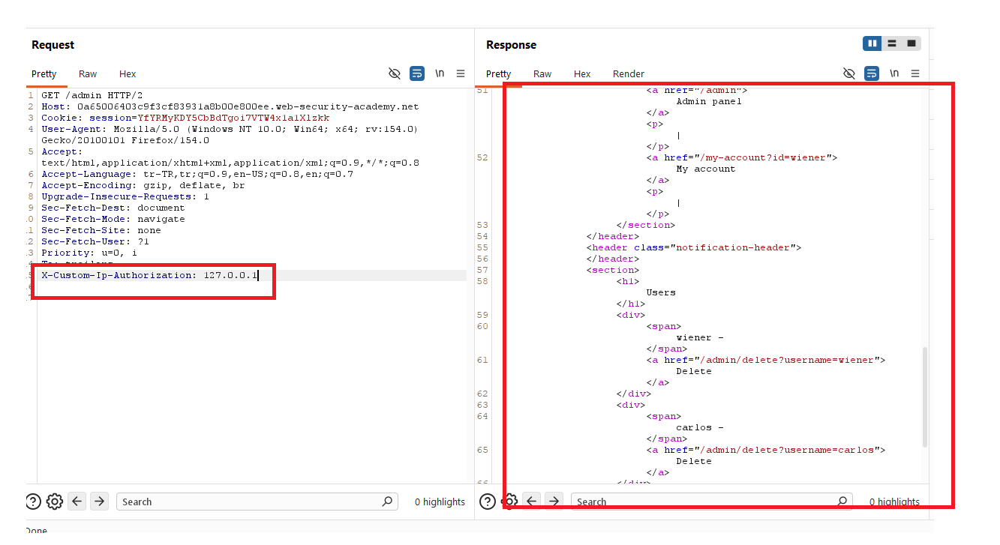
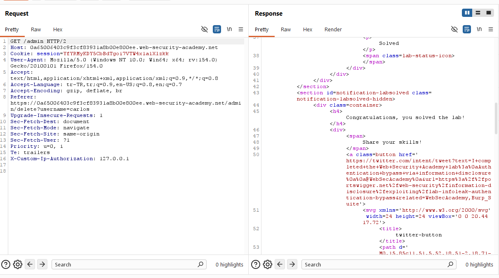
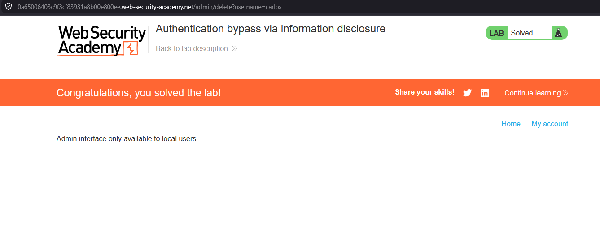

# Authentication bypass via information disclosure

## 1. Lab Bilgisi

**Difficulty:** Apprentice

## 2. Vulnerability Özeti

Bu labda `/admin` endpoint'ine doğrudan eriştiğimde admin panelinin yalnızca local kullanıcılara açık olduğu bilgisi döndü. Burp Suite ile isteğe `X-Custom-Ip-Authorization: 127.0.0.1` header'ı ekleyerek uygulamanın isteği localhost'tan gelmiş gibi değerlendirmesini sağladım. Bu sayede admin paneline erişip `carlos` kullanıcısını silerek authentication bypass gerçekleştirdim.

## 3. Kullanılan Payload

```http
X-Custom-Ip-Authorization: 127.0.0.1
```

Carlos kullanıcısını silmek için kullanılan endpoint:

```http
GET /admin/delete?username=carlos HTTP/2
X-Custom-Ip-Authorization: 127.0.0.1
```

## 4. Exploitation Steps

1. İlk olarak `/admin` endpoint'ine doğrudan erişmeyi denedim. Uygulama admin arayüzünün yalnızca local kullanıcılara açık olduğunu belirtti.



2. Burp Suite üzerinde `/admin` isteğine `X-Custom-Ip-Authorization: 127.0.0.1` header'ını ekledim. Response içinde admin panelinin HTML içeriği ve kullanıcı silme linkleri göründü.

```http
GET /admin HTTP/2
X-Custom-Ip-Authorization: 127.0.0.1
```



3. Admin panelinde `carlos` kullanıcısını silen endpoint'i tespit ettim ve aynı header ile bu endpoint'e istek gönderdim.

```http
GET /admin/delete?username=carlos HTTP/2
X-Custom-Ip-Authorization: 127.0.0.1
```

4. İstek başarıyla işlendi ve response içinde labın çözüldüğünü gösteren bildirim döndü.



5. Tarayıcıda da lab durumunun `Solved` olduğunu doğruladım.



## 5. Impact

Uygulamanın istemciden gelen IP belirtici header'lara güvenmesi, saldırganın kendi isteğini güvenilir bir kaynaktan gelmiş gibi göstermesine neden olabilir. Bu durumda internal veya yalnızca localhost'a açık olması beklenen admin fonksiyonları yetkisiz kullanıcılar tarafından erişilebilir hale gelebilir. Sonuç olarak kullanıcı silme gibi kritik yönetim işlemleri authentication bypass ile gerçekleştirilebilir.

## 6. Remediation

Yetkilendirme kararları kullanıcı tarafından kontrol edilebilen header değerlerine göre verilmemelidir. Gerçek istemci IP bilgisi yalnızca güvenilir reverse proxy katmanından alınmalı ve bu proxy dışından gelen `X-Forwarded-For`, `X-Custom-Ip-Authorization` gibi header'lar yok sayılmalıdır. Admin panelleri yalnızca network konumuna güvenmek yerine güçlü authentication ve authorization kontrolleriyle korunmalıdır.
