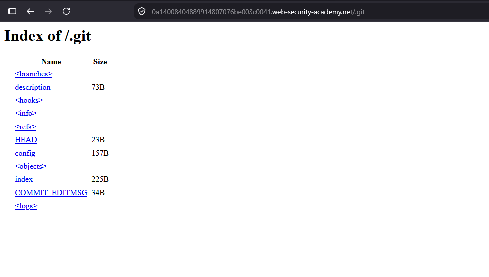
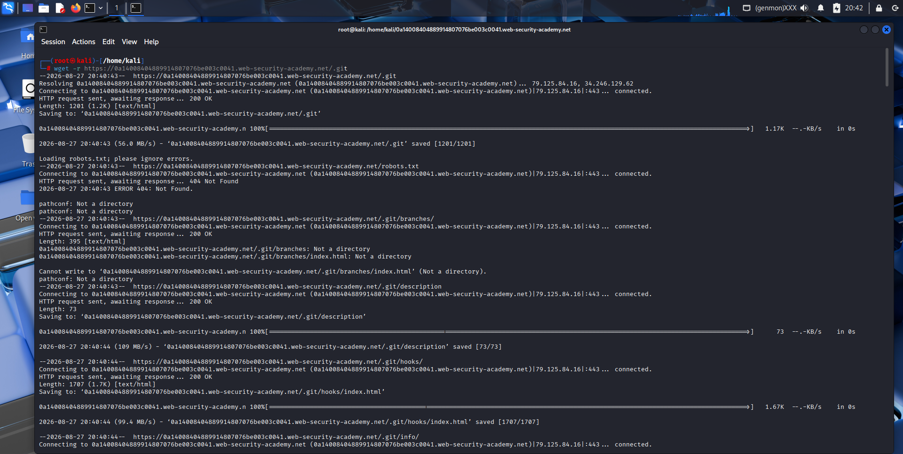
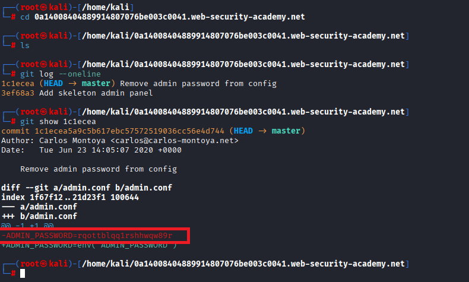
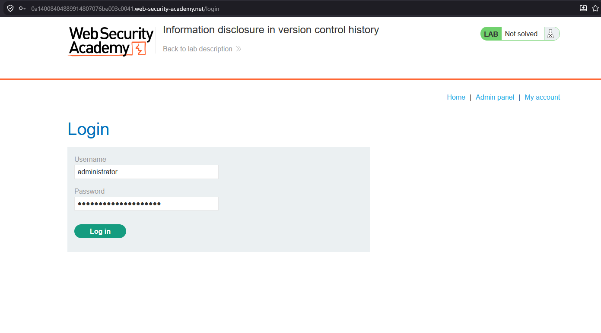
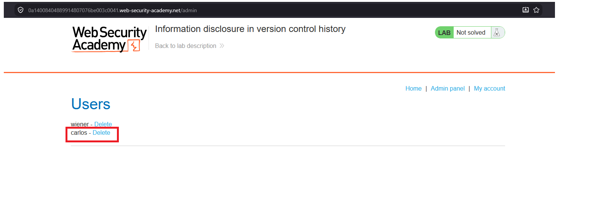
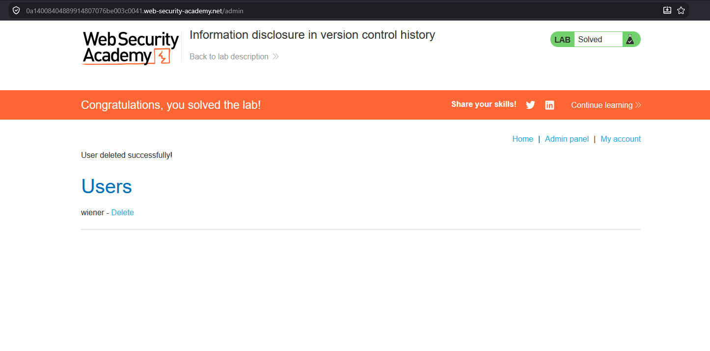

# Information disclosure in version control history

## 1. Lab Bilgisi

**Difficulty:** Apprentice

## 2. Vulnerability Özeti

Bu labda uygulamanın `.git` dizininin web üzerinden erişilebilir olduğunu tespit ettim. `.git` dizinini indirip repository geçmişini incelediğimde, önceki bir commit içinde admin parolasının `admin.conf` dosyasından silindiğini gördüm. Commit diff'i içinde kalan eski `ADMIN_PASSWORD` değeriyle admin hesabına giriş yapıp `carlos` kullanıcısını silerek labı çözdüm.

## 3. Kullanılan Payload / Komutlar

```bash
wget -r https://LAB-ID.web-security-academy.net/.git
cd LAB-ID.web-security-academy.net
git log --oneline
git show 1c1ecea
```

Admin paneline giriş için kullanılan bilgi:

```text
Username: administrator
Password: rqottblqq1rshhwqw89r
```

## 4. Exploitation Steps

1. İlk olarak uygulamanın `.git` dizinine doğrudan erişmeyi denedim. Directory listing açık olduğu için Git metadata dosyalarının listelendiğini gördüm.



2. `.git` dizinini recursive şekilde indirerek repository geçmişini lokal ortamda inceleyebilecek hale getirdim.

```bash
wget -r https://0a14008404889914807076be003c0041.web-security-academy.net/.git
```



3. İndirilen repository içinde `git log --oneline` komutunu çalıştırdım. Commit geçmişinde `Remove admin password from config` mesajlı bir commit olduğunu fark ettim.

```bash
git log --oneline
```



4. İlgili commit'i `git show` ile incelediğimde, `admin.conf` dosyasından silinen `ADMIN_PASSWORD` değerinin diff içinde göründüğünü tespit ettim.

```bash
git show 1c1ecea
```

```diff
-ADMIN_PASSWORD=rqottblqq1rshhwqw89r
```

5. Bulduğum parola ile `administrator` kullanıcısı olarak login oldum.



6. Admin panelinde `carlos` kullanıcısının silme bağlantısını tespit ettim.



7. `carlos` kullanıcısını sildikten sonra lab başarıyla çözüldü.



## 5. Impact

Web root altında erişilebilir bırakılan `.git` dizini, uygulamanın kaynak kodunun ve commit geçmişinin sızmasına neden olabilir. Commit geçmişinde daha önce silinmiş parolalar, API key'ler, secret değerleri veya hassas konfigürasyonlar bulunabilir. Saldırgan bu bilgilerle admin hesabına erişebilir, uygulama mantığını inceleyebilir ve daha ileri saldırılar geliştirebilir.

## 6. Remediation

`.git` dizini ve diğer version control metadata dosyaları production ortamında web üzerinden erişilebilir olmamalıdır. Deploy sürecinde yalnızca çalışması gereken uygulama dosyaları yayınlanmalı, `.git`, `.svn`, `.hg` gibi dizinler web root dışında tutulmalı veya sunucu seviyesinde engellenmelidir. Repository geçmişine yanlışlıkla secret commit edildiyse secret rotate edilmeli, yalnızca commit'ten silmek yeterli görülmemelidir.
