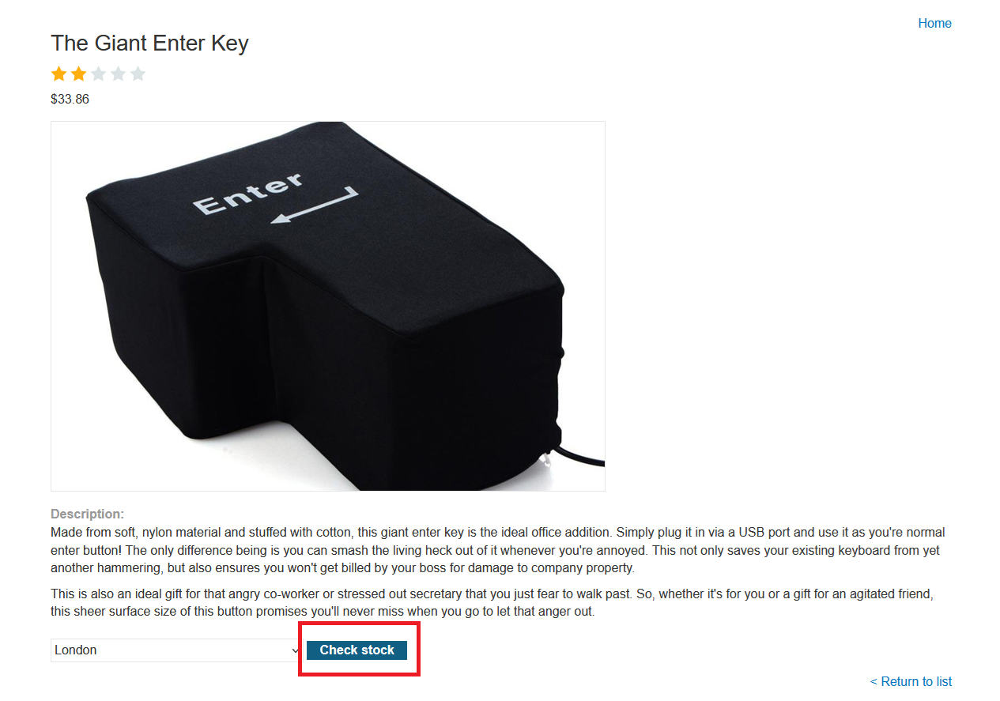
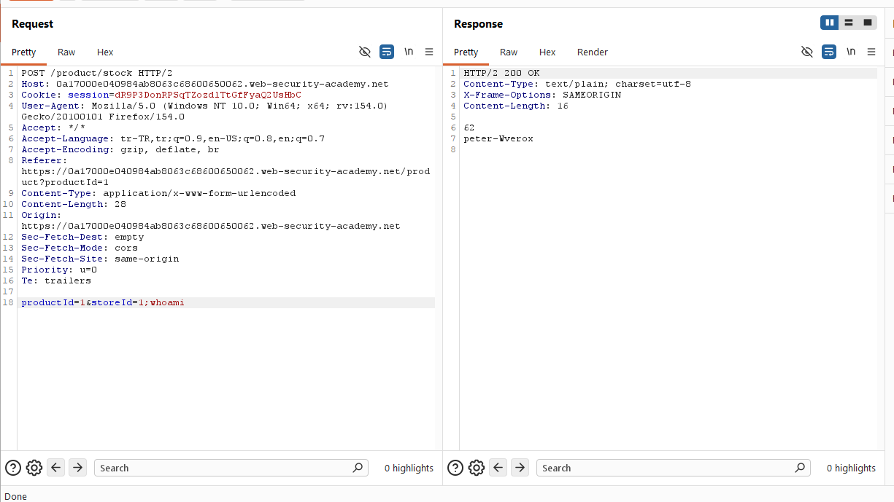
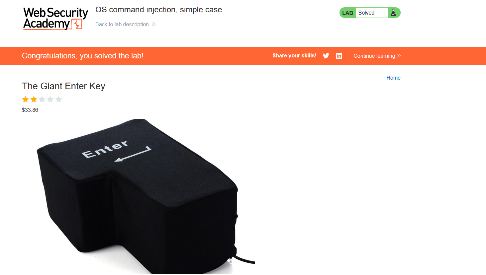

# OS command injection, simple case

## 1. Lab Bilgisi

**Difficulty:** Apprentice

## 2. Vulnerability Özeti

Bu labda ürün stok kontrolü için gönderilen `storeId` parametresinin backend tarafında işletim sistemi komutuna dahil edildiğini gördüm. Uygulama bu parametreyi güvenli şekilde filtrelemediği için `;` karakteriyle mevcut komutu sonlandırıp kendi komutumu çalıştırabildim.

## 3. Kullanılan Payload

```http
productId=1&storeId=1;whoami
```

## 4. Exploitation Steps

1. İlk olarak ürün detay sayfasında `Check stock` fonksiyonunu tespit ettim.



2. `Check stock` isteğini Burp Suite ile yakaladım. İstek body kısmında `productId` ve `storeId` parametrelerinin gönderildiğini gördüm.

```http
POST /product/stock HTTP/2
Content-Type: application/x-www-form-urlencoded

productId=1&storeId=1
```

3. `storeId` parametresinin sunucu tarafında bir komuta dahil ediliyor olabileceğini düşünerek komut ayırıcı karakteriyle `whoami` komutunu ekledim.

```http
productId=1&storeId=1;whoami
```

4. İsteği gönderdiğimde response içinde normal stok çıktısının yanında komut çıktısı da döndü. `peter-Werox` çıktısı, `whoami` komutunun sunucuda çalıştığını gösterdi.



5. Komut çalıştırma doğrulandığı için lab başarıyla çözüldü.



## 5. Impact

OS command injection zafiyeti sayesinde saldırgan, uygulamanın çalıştığı sunucu üzerinde işletim sistemi komutları çalıştırabilir. Bu durum sistem bilgisi toplama, dosya okuma, veri sızdırma veya daha ileri senaryolarda sunucunun tamamen ele geçirilmesi gibi kritik sonuçlara yol açabilir.

## 6. Remediation

Kullanıcıdan gelen değerler işletim sistemi komutlarına doğrudan eklenmemelidir. Mümkünse shell komutu çalıştırmak yerine güvenli framework veya dil API'leri kullanılmalıdır. Komut çalıştırmak zorunluysa parametreler allowlist ile doğrulanmalı, shell yorumlaması devre dışı bırakılmalı ve kullanıcı girdisi komut string'i içinde birleştirilmemelidir.
