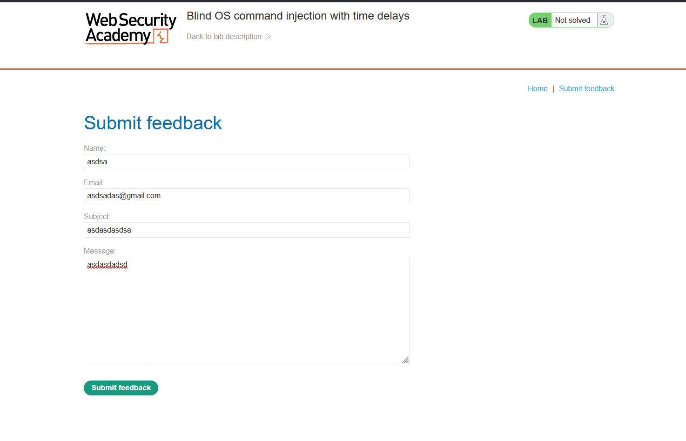
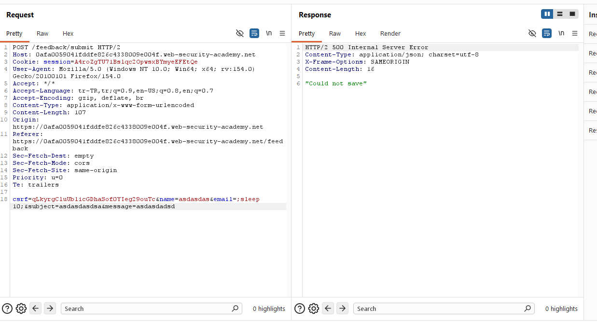
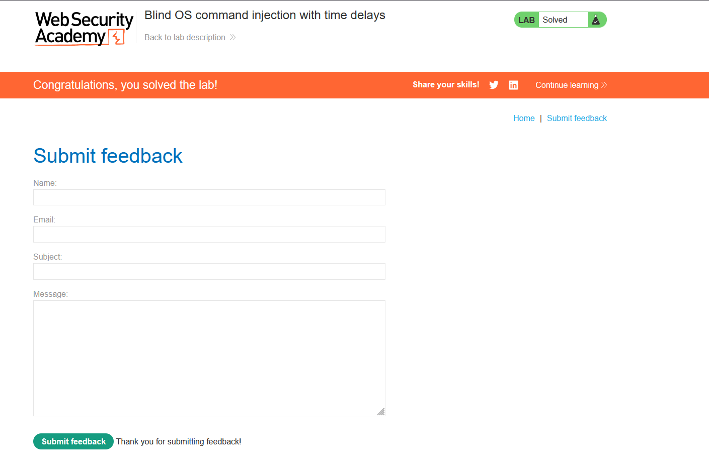

# Blind OS command injection with time delays

## 1. Lab Bilgisi

**Difficulty:** Practitioner

## 2. Vulnerability Özeti

Bu labda feedback formundan gönderilen alanlardan birinin backend tarafında işletim sistemi komutuna dahil edildiğini gördüm. Komut çıktısı response içinde görünmediği için zafiyet blind şekilde çalışıyordu. Bu nedenle `sleep` komutuyla zaman gecikmesi oluşturarak komutun sunucuda çalıştığını doğruladım.

## 3. Kullanılan Payload

```http
email=;sleep 10;
```

## 4. Exploitation Steps

1. İlk olarak feedback sayfasındaki formu doldurup `Submit feedback` fonksiyonunu test ettim.



2. Form gönderimini Burp Suite ile yakaladım. İstek body kısmında `csrf`, `name`, `email`, `subject` ve `message` parametrelerinin gönderildiğini gördüm.

```http
POST /feedback/submit HTTP/2
Content-Type: application/x-www-form-urlencoded
```

3. `email` parametresinin sunucu tarafında bir komuta dahil ediliyor olabileceğini düşünerek komut ayırıcı karakteriyle `sleep 10` komutunu ekledim.

```http
csrf=...&name=asdasdas&email=;sleep 10;&subject=asdasdassa&message=asdasdadsd
```

4. İsteği gönderdiğimde response içinde komut çıktısı görünmedi, ancak sunucu cevabının gecikmesi `sleep 10` komutunun çalıştığını gösterdi. Response `500 Internal Server Error` dönse de zaman gecikmesi zafiyeti doğrulamak için yeterli oldu.



5. Zaman gecikmesiyle blind command injection doğrulandığı için lab başarıyla çözüldü.



## 5. Impact

Blind OS command injection zafiyetinde saldırgan komut çıktısını doğrudan göremese bile zaman gecikmesi, DNS/HTTP callback veya farklı yan kanallar kullanarak sunucuda komut çalıştırıldığını doğrulayabilir. Bu durum sistem keşfi, veri sızdırma ve daha ileri saldırılar için kritik bir başlangıç noktası oluşturabilir.

## 6. Remediation

Kullanıcı girdileri işletim sistemi komutlarına doğrudan eklenmemelidir. Shell komutu çalıştırmak yerine güvenli uygulama API'leri tercih edilmelidir. Komut çalıştırmak zorunluysa kullanıcı girdisi allowlist ile doğrulanmalı, shell yorumlaması devre dışı bırakılmalı ve parametreler komut string'i içinde birleştirilmeden güvenli argümanlar olarak aktarılmalıdır.
