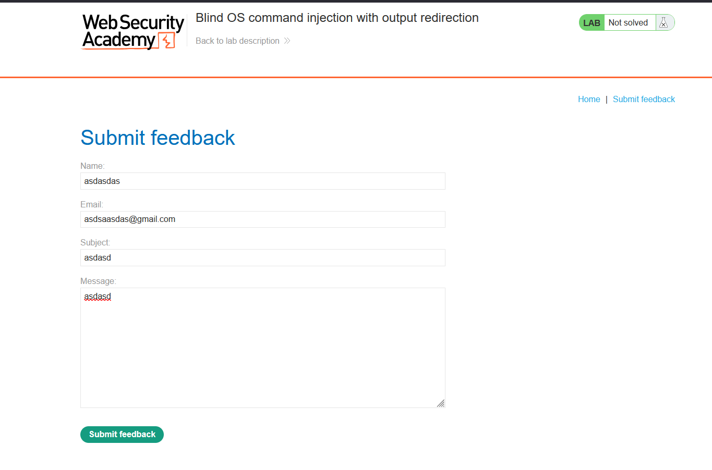
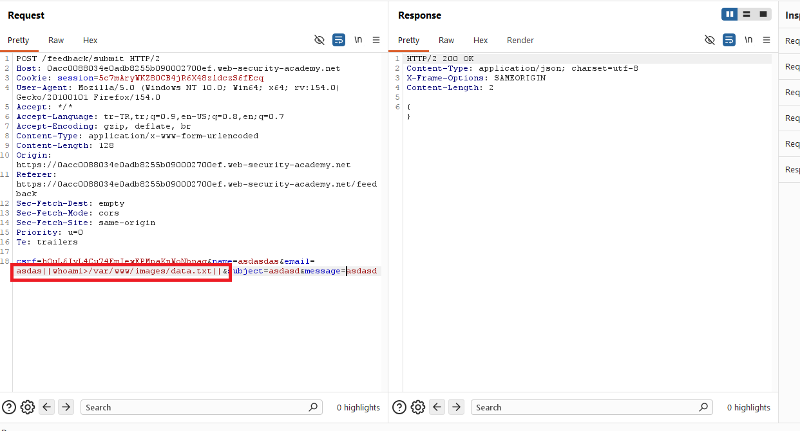
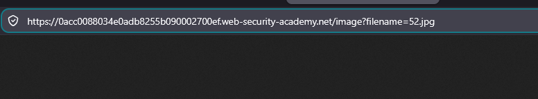
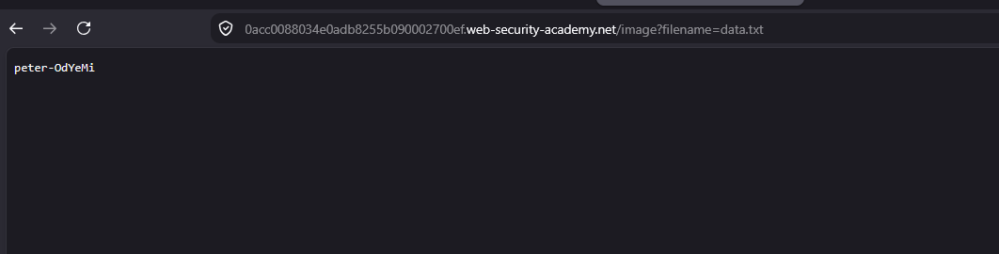

# Blind OS command injection with output redirection

## 1. Lab Bilgisi

**Difficulty:** Practitioner

## 2. Vulnerability Özeti

Bu labda feedback formundan gönderilen `email` parametresinin backend tarafında işletim sistemi komutuna dahil edildiğini gördüm. Komut çıktısı doğrudan HTTP response içinde dönmediği için zafiyet blind şekilde çalışıyordu. Ancak uygulamanın `/var/www/images/` dizinindeki dosyaları `/image?filename=` endpoint'i üzerinden servis ettiğini kullanarak komut çıktısını bu dizine yazdırabildim ve daha sonra tarayıcıdan okuyabildim.

## 3. Kullanılan Payload

```http
email=asdas|whoami>/var/www/images/data.txt|
```

Komut çıktısını okumak için kullanılan endpoint:

```http
/image?filename=data.txt
```

## 4. Exploitation Steps

1. İlk olarak feedback sayfasındaki formu doldurup `Submit feedback` fonksiyonunu test ettim.



2. Form gönderimini Burp Suite ile yakaladım. İstek body kısmında `csrf`, `name`, `email`, `subject` ve `message` parametrelerinin gönderildiğini gördüm.

```http
POST /feedback/submit HTTP/2
Content-Type: application/x-www-form-urlencoded
```

3. `email` parametresine komut ayırıcı karakter ekleyerek `whoami` komutunu çalıştırdım ve çıktısını web uygulamasının erişilebilir image dizinine yazdırdım.

```http
email=asdas|whoami>/var/www/images/data.txt|
```



4. Uygulamada ürün görsellerinin `/image?filename=` endpoint'i ile çağrıldığını tespit ettim.


5. Normal bir görsel isteğinde `filename` parametresinin dosya adını taşıdığını gördüm.

```http
/image?filename=52.jpg
```



6. Daha sonra `filename` parametresini komut çıktısını yazdırdığım `data.txt` dosyasını gösterecek şekilde değiştirdim.

```http
/image?filename=data.txt
```

7. Tarayıcıda `data.txt` dosyası açıldığında `whoami` komutunun çıktısı olan `peter-0dYeMi` değeri görüntülendi.



8. Komut çıktısı başarıyla okunabildiği için lab çözüldü.


## 5. Impact

Blind OS command injection zafiyeti, komut çıktısı doğrudan response içinde görünmese bile saldırganın farklı yan kanallar kullanarak sunucuda komut çalıştırmasına imkan verir. Output redirection ile saldırgan komut çıktısını web kökü gibi erişilebilir bir konuma yazdırabilir ve hassas sistem bilgilerini dışarı aktarabilir.

## 6. Remediation

Kullanıcı girdileri işletim sistemi komutlarına doğrudan eklenmemelidir. Shell komutu çalıştırmak yerine güvenli uygulama API'leri tercih edilmelidir. Komut çalıştırmak zorunluysa kullanıcı girdisi allowlist ile doğrulanmalı, shell yorumlaması devre dışı bırakılmalı ve çıktının web root gibi erişilebilir dizinlere yazılması engellenmelidir.
